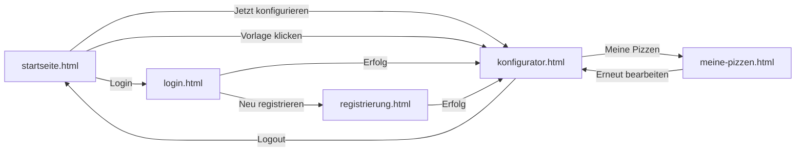

# B1 — Dialogspezifikation

## Seitenübersicht

| Seite | Datei | Zugang | Hauptfunktion |
|---|---|---|---|
| Startseite | `startseite.html` | Alle | Einstiegsbereich, Vorlagen und Funktionsübersicht |
| Konfigurator | `konfigurator.html` | Alle | Pizza zusammenstellen sowie Preis und Kalorien anzeigen |
| Login | `login.html` | Nur Gäste | Anmeldung mit E-Mail und Passwort |
| Registrierung | `registrierung.html` | Nur Gäste | Benutzerkonto anlegen |
| Meine Pizzen | `meine-pizzen.html` | Nur angemeldet | Gespeicherte Pizzen anzeigen und verwalten |

## Navigation

Auf allen Seiten wird dieselbe Bootstrap-Navigation (`bg-danger`) verwendet. Welche Menüpunkte angezeigt werden, hängt vom Anmeldestatus ab und wird über `auth.js` beziehungsweise `checkSession()` gesteuert:

| Element | Gast | Angemeldeter Nutzer |
|---|---|---|
| Startseite | ✅ | ✅ |
| Konfigurator | ✅ | ✅ |
| Meine Pizzen | ❌ | ✅ |
| Login | ✅ | ❌ |
| Logout (Vorname) | ❌ | ✅ |

## Seitennavigation

## Dialoge

### Startseite (`startseite.html`)

Aufbau von oben nach unten:

- **Navbar:** Logo links, Navigationslinks rechts
- **Einstiegsbereich:** Roter Hintergrund, kurzer Haupttitel und Schaltfläche „Jetzt konfigurieren“
- **„So funktioniert es“:** Drei kurze Schritte zur Bedienung (Größe → Sauce und Käse → Beläge)
- **„Beliebte Kreationen“:** Drei anklickbare Pizza-Vorlagen mit Bild, zum Beispiel Margherita, Salami und Hawaii
- **Funktionshinweise:** Vier Symbole für sichere Anmeldung, schnelle Bedienung, Zutaten-Auswahl und Gutscheincodes
- **Footer:** Dunkel, Copyright

### Konfigurator (`konfigurator.html`)

Auf größeren Bildschirmen ist die Seite zweispaltig aufgebaut. Links befinden sich die Auswahlmöglichkeiten, rechts die Vorschau und die Zusammenfassung.

- **Größenauswahl:** Schaltflächen für S, M, L, XL und XXL
- **Aufklappbare Bereiche:** Teig, Sauce, Käse, Beläge und Extras mit anklickbaren Auswahlkarten
- **Gutscheinfeld:** Eingabefeld und Schaltfläche „Einlösen“. Das Ergebnis wird als Hinweis angezeigt.
- **Preis:** Wird nach jeder Änderung direkt neu berechnet
- **Kalorien:** Separate Anzeige mit der Summe der ausgewählten Zutaten
- **Schaltflächen:** „Speichern“ für angemeldete Nutzer und „Zusammenfassung anzeigen“. Eine echte Bestellung wird nicht ausgelöst.

### Login (`login.html`)

- Zentrierter Formularbereich mit maximal 480 Pixel Breite
- Felder für E-Mail und Passwort; das Passwort kann über ein Auge-Symbol ein- oder ausgeblendet werden
- Bootstrap-Formularvalidierung (`was-validated`)
- Hinweisfeld für Fehler- und Erfolgsmeldungen
- Link zur Registrierungsseite

### Registrierung (`registrierung.html`)

- Zweispaltige Formularanordnung
- Felder: Vorname, Nachname, E-Mail, Passwort (×2), Straße, Hausnr., PLZ, Stadt, Telefon (optional)
- Passwort-Übereinstimmungsprüfung clientseitig (`setCustomValidity`)
- Alle Pflichtfelder mit `*` markiert

### Meine Pizzen (`meine-pizzen.html`)

- Responsives Kartenraster: drei Spalten am Desktop, zwei auf Tablets und eine auf Mobilgeräten
- **Ladeanzeige:** Bootstrap-Spinner während des API-Aufrufs
- **Nicht angemeldet:** Hinweis mit Link zur Login-Seite
- **Leere Ansicht:** Symbol, kurzer Hinweis und Link zum Konfigurator
- **Pizza-Karte zeigt:** Name, Datum, Größe, Teig, Sauce, Käse, Beläge, Preis, Gutschein-Badge (grün)
- **Schaltflächen pro Karte:** „Erneut bearbeiten“ lädt die gespeicherten Werte in den Konfigurator. „Löschen“ öffnet vorher einen Bestätigungsdialog.
- Nach dem Löschen wird die betreffende Karte mit einer kurzen Animation ausgeblendet (`animate-fade-out`).
