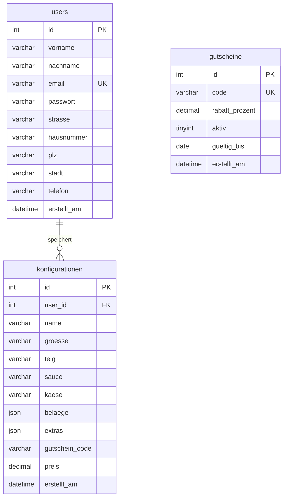

# D1 — Datenmodell

## Entity-Relationship-Diagramm

## Entitäten

### users

In dieser Tabelle werden die registrierten Nutzer gespeichert.

| Attribut | Typ | Constraints | Beschreibung |
|---|---|---|---|
| `id` | INT | PK, AUTO_INCREMENT | Eindeutige Benutzer-ID |
| `vorname` | VARCHAR(100) | NOT NULL | Vorname |
| `nachname` | VARCHAR(100) | NOT NULL | Nachname |
| `email` | VARCHAR(255) | NOT NULL, UNIQUE | Login-Kennung |
| `passwort` | VARCHAR(255) | NOT NULL | bcrypt-Hash |
| `strasse` | VARCHAR(255) | NOT NULL | Straße |
| `hausnummer` | VARCHAR(20) | NOT NULL | Hausnummer |
| `plz` | VARCHAR(10) | NOT NULL | Postleitzahl |
| `stadt` | VARCHAR(100) | NOT NULL | Stadt |
| `telefon` | VARCHAR(30) | DEFAULT NULL | Optional |
| `erstellt_am` | DATETIME | NOT NULL, DEFAULT NOW() | Registrierungszeitpunkt |

### konfigurationen

Hier werden die von Nutzern gespeicherten Pizza-Konfigurationen abgelegt.

| Attribut | Typ | Constraints | Beschreibung |
|---|---|---|---|
| `id` | INT | PK, AUTO_INCREMENT | Konfigurations-ID |
| `user_id` | INT | FK → users(id), CASCADE | Zugehöriger Nutzer |
| `name` | VARCHAR(100) | DEFAULT 'Meine Pizza' | Benutzerdefinierter Name |
| `groesse` | VARCHAR(10) | NOT NULL | S / M / L / XL / XXL |
| `teig` | VARCHAR(50) | NOT NULL | Teigart |
| `sauce` | VARCHAR(50) | NOT NULL | Sauce |
| `kaese` | VARCHAR(50) | NOT NULL | Käse |
| `belaege` | JSON | NOT NULL | Array der gewählten Beläge |
| `extras` | JSON | DEFAULT NULL | Optionale Extras |
| `gutschein_code` | VARCHAR(50) | DEFAULT NULL | Eingelöster Code |
| `preis` | DECIMAL(8,2) | NOT NULL | Endpreis in € |
| `erstellt_am` | DATETIME | NOT NULL, DEFAULT NOW() | Speicherzeitpunkt |

### gutscheine

Die Tabelle enthält die verfügbaren Rabattcodes.

| Attribut | Typ | Constraints | Beschreibung |
|---|---|---|---|
| `id` | INT | PK, AUTO_INCREMENT | Gutschein-ID |
| `code` | VARCHAR(50) | NOT NULL, UNIQUE | Code, zum Beispiel `PIZZA10` |
| `rabatt_prozent` | DECIMAL(5,2) | NOT NULL | Rabatt in Prozent |
| `aktiv` | TINYINT(1) | DEFAULT 1 | 1 = aktiv, 0 = deaktiviert |
| `gueltig_bis` | DATE | DEFAULT NULL | Ablaufdatum (NULL = unbegrenzt) |
| `erstellt_am` | DATETIME | NOT NULL, DEFAULT NOW() | Erstellungsdatum |

## Beziehungen

- **users → konfigurationen**: 1:N. Ein Nutzer kann mehrere Konfigurationen speichern, während jede Konfiguration genau einem Nutzer zugeordnet ist. Durch `ON DELETE CASCADE` werden beim Löschen eines Nutzers auch dessen Konfigurationen entfernt.
- **gutscheine**: Die Gutscheintabelle ist nicht über einen Fremdschlüssel mit den Konfigurationen verbunden. Der verwendete Code wird als Text im Feld `gutschein_code` gespeichert.

## Seed-Daten (Gutscheine)

| Code | Rabatt | Gültig bis | Status |
|---|---|---|---|
| `PIZZA10` | 10 % | 31.12.2027 | Aktiv |
| `SPARE20` | 20 % | 30.06.2027 | Aktiv |
| `WELCOME` | 15 % | 31.12.2027 | Aktiv |
| `STUDENT5` | 5 % | 31.12.2027 | Aktiv |
