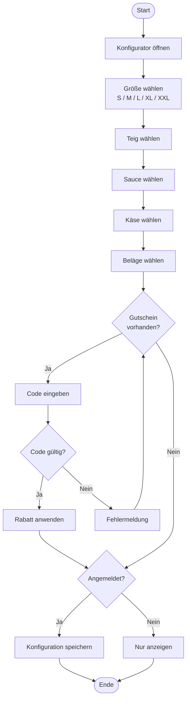
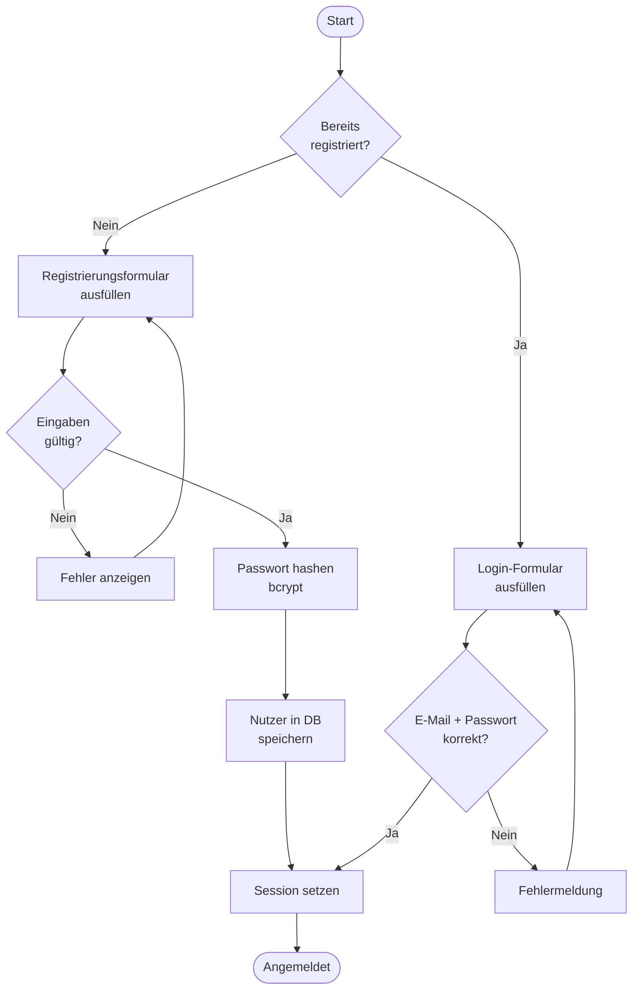

# F1 — Geschäftsprozesse

## GP1 — Pizza konfigurieren und speichern

Der wichtigste Ablauf der Anwendung ist das Zusammenstellen und Speichern einer Pizza.

### Schritte

| Schritt | Akteur | Beschreibung |
|---|---|---|
| 1 | Nutzer / Gast | Konfigurator öffnen (`konfigurator.html`) |
| 2 | Nutzer / Gast | Größe, Teig, Sauce, Käse und Beläge wählen |
| 3 | System | Preis und Kalorien nach jeder Auswahl direkt aktualisieren |
| 4 | Nutzer / Gast | Optional: Gutscheincode eingeben |
| 5 | System | Code in der Datenbank prüfen und gegebenenfalls den Rabatt anwenden |
| 6a | Gast | Konfiguration nur anzeigen, nicht speichern |
| 6b | Angemeldeter Nutzer | Konfiguration in der Datenbank speichern |
| 7 | Nutzer | Gespeicherte Pizzen unter "Meine Pizzen" abrufen |

---

## GP2 — Benutzerregistrierung und Login

---

## GP3 — Gespeicherte Pizza löschen

| Schritt | Akteur | Beschreibung |
|---|---|---|
| 1 | Angemeldeter Nutzer | "Meine Pizzen" öffnen |
| 2 | Nutzer | Auf "Löschen" klicken |
| 3 | System | Bestätigungsdialog anzeigen |
| 4 | Nutzer | Bestätigen |
| 5 | System | Prüfen, ob die `user_id` mit dem angemeldeten Nutzer übereinstimmt |
| 6 | System | Datensatz löschen und die Karte aus der Ansicht entfernen |
