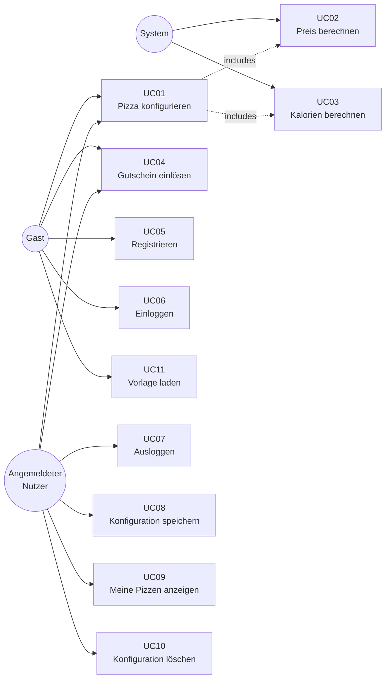

# F2 — Anwendungsfälle

## Übersicht

## Übersicht der Anwendungsfälle

| ID | Name | Akteur | Priorität |
|---|---|---|---|
| UC01 | Pizza konfigurieren | Gast / Nutzer | Hoch |
| UC02 | Preis berechnen | System (automatisch) | Hoch |
| UC03 | Kalorien berechnen | System (automatisch) | Hoch |
| UC04 | Gutscheincode einlösen | Gast / Nutzer | Mittel |
| UC05 | Nutzer registrieren | Gast | Hoch |
| UC06 | Nutzer einloggen | Gast | Hoch |
| UC07 | Nutzer ausloggen | Angemeldeter Nutzer | Mittel |
| UC08 | Konfiguration speichern | Angemeldeter Nutzer | Mittel |
| UC09 | Gespeicherte Pizzen anzeigen | Angemeldeter Nutzer | Mittel |
| UC10 | Konfiguration löschen | Angemeldeter Nutzer | Niedrig |
| UC11 | Vorlage laden | Gast / Nutzer | Niedrig |

---

## Ausgewählte Anwendungsfälle im Detail

### UC01 — Pizza konfigurieren

| Feld | Inhalt |
|---|---|
| **Akteur** | Gast oder angemeldeter Nutzer |
| **Vorbedingung** | `konfigurator.html` ist geöffnet |
| **Normaler Ablauf** | 1. Größe wählen (S / M / L / XL / XXL)   2. Teig wählen (Normal, Dünn & Knusprig, Dick & Fluffig, Vollkorn, Käserand)   3. Sauce wählen (Tomate, Pesto, Knoblauch-Öl, Crème fraîche, BBQ)   4. Käse wählen (Mozzarella, Gouda, Gorgonzola, Ziegenkäse, Vegan)   5. Beläge auswählen (Mehrfachauswahl)   6. Preis (UC02) und Kalorien (UC03) werden live aktualisiert |
| **Ergebnis** | Fertige Konfiguration mit Preis und Kalorien |
| **Alternativer Ablauf** | Nutzer wählt Vorlage (UC11) → Felder werden vorausgefüllt und können anschließend geändert werden |
| **Fehlerfälle** | Fehlende Pflichtauswahl: Die Konfiguration kann nicht gespeichert werden |

---

### UC04 — Gutscheincode einlösen

| Feld | Inhalt |
|---|---|
| **Akteur** | Gast oder angemeldeter Nutzer |
| **Vorbedingung** | Die notwendigen Pizza-Bestandteile wurden ausgewählt |
| **Normaler Ablauf** | 1. Nutzer gibt Code ein (z. B. `PIZZA10`)   2. POST-Request an `api/coupon.php`   3. Code wird gegen Tabelle `gutscheine` geprüft (`aktiv = 1`, Ablaufdatum)   4. Rabatt wird vom Preis abgezogen   5. Neuer Preis wird angezeigt |
| **Fehlerfälle** | Ungültiger Code → HTTP 404 · Abgelaufener Code → HTTP 410 |
| **Verfügbare Codes** | `PIZZA10` (10 %), `SPARE20` (20 %), `WELCOME` (15 %), `STUDENT5` (5 %) |

---

### UC05 — Nutzer registrieren

| Feld | Inhalt |
|---|---|
| **Akteur** | Gast |
| **Vorbedingung** | Nutzer ist nicht angemeldet |
| **Normaler Ablauf** | 1. Formular ausfüllen: Vorname, Nachname, E-Mail, Passwort, Adresse   2. Clientseitige Validierung (HTML5 + JavaScript)   3. POST-Request an `api/register.php`   4. Serverseitige Validierung + E-Mail-Duplikat-Prüfung   5. Passwort wird mit bcrypt gehasht gespeichert   6. Session wird gesetzt → Weiterleitung zum Konfigurator |
| **Fehlerfälle** | E-Mail bereits vorhanden → HTTP 409 · Pflichtfeld leer → HTTP 400 · Passwort < 6 Zeichen → HTTP 400 |

---

### UC06 — Nutzer einloggen

| Feld | Inhalt |
|---|---|
| **Akteur** | Gast |
| **Vorbedingung** | Nutzer ist registriert und nicht angemeldet |
| **Normaler Ablauf** | 1. E-Mail und Passwort eingeben   2. POST-Request an `api/login.php`   3. Passwortprüfung mit `password_verify()`   4. Session wird gesetzt → Weiterleitung zum Konfigurator |
| **Fehlerfälle** | Falsche Zugangsdaten → HTTP 401 |

---

### UC08 — Konfiguration speichern

| Feld | Inhalt |
|---|---|
| **Akteur** | Angemeldeter Nutzer |
| **Vorbedingung** | Der Nutzer ist angemeldet und die notwendigen Pizza-Bestandteile wurden ausgewählt |
| **Normaler Ablauf** | 1. Nutzer klickt "Speichern"   2. POST-Request an `api/save_config.php`   3. Session-Prüfung mit `requireLogin()`   4. Konfiguration wird mit `user_id` in `konfigurationen` gespeichert |
| **Ergebnis** | Konfiguration unter "Meine Pizzen" abrufbar |
| **Fehlerfälle** | Nicht angemeldet → HTTP 401 · Pflichtfeld fehlt → HTTP 400 |

---

### UC10 — Konfiguration löschen

| Feld | Inhalt |
|---|---|
| **Akteur** | Angemeldeter Nutzer |
| **Vorbedingung** | Der Nutzer ist angemeldet und die Konfiguration existiert |
| **Normaler Ablauf** | 1. Nutzer klickt "Löschen"   2. Bestätigungsdialog erscheint   3. POST-Request an `api/delete_config.php`   4. Der Server prüft, ob die `user_id` zum angemeldeten Nutzer gehört   5. Datensatz wird gelöscht |
| **Fehlerfälle** | Fremde Konfiguration → HTTP 404 · Nicht angemeldet → HTTP 401 |

---

## Akzeptanzkriterien

| ID | Feature | Akzeptanzkriterium |
|---|---|---|
| AK01 | Registrierung | Neuer Nutzer kann sich registrieren und wird direkt angemeldet weitergeleitet |
| AK02 | Login | Registrierter Nutzer kann sich einloggen; bei falschen Zugangsdaten erscheint eine Fehlermeldung |
| AK03 | Konfiguration | Preis wird nach jeder Änderung sofort aktualisiert |
| AK04 | Kalorien | Kalorienanzahl summiert korrekt alle gewählten Zutaten |
| AK05 | Gutschein | `PIZZA10` reduziert Preis um 10 %; bei einem ungültigen Code erscheint eine Fehlermeldung |
| AK06 | Speichern | Angemeldeter Nutzer kann Konfiguration speichern; sie erscheint unter "Meine Pizzen" |
| AK07 | Löschen | Nutzer kann nur eigene Konfigurationen löschen |
| AK08 | Logout | Nach Logout ist "Meine Pizzen" nicht sichtbar; API gibt HTTP 401 zurück |
