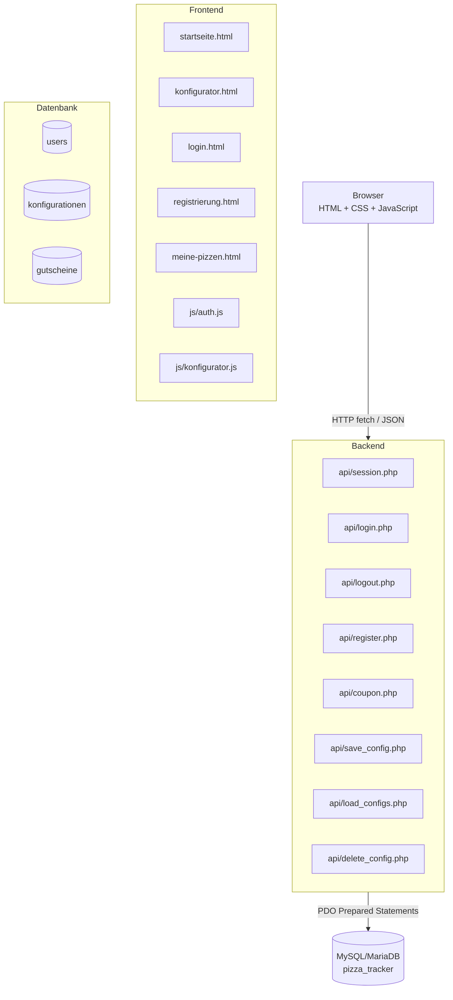

# P2 — Architekturüberblick

## Systemarchitektur

Der Pizza Tracker ist als dreischichtige Webanwendung aufgebaut:

```
Browser (HTML + CSS + JavaScript)
        │  HTTP / fetch API
        ▼
PHP-Backend  (api/*.php)
        │  PDO Prepared Statements
        ▼
MySQL / MariaDB  (pizza_tracker)
```

Das Frontend sendet HTTP-Anfragen an das PHP-Backend und verarbeitet die Antworten im JSON-Format. Nur das Backend greift über PDO auf die Datenbank zu; der Browser hat keinen direkten Datenbankzugriff.

## Systemarchitektur-Diagramm



## Technologie-Stack

| Schicht | Technologie | Version |
|---|---|---|
| Frontend | HTML5 / CSS3 / JavaScript | ES2022 |
| CSS-Framework | Bootstrap | 5.3.3 |
| Icons | Bootstrap Icons | 1.11.3 |
| Backend | PHP | 8.x |
| Datenbank | MySQL / MariaDB | 10.4+ |
| Datenbankzugriff | PDO (Prepared Statements) | — |
| Versionskontrolle | Git / GitLab THM | — |

## Projektstruktur

```
pizza-tracker/
├── startseite.html
├── konfigurator.html
├── login.html
├── registrierung.html
├── meine-pizzen.html
├── css/
│   └── style.css
├── js/
│   ├── auth.js
│   └── konfigurator.js
├── api/
│   ├── session.php
│   ├── login.php
│   ├── logout.php
│   ├── register.php
│   ├── coupon.php
│   ├── save_config.php
│   ├── load_configs.php
│   └── delete_config.php
├── config/
│   ├── database.php
│   └── helpers.php
├── INSTALL.md
└── docs/
    └── spec/
        └── README.md
```

## Wichtigste Architekturentscheidungen

| Entscheidung | Wahl | Begründung |
|---|---|---|
| Backend-Sprache | PHP 8 | Lässt sich lokal über XAMPP ausführen und benötigt keinen zusätzlichen Build-Schritt |
| Datenbankzugriff | PDO Prepared Statements | Parametrisierte Abfragen und eine einheitliche Datenbankschnittstelle |
| Authentifizierung | PHP Sessions | Für den Projektumfang einfacher umzusetzen als eine tokenbasierte Lösung |
| Frontend-Framework | Bootstrap 5.3 | Vorgefertigte responsive Komponenten und einheitliches Layout |
| Keine SPA | Vanilla JS + PHP | Überschaubare Struktur ohne zusätzlichen Build-Prozess |
