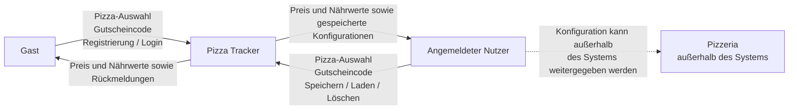
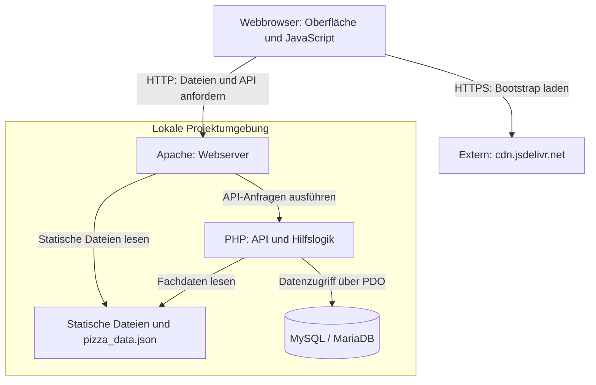

# 3 — Kontext und Abgrenzung

Dieses Kapitel beschreibt den fachlichen und technischen Kontext des **Pizza Trackers**. Es zeigt, welche Personen mit dem System interagieren, welche Informationen ausgetauscht werden und wo die Systemgrenze verläuft.

Die fachliche Grundlage bilden insbesondere [`P1 — Ziele und Rahmenbedingungen`](../spec/P1-ziele-rahmenbedingungen.md), [`P2 — Architekturüberblick`](../spec/P2-architekturueberblick.md), [`F1 — Geschäftsprozesse`](../spec/F1-geschaeftsprozesse.md) und [`F2 — Anwendungsfälle`](../spec/F2-anwendungsfaelle.md).

Während die Spezifikation den fachlichen Umfang des Pizza Trackers beschreibt, konkretisiert dieses Kapitel die Einordnung des Systems in seine Umgebung und die technischen Kommunikationsbeziehungen.

---

## 3.1 Fachlicher Kontext

Der Pizza Tracker unterstützt Nutzer bei der digitalen Zusammenstellung und Verwaltung individueller Pizza-Konfigurationen.

Es werden zwei Nutzergruppen unterschieden:

* **Gast:** nicht angemeldeter Nutzer
* **Angemeldeter Nutzer:** registrierter und aktuell angemeldeter Nutzer mit zusätzlichen Verwaltungsfunktionen

Beide Nutzergruppen greifen über einen Webbrowser auf den Pizza Tracker zu.

Ein Gast kann eine Pizza einschließlich Extras konfigurieren, Preis, Kalorien und Nährwerte anzeigen lassen, für Gäste zulässige Gutscheincodes einlösen, Vorlagen laden sowie ein Benutzerkonto erstellen und sich anmelden. Die Foto-Vorschau und die Allergenseite unterstützen die Auswahl. Der Gutschein WELCOME setzt eine Anmeldung voraus.

Ein angemeldeter Nutzer kann zusätzlich eigene Pizza-Konfigurationen speichern, anzeigen, erneut laden und löschen.

Erneutes Laden übernimmt die Auswahl in den Konfigurator. Wird sie anschließend gespeichert, entsteht ein neuer Datensatz; der bisherige wird nicht überschrieben. Die Foto-Vorschau verwendet vorhandene Bilder und stellt nicht jede individuelle Kombination exakt dar.

### 3.1.1 Fachliches Kontextdiagramm

Die gestrichelte Verbindung zur Pizzeria verdeutlicht, dass **keine technische Schnittstelle zwischen dem Pizza Tracker und einer Pizzeria besteht**.

Die Pizzeria ist Bestandteil des übergeordneten Geschäftsprozesses aus [`F1 — Geschäftsprozesse`](../spec/F1-geschaeftsprozesse.md), liegt jedoch außerhalb der technischen Systemgrenze.

---

### 3.1.2 Informationsaustausch

| Beteiligter             | Informationen an den Pizza Tracker                                                                   | Informationen vom Pizza Tracker                                                       |
| ----------------------- | ---------------------------------------------------------------------------------------------------- | ------------------------------------------------------------------------------------- |
| **Gast** | Auswahl von Größe, Teig, Sauce, Käse, Belägen und Extras; Gutscheincode; Registrierungs- und Anmeldedaten | Aktueller Preis, Kalorien, Nährwerte, Ernährungskennzeichnungen, Allergeninformationen, Vorschau und Rückmeldungen |
| **Angemeldeter Nutzer** | Zusätzlich Aktionen zum Speichern, Laden und Löschen eigener Konfigurationen | Zusätzlich gespeicherte Pizza-Konfigurationen und Ergebnisse der Verwaltungsaktionen |
| **Pizzeria**            | Keine direkte technische Kommunikation                                                               | Keine direkte technische Kommunikation                                                |

---

### 3.1.3 Systemgrenze

Innerhalb der Systemgrenze befinden sich alle Funktionen, die unmittelbar durch den Pizza Tracker bereitgestellt werden.

**Innerhalb des Systems:**

* Darstellung der Weboberfläche
* Pizza-Konfigurator
* Auswahl von Größe, Teig, Sauce, Käse, Belägen und Extras
* Berechnung des aktuellen Preises
* Berechnung der aktuellen Kalorien und Nährwerte
* Foto-Vorschau, Ernährungskennzeichnungen und Allergeninformationen
* Prüfung und Anwendung von Gutscheincodes
* Laden vordefinierter Pizza-Vorlagen
* Registrierung von Nutzern
* Anmeldung und Abmeldung
* Verwaltung der Benutzersitzung
* Speicherung von Benutzerkonten
* Speicherung eigener Pizza-Konfigurationen
* Anzeigen gespeicherter Konfigurationen
* erneutes Laden gespeicherter Konfigurationen
* Löschen eigener Konfigurationen
* Speicherung der benötigten Daten in MySQL / MariaDB

**Außerhalb des Systems:**

* tatsächliche Bestellung bei einer Pizzeria
* Zubereitung einer Pizza
* Bezahlung
* Lieferung oder Abholung
* Echtzeit-Tracking
* Verwaltung einer Pizzeria über einen Admin-Bereich
* native Mobile-App

Der Pizza Tracker endet fachlich bei der **digitalen Konfiguration, Berechnung und Verwaltung einer Pizza-Zusammenstellung**.

Eine tatsächliche Bestellung, Bezahlung oder Lieferung wird nicht durch das System durchgeführt.

---

## 3.2 Technischer Kontext

Der Pizza Tracker ist gemäß [`P2 — Architekturüberblick`](../spec/P2-architekturueberblick.md) als **dreischichtige Webanwendung** aufgebaut.

Die drei grundlegenden Schichten sind:

1. **Präsentationsschicht**
   Darstellung und Benutzerinteraktion im Webbrowser mit HTML, CSS, JavaScript und Bootstrap 5.3.3. JavaScript berechnet die laufende Anzeige während der Konfiguration.

2. **Anwendungsschicht**
   Verarbeitung von API-Anfragen mit PHP ab 8.1, insbesondere Authentifizierung, Gutscheinprüfung und serverseitige Neuberechnung beim Speichern.

3. **Persistenzschicht**
   Speicherung und Abfrage dauerhaft benötigter Daten mit MySQL beziehungsweise MariaDB.

### 3.2.1 Technisches Kontextdiagramm

Die Pfeile zeigen Aufrufe und Zugriffe; Antworten laufen jeweils zurück. Apache liefert HTML, CSS, JavaScript, Bilder und die JSON-Fachdaten als statische Dateien aus. Die PHP-Endpunkte liefern JSON-Antworten und erzeugen keine HTML-Seiten. Nicht jede Benutzeraktion benötigt PHP oder einen Datenbankzugriff: Nach dem Laden der Fachdaten aktualisiert JavaScript die Konfiguration im Browser.

Die Datenbank ist kein externes fachliches Nachbarsystem, sondern Bestandteil der technischen Infrastruktur des Pizza Trackers.

---

### 3.2.2 Präsentationsschicht

Die Präsentationsschicht läuft im Webbrowser des Nutzers.

Sie besteht aus:

* HTML zur Strukturierung der Seiten
* CSS und Bootstrap 5.3.3 für Darstellung und Layout
* JavaScript für clientseitige Interaktionen

JavaScript aktualisiert Preis, Kalorien, Nährwerte, Kennzeichnungen und Vorschau anhand der Auswahl und der geladenen Datei `data/pizza_data.json`. Eine gewöhnliche Auswahländerung benötigt keinen API-Aufruf. Gutscheinprüfung und Speichern rufen dagegen das Backend auf.

Die Präsentationsschicht bildet die Schnittstelle zwischen Nutzer und serverseitiger Anwendung.

---

### 3.2.3 Anwendungsschicht

Die serverseitige Anwendungslogik wird mit PHP ab 8.1 umgesetzt.

Zu ihren Aufgaben gehören insbesondere:

* Verarbeitung von Benutzeranfragen
* Registrierung von Nutzern
* Anmeldung und Abmeldung
* Prüfung geschützter Funktionen
* Verarbeitung von Pizza-Konfigurationen
* Prüfung von Gutscheincodes
* Verwaltung gespeicherter Konfigurationen
* Kommunikation mit der Datenbank

Für die Authentifizierung wird gemäß [`P2 — Architekturüberblick`](../spec/P2-architekturueberblick.md) eine **session-basierte Lösung** verwendet.

Dadurch kann die Anwendung unterscheiden, ob ein Nutzer angemeldet ist und ob er auf geschützte Funktionen wie „Meine Pizzen“ zugreifen darf.

Der Browser übermittelt die Sitzungskennung im Cookie; der Anmeldestatus wird serverseitig verwaltet. Das Ausblenden von Bedienelementen ersetzt keine Zugriffskontrolle: Die geschützten API-Endpunkte prüfen die Anmeldung und beschränken das Laden und Löschen auf eigene Konfigurationen. Beim Speichern berechnet PHP Preis und Kalorien erneut; die ergänzenden Makronährwerte berechnet der Browser. Einzelheiten stehen in [A08](A08-cross-cutting-concepts.md).

---

### 3.2.4 Persistenzschicht

Die Persistenzschicht basiert auf **MySQL beziehungsweise MariaDB**.

Dort werden die dauerhaft benötigten Daten des Systems gespeichert.

Dazu gehören insbesondere:

* Benutzerkonten
* gespeicherte Pizza-Konfigurationen
* Gutscheindaten

Der Zugriff auf diese Daten erfolgt über die PHP-Anwendung. Der Browser greift nicht direkt auf die Datenbank zu.

Dadurch bleibt die Datenhaltung von der Benutzeroberfläche getrennt.

Pizzaoptionen, Grundpreise, Nährwerte und Vorlagen liegen dagegen in `data/pizza_data.json`. Diese gemeinsame Fachdatenquelle wird vom Browser über HTTP und von PHP über das Dateisystem gelesen. Sie wird durch die Anwendung nicht zur Laufzeit verändert.

---

### 3.2.5 Technische Kommunikationswege

| Verbindung                        | Technische Umsetzung                   | Informationen                                                    | Zweck                               |
| --------------------------------- | -------------------------------------- | ---------------------------------------------------------------- | ----------------------------------- |
| **Nutzer ↔ Browser**              | Weboberfläche                          | Auswahlen, Eingaben und Benutzeraktionen                         | Interaktion mit dem Pizza Tracker   |
| **Browser ↔ Apache** | HTTP über die lokale Projektadresse | HTML, CSS, JavaScript, Bilder und JSON-Fachdaten | Statische Oberfläche und Fachdaten laden |
| **Browser ↔ PHP-API über Apache** | HTTP-Aufrufe mit `fetch`; JSON bei Anfragen mit Nutzdaten und bei Antworten | Anmeldedaten, Auswahl, Gutscheincodes, Konfigurationen und Rückmeldungen | Serverseitige Funktionen ausführen |
| **Browser ↔ PHP-API über Apache** | Session-Cookie | Sitzungskennung; der Sitzungszustand bleibt auf dem Server | Anmeldung zuordnen und geschützte Funktionen prüfen |
| **PHP ↔ MySQL/MariaDB** | PDO-MySQL mit vorbereiteten SQL-Anweisungen | Benutzer-, Gutschein- und Konfigurationsdaten | Persistente Speicherung und Abfrage |
| **PHP → JSON-Fachdaten** | Dateisystemzugriff | Optionen, Preise und Kalorien | Auswahl validieren und beim Speichern neu berechnen |
| **Browser ↔ Bootstrap-CDN** | HTTPS | Bootstrap-CSS und -JavaScript | Darstellung und Bootstrap-Komponenten bereitstellen |

---

## 3.3 Externe Systeme und fachliche Abgrenzung

Der Pizza Tracker besitzt mit **`cdn.jsdelivr.net` eine externe technische Abhängigkeit**: Der Browser lädt dort Bootstrap 5.3.3. Dafür werden übliche HTTP-Verbindungsdaten übertragen. Die Anwendung sendet keine Pizza-Konfigurationen oder Kontodaten gezielt an dieses CDN. Die Betriebsfolgen dieser Abhängigkeit beschreibt [A07](A07-deployment-view.md).

Für fachliche Funktionen bestehen keine Anbindungen an:

* Zahlungsanbietern
* Lieferdiensten
* Pizzeria-Systemen
* Karten- oder Trackingdiensten
* externen Authentifizierungsdiensten
* externe fachliche APIs

Auch wenn der Geschäftsprozess GP1 die Weitergabe einer Pizza-Konfiguration an eine Pizzeria beschreibt, erfolgt diese Weitergabe **außerhalb des technischen Systems**.

Die Pizzeria ist daher kein technisch angebundenes Nachbarsystem des Pizza Trackers.

---

## 3.4 Zuordnung zu den Anwendungsfällen

Die Anwendungsfälle aus [`F2 — Anwendungsfälle`](../spec/F2-anwendungsfaelle.md) lassen sich bereits auf Ebene der drei Architekturschichten zuordnen.

Die detaillierte Zuordnung zu konkreten Softwarebausteinen erfolgt später in **A05 — Bausteinsicht**.

| Anwendungsfall                          | Betroffene Architekturbereiche                             |
| --------------------------------------- | ---------------------------------------------------------- |
| **UC01 — Pizza konfigurieren** | Browser mit geladenen JSON-Fachdaten; gewöhnliche Auswahländerungen ohne PHP-Aufruf |
| **UC02 — Preis berechnen** | Laufende Anzeige im Browser; erneute serverseitige Berechnung beim Speichern in UC08 |
| **UC03 — Kalorien berechnen** | Laufende Anzeige im Browser; erneute serverseitige Berechnung beim Speichern in UC08 |
| **UC04 — Gutscheincode einlösen**       | Präsentationsschicht, Anwendungsschicht, Persistenzschicht |
| **UC05 — Nutzer registrieren**          | Präsentationsschicht, Anwendungsschicht, Persistenzschicht |
| **UC06 — Nutzer einloggen**             | Präsentationsschicht, Anwendungsschicht, Persistenzschicht |
| **UC07 — Nutzer ausloggen**             | Präsentationsschicht, Anwendungsschicht                    |
| **UC08 — Konfiguration speichern**      | Präsentationsschicht, Anwendungsschicht, Persistenzschicht |
| **UC09 — Gespeicherte Pizzen anzeigen** | Präsentationsschicht, Anwendungsschicht, Persistenzschicht |
| **UC10 — Konfiguration löschen**        | Präsentationsschicht, Anwendungsschicht, Persistenzschicht |
| **UC11 — Vorlage laden** | Browser übernimmt die Vorlage aus den JSON-Fachdaten; keine PHP-Funktion für das Laden der Vorlage |

Diese Zuordnung schafft einen nachvollziehbaren Übergang von der **Spezifikation zur Architektur**.

Die konkreten Dateien und Verantwortlichkeiten beschreibt [A05](A05%20-%20Bausteinsicht.md), die zeitlichen Abläufe [A06](A06%20-%20Laufzeitsicht.md). Die Zuordnung beschreibt den vorhandenen Aufbau; sie ersetzt keinen Laufzeittest der einzelnen Anwendungsfälle.
