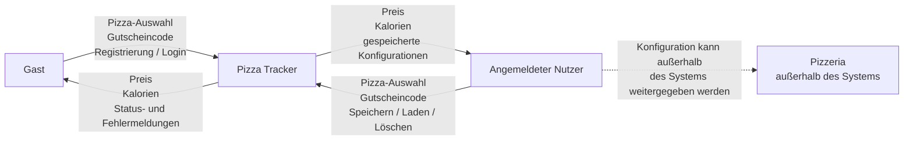
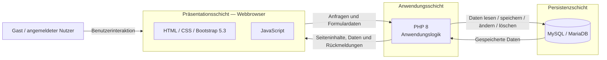

# 3 — Kontext und Abgrenzung

Dieses Kapitel beschreibt den fachlichen und technischen Kontext des **Pizza Trackers**. Es zeigt, welche Personen mit dem System interagieren, welche Informationen ausgetauscht werden und wo die Systemgrenze verläuft.

Die fachliche Grundlage bilden insbesondere [`P1 — Ziele und Rahmenbedingungen`](../spec/P1-ziele-rahmenbedingungen.md), [`P2 — Architekturüberblick`](../spec/P2-architekturueberblick.md), [`F1 — Geschäftsprozesse`](../spec/F1-geschaeftsprozesse.md) und [`F2 — Anwendungsfälle`](../spec/F2-anwendungsfaelle.md).

Während die Spezifikation den fachlichen Umfang des Pizza Trackers beschreibt, konkretisiert dieses Kapitel die Einordnung des Systems in seine Umgebung und die technischen Kommunikationsbeziehungen.

---

## 3.1 Fachlicher Kontext

Der Pizza Tracker unterstützt Nutzer bei der digitalen Zusammenstellung und Verwaltung individueller Pizza-Konfigurationen.

Es werden zwei Nutzergruppen unterschieden:

* **Gast:** nicht angemeldeter Nutzer
* **Angemeldeter Nutzer:** registrierter und aktuell angemeldeter Nutzer mit zusätzlichen Verwaltungsfunktionen

Beide Nutzergruppen greifen über einen Webbrowser auf den Pizza Tracker zu.

Ein Gast kann eine Pizza konfigurieren, Preis und Kalorien anzeigen lassen, Gutscheincodes einlösen, Vorlagen laden sowie ein Benutzerkonto erstellen und sich anmelden.

Ein angemeldeter Nutzer kann zusätzlich eigene Pizza-Konfigurationen speichern, anzeigen, erneut laden und löschen.

### 3.1.1 Fachliches Kontextdiagramm



Die gestrichelte Verbindung zur Pizzeria verdeutlicht, dass **keine technische Schnittstelle zwischen dem Pizza Tracker und einer Pizzeria besteht**.

Die Pizzeria ist Bestandteil des übergeordneten Geschäftsprozesses aus [`F1 — Geschäftsprozesse`](../spec/F1-geschaeftsprozesse.md), liegt jedoch außerhalb der technischen Systemgrenze.

---

### 3.1.2 Informationsaustausch

| Beteiligter             | Informationen an den Pizza Tracker                                                                   | Informationen vom Pizza Tracker                                                       |
| ----------------------- | ---------------------------------------------------------------------------------------------------- | ------------------------------------------------------------------------------------- |
| **Gast**                | Auswahl von Größe, Teig, Sauce, Käse und Belägen; Gutscheincode; Registrierungsdaten; Anmeldedaten   | Aktueller Preis, Kalorien, Gutscheinstatus sowie Status- und Fehlermeldungen          |
| **Angemeldeter Nutzer** | Pizza-Auswahl, Gutscheincode sowie Aktionen zum Speichern, Laden und Löschen eigener Konfigurationen | Preis, Kalorien, gespeicherte Pizza-Konfigurationen sowie Status- und Fehlermeldungen |
| **Pizzeria**            | Keine direkte technische Kommunikation                                                               | Keine direkte technische Kommunikation                                                |

---

### 3.1.3 Systemgrenze

Innerhalb der Systemgrenze befinden sich alle Funktionen, die unmittelbar durch den Pizza Tracker bereitgestellt werden.

**Innerhalb des Systems:**

* Darstellung der Weboberfläche
* Pizza-Konfigurator
* Auswahl von Größe, Teig, Sauce, Käse und Belägen
* Berechnung des aktuellen Preises
* Berechnung der aktuellen Kalorien
* Prüfung und Anwendung von Gutscheincodes
* Laden vordefinierter Pizza-Vorlagen
* Registrierung von Nutzern
* Anmeldung und Abmeldung
* Verwaltung der Benutzersitzung
* Speicherung von Benutzerkonten
* Speicherung eigener Pizza-Konfigurationen
* Anzeigen gespeicherter Konfigurationen
* erneutes Laden gespeicherter Konfigurationen
* Löschen eigener Konfigurationen
* Speicherung der benötigten Daten in MySQL / MariaDB

**Außerhalb des Systems:**

* tatsächliche Bestellung bei einer Pizzeria
* Zubereitung einer Pizza
* Bezahlung
* Lieferung oder Abholung
* Echtzeit-Tracking
* Verwaltung einer Pizzeria über einen Admin-Bereich
* native Mobile-App

Der Pizza Tracker endet fachlich bei der **digitalen Konfiguration, Berechnung und Verwaltung einer Pizza-Zusammenstellung**.

Eine tatsächliche Bestellung, Bezahlung oder Lieferung wird nicht durch das System durchgeführt.

---

## 3.2 Technischer Kontext

Der Pizza Tracker ist gemäß [`P2 — Architekturüberblick`](../spec/P2-architekturueberblick.md) als **dreischichtige Webanwendung** aufgebaut.

Die drei grundlegenden Schichten sind:

1. **Präsentationsschicht**
   Darstellung und Benutzerinteraktion im Webbrowser mit HTML, CSS, JavaScript und Bootstrap 5.3.

2. **Anwendungsschicht**
   Verarbeitung von Anfragen und fachlicher Logik mit PHP 8.

3. **Persistenzschicht**
   Speicherung und Abfrage dauerhaft benötigter Daten mit MySQL beziehungsweise MariaDB.

### 3.2.1 Technisches Kontextdiagramm



Der grundlegende technische Ablauf entspricht damit:

```text
Webbrowser
    ↓
PHP-Anwendungslogik
    ↓
MySQL / MariaDB
```

Die Datenbank ist kein externes fachliches Nachbarsystem, sondern Bestandteil der technischen Infrastruktur des Pizza Trackers.

---

### 3.2.2 Präsentationsschicht

Die Präsentationsschicht läuft im Webbrowser des Nutzers.

Sie besteht aus:

* HTML zur Strukturierung der Seiten
* CSS und Bootstrap 5.3 für Darstellung und Layout
* JavaScript für clientseitige Interaktionen

JavaScript unterstützt insbesondere Funktionen, bei denen Änderungen unmittelbar auf der Oberfläche sichtbar werden sollen. Dazu gehören beispielsweise die Aktualisierung von Preis und Kalorien während der Pizza-Konfiguration.

Die Präsentationsschicht bildet die Schnittstelle zwischen Nutzer und serverseitiger Anwendung.

---

### 3.2.3 Anwendungsschicht

Die serverseitige Anwendungslogik wird mit PHP 8 umgesetzt.

Zu ihren Aufgaben gehören insbesondere:

* Verarbeitung von Benutzeranfragen
* Registrierung von Nutzern
* Anmeldung und Abmeldung
* Prüfung geschützter Funktionen
* Verarbeitung von Pizza-Konfigurationen
* Prüfung von Gutscheincodes
* Verwaltung gespeicherter Konfigurationen
* Kommunikation mit der Datenbank

Für die Authentifizierung wird gemäß [`P2 — Architekturüberblick`](../spec/P2-architekturueberblick.md) eine **session-basierte Lösung** verwendet.

Dadurch kann die Anwendung unterscheiden, ob ein Nutzer angemeldet ist und ob er auf geschützte Funktionen wie „Meine Pizzen“ zugreifen darf.

---

### 3.2.4 Persistenzschicht

Die Persistenzschicht basiert auf **MySQL beziehungsweise MariaDB**.

Dort werden die dauerhaft benötigten Daten des Systems gespeichert.

Dazu gehören insbesondere:

* Benutzerkonten
* gespeicherte Pizza-Konfigurationen
* Gutscheindaten

Der Zugriff auf diese Daten erfolgt über die PHP-Anwendung. Der Browser greift nicht direkt auf die Datenbank zu.

Dadurch bleibt die Datenhaltung von der Benutzeroberfläche getrennt.

---

### 3.2.5 Technische Kommunikationswege

| Verbindung                        | Technische Umsetzung                   | Informationen                                                    | Zweck                               |
| --------------------------------- | -------------------------------------- | ---------------------------------------------------------------- | ----------------------------------- |
| **Nutzer ↔ Browser**              | Weboberfläche                          | Auswahlen, Eingaben und Benutzeraktionen                         | Interaktion mit dem Pizza Tracker   |
| **Browser ↔ PHP-Anwendung**       | Webanfragen über den lokalen Webserver | Formulardaten, Benutzeraktionen, Seiteninhalte und Rückmeldungen | Verarbeitung der Anwendungsvorgänge |
| **Browser ↔ PHP-Anwendung**       | Session-basierte Authentifizierung     | Sitzungszustand des angemeldeten Nutzers                         | Zugriff auf geschützte Funktionen   |
| **PHP-Anwendung ↔ MySQL/MariaDB** | Datenbankzugriff                       | Benutzer-, Gutschein- und Konfigurationsdaten                    | Persistente Speicherung und Abfrage |

---

## 3.3 Externe Systeme und fachliche Abgrenzung

Im aktuell spezifizierten Projektumfang besitzt der Pizza Tracker **keine direkte technische Anbindung an externe Dienste oder Fremdsysteme**.

Insbesondere existieren keine technischen Schnittstellen zu:

* Zahlungsanbietern
* Lieferdiensten
* Pizzeria-Systemen
* Karten- oder Trackingdiensten
* externen Authentifizierungsdiensten
* externen APIs

Auch wenn der Geschäftsprozess GP1 die Weitergabe einer Pizza-Konfiguration an eine Pizzeria beschreibt, erfolgt diese Weitergabe **außerhalb des technischen Systems**.

Die Pizzeria ist daher kein technisch angebundenes Nachbarsystem des Pizza Trackers.

---

## 3.4 Zuordnung zu den Anwendungsfällen

Die Anwendungsfälle aus [`F2 — Anwendungsfälle`](../spec/F2-anwendungsfaelle.md) lassen sich bereits auf Ebene der drei Architekturschichten zuordnen.

Die detaillierte Zuordnung zu konkreten Softwarebausteinen erfolgt später in **A05 — Bausteinsicht**.

| Anwendungsfall                          | Betroffene Architekturbereiche                             |
| --------------------------------------- | ---------------------------------------------------------- |
| **UC01 — Pizza konfigurieren**          | Präsentationsschicht, Anwendungsschicht                    |
| **UC02 — Preis berechnen**              | Präsentationsschicht, Anwendungsschicht                    |
| **UC03 — Kalorien berechnen**           | Präsentationsschicht, Anwendungsschicht                    |
| **UC04 — Gutscheincode einlösen**       | Präsentationsschicht, Anwendungsschicht, Persistenzschicht |
| **UC05 — Nutzer registrieren**          | Präsentationsschicht, Anwendungsschicht, Persistenzschicht |
| **UC06 — Nutzer einloggen**             | Präsentationsschicht, Anwendungsschicht, Persistenzschicht |
| **UC07 — Nutzer ausloggen**             | Präsentationsschicht, Anwendungsschicht                    |
| **UC08 — Konfiguration speichern**      | Präsentationsschicht, Anwendungsschicht, Persistenzschicht |
| **UC09 — Gespeicherte Pizzen anzeigen** | Präsentationsschicht, Anwendungsschicht, Persistenzschicht |
| **UC10 — Konfiguration löschen**        | Präsentationsschicht, Anwendungsschicht, Persistenzschicht |
| **UC11 — Vorlage laden**                | Präsentationsschicht, Anwendungsschicht                    |

Diese Zuordnung schafft einen nachvollziehbaren Übergang von der **Spezifikation zur Architektur**.

In der späteren Bausteinsicht werden daraus konkrete Komponenten und Verantwortlichkeiten abgeleitet und anschließend mit der tatsächlichen Implementierung abgeglichen.
