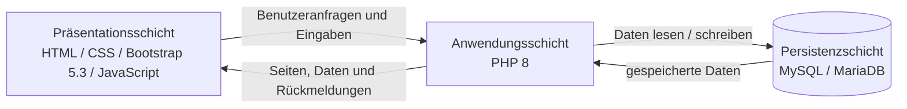
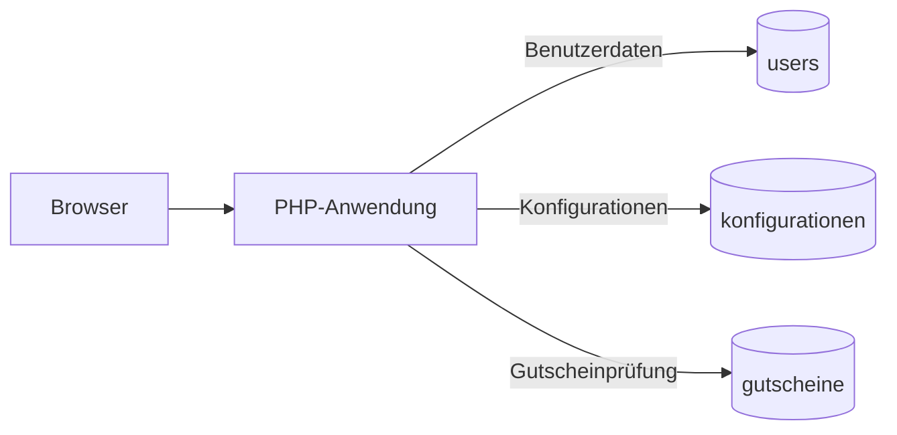

# 4 — Lösungsstrategie

Dieses Kapitel beschreibt die grundlegende Lösungsstrategie des **Pizza Trackers**. Es zeigt, mit welchen architektonischen Ansätzen die funktionalen und nichtfunktionalen Anforderungen umgesetzt werden.

Die Lösungsstrategie basiert insbesondere auf:

* [P1 — Ziele und Rahmenbedingungen](../spec/P1-ziele-rahmenbedingungen.md)
* [P2 — Architekturüberblick](../spec/P2-architekturueberblick.md)
* [F1 — Geschäftsprozesse](../spec/F1-geschaeftsprozesse.md)
* [F2 — Anwendungsfälle](../spec/F2-anwendungsfaelle.md)
* [F3 — Anwendungsfunktionen](../spec/F3-anwendungsfunktionen.md)
* [D1 — Datenmodell](../spec/D1-datenmodell.md)
* [D2 — Datentypenverzeichnis](../spec/D2-datentypen.md)
* [B1 — Dialogspezifikation](../spec/B1-dialogspezifikation.md)
* [N1 — Nichtfunktionale Anforderungen](../spec/N1-nichtfunktional.md)
* [N2 — Querschnittskonzepte](../spec/N2-querschnittskonzepte.md)
* [S3 — Inbetriebnahme](../spec/S3-inbetriebnahme.md)

Die Lösungsstrategie beschreibt bewusst noch keine konkreten PHP-Dateien, Klassen oder Funktionen. Die tatsächliche Zerlegung der Implementierung wird in **A05 — Bausteinsicht** beschrieben und mit dem Quellcode abgeglichen.

---

## 4.1 Architektonischer Grundansatz

Der Pizza Tracker wird als **dreischichtige Webanwendung** umgesetzt.

Die drei Schichten sind:

1. Präsentationsschicht
2. Anwendungsschicht
3. Persistenzschicht

Die Trennung der Schichten unterstützt insbesondere:

* klare Verantwortlichkeiten
* nachvollziehbare Struktur
* Trennung von Benutzeroberfläche und Datenhaltung
* einfachere Wartung und Weiterentwicklung
* kontrollierten Zugriff auf persistente Daten

Der Browser greift nicht direkt auf die Datenbank zu. Der Zugriff erfolgt über die serverseitige Anwendungsschicht.

---

## 4.2 Strategie der Benutzeroberfläche

Der Pizza Tracker wird als klassische Webanwendung mit mehreren Dialogen beziehungsweise Seiten umgesetzt.

Die zentralen Dialoge sind:

* Startseite
* Konfigurator
* Anmeldung
* Registrierung
* „Meine Pizzen“

Diese Dialogstruktur entspricht der [B1 — Dialogspezifikation](../spec/B1-dialogspezifikation.md).

Die Navigation berücksichtigt den Anmeldestatus des Nutzers. Gäste und angemeldete Nutzer sehen daher teilweise unterschiedliche Navigationsmöglichkeiten. Insbesondere steht „Meine Pizzen“ nur angemeldeten Nutzern zur Verfügung.

Für Darstellung und Interaktion werden verwendet:

* HTML
* CSS
* Bootstrap 5.3
* JavaScript

Bootstrap unterstützt insbesondere die Anforderung einer auf unterschiedlichen Bildschirmgrößen nutzbaren Oberfläche.

JavaScript wird für unmittelbare Interaktionen innerhalb der Oberfläche eingesetzt. Die Spezifikation verlangt beispielsweise, dass Preis und Kalorien nach Änderungen der Pizza-Konfiguration direkt aktualisiert werden.

Die konkrete Aufteilung der Berechnungslogik zwischen Browser und Server wird anhand der tatsächlichen Implementierung in den folgenden Architekturkapiteln dokumentiert.

---

## 4.3 Strategie der Anwendungslogik

Die serverseitige Anwendungslogik wird mit **PHP 8** umgesetzt.

Sie bildet die Verbindung zwischen Benutzeroberfläche und Datenhaltung und verarbeitet insbesondere fachliche Vorgänge wie:

* Registrierung
* Anmeldung und Abmeldung
* Prüfung des Benutzerstatus
* Prüfung geschützter Funktionen
* Verarbeitung von Pizza-Konfigurationen
* Gutscheinprüfung
* Speicherung von Konfigurationen
* Laden gespeicherter Konfigurationen
* Löschen gespeicherter Konfigurationen
* Datenbankzugriffe

Damit wird verhindert, dass die Benutzeroberfläche unmittelbar auf persistente Daten zugreift.

Die konkrete Zerlegung dieser Verantwortlichkeiten in einzelne Softwarebausteine wird in **A05 — Bausteinsicht** beschrieben.

---

## 4.4 Strategie für Pizza-Konfiguration, Preis und Kalorien

Die Pizza-Konfiguration ist der fachliche Kern des Systems.

Der Nutzer kann insbesondere folgende Bestandteile auswählen:

* Größe
* Teig
* Sauce
* Käse
* Beläge
* Extras

Die zulässigen fachlichen Werte für zentrale Auswahlbereiche wie Größe, Teig, Sauce und Käse werden im [D2 — Datentypenverzeichnis](../spec/D2-datentypen.md) festgelegt.

Architektur und Implementierung sollen dieselben fachlichen Bezeichnungen verwenden, damit die Werte zwischen Spezifikation, Benutzeroberfläche, Anwendungslogik und Datenhaltung konsistent bleiben.

Nach Änderungen der Konfiguration werden Preis und Kalorien unmittelbar aktualisiert und dem Nutzer angezeigt.

Für die Preisberechnung werden die gewählten Bestandteile sowie mögliche Aufpreise berücksichtigt. Ein gültiger Gutschein reduziert anschließend den berechneten Preis entsprechend dem hinterlegten prozentualen Rabatt.

Die Kalorienanzeige basiert auf den Kalorienwerten der ausgewählten Bestandteile.

Diese Strategie unterstützt insbesondere:

* [UC01 — Pizza konfigurieren](../spec/F2-anwendungsfaelle.md#uc01--pizza-konfigurieren)
* [UC02 — Preis berechnen](../spec/F2-anwendungsfaelle.md#uc02--preis-berechnen)
* [UC03 — Kalorien berechnen](../spec/F2-anwendungsfaelle.md#uc03--kalorien-berechnen)

---

## 4.5 Strategie für Gutscheine und Rabatte

Die Gutscheinprüfung wird als eigenständiger fachlicher Verarbeitungsvorgang behandelt.

Bei der Einlösung eines Gutscheincodes wird geprüft:

1. ob der Code vorhanden ist,
2. ob der Gutschein aktiv ist,
3. ob der Gutschein noch gültig ist,
4. welcher prozentuale Rabatt anzuwenden ist.

Nur ein gültiger Gutschein beeinflusst den Endpreis.

Bei einer fehlgeschlagenen Prüfung wird kein Rabatt angewendet und der Nutzer erhält eine verständliche Rückmeldung.

Die persistierten Gutscheindaten enthalten laut Datenmodell insbesondere:

* Gutscheincode
* prozentualen Rabatt
* Aktiv-Status
* optionales Gültigkeitsdatum

Eine gespeicherte Pizza-Konfiguration kann zusätzlich den verwendeten Gutscheincode enthalten.

Die genaue fachliche Prüfreihenfolge ist in [F3 — Anwendungsfunktionen](../spec/F3-anwendungsfunktionen.md) beschrieben.

---

## 4.6 Authentifizierungs- und Berechtigungsstrategie

Die Authentifizierung erfolgt gemäß [P2 — Architekturüberblick](../spec/P2-architekturueberblick.md) **session-basiert**.

Nach erfolgreicher Anmeldung bleibt der Benutzerstatus während der Nutzung erhalten.

Das System unterscheidet zwischen:

* Gast
* angemeldetem Nutzer

Bestimmte Funktionen dürfen ausschließlich angemeldeten Nutzern zur Verfügung stehen.

Dazu gehören insbesondere:

* Konfiguration speichern
* „Meine Pizzen“ anzeigen
* gespeicherte Konfiguration erneut laden
* eigene Konfiguration löschen
* Abmelden

Gespeicherte Konfigurationen werden einem Benutzerkonto zugeordnet.

Ein Nutzer darf nur auf seine eigenen gespeicherten Konfigurationen zugreifen, diese erneut laden oder löschen.

---

## 4.7 Validierungs- und Sicherheitsstrategie

Eingaben werden vor der Verarbeitung auf Vollständigkeit und Gültigkeit geprüft.

Dazu gehören insbesondere:

* Prüfung von Pflichtfeldern
* Prüfung des E-Mail-Formats
* Prüfung, ob eine E-Mail-Adresse bereits registriert ist
* Prüfung von Gutscheincodes
* Prüfung des Anmeldestatus
* Prüfung, ob eine gespeicherte Konfiguration dem angemeldeten Nutzer gehört

Ungültige Eingaben oder nicht erlaubte Aktionen werden nicht verarbeitet.

Passwörter dürfen gemäß NFA02 nicht im Klartext gespeichert werden.

Gemäß NFA03 muss die Anwendung außerdem gegen das Einschleusen schädlicher Eingaben geschützt werden.

Die konkrete technische Umsetzung dieser Sicherheitsmaßnahmen wird erst nach Abgleich mit der tatsächlichen Implementierung in **A08 — Querschnittliche Konzepte** beschrieben.

---

## 4.8 Strategie für Fehlerbehandlung und Benutzerfeedback

Fehler und ungültige Eingaben sollen einheitlich und verständlich behandelt werden.

Fehlermeldungen werden direkt im jeweils betroffenen Dialog angezeigt, damit der Nutzer seine Eingabe korrigieren und den Vorgang erneut versuchen kann.

Typische Fehlerfälle sind beispielsweise:

* ungültiger Gutscheincode
* abgelaufener Gutschein
* bereits registrierte E-Mail-Adresse
* ungültige Registrierungsdaten
* falsche Zugangsdaten
* fehlende Pflichtfelder
* fehlende Anmeldung
* unzulässiger Zugriff auf fremde Konfigurationen

Ungültige Aktionen werden nicht ausgeführt.

Erfolgreiche Aktionen sollen ebenfalls verständlich bestätigt werden.

Unwiderrufliche Aktionen werden zusätzlich abgesichert. Das Löschen einer gespeicherten Konfiguration erfordert beispielsweise eine Bestätigung durch den Nutzer.

---

## 4.9 Persistenzstrategie

Für die persistente Datenhaltung wird **MySQL beziehungsweise MariaDB** eingesetzt.

Das Datenmodell enthält drei zentrale Entitäten:

### Benutzer (`users`)

Speichert die registrierten Benutzerkonten und die zugehörigen Benutzerdaten.

### Konfigurationen (`konfigurationen`)

Speichert die Pizza-Konfigurationen angemeldeter Nutzer.

Jede Konfiguration besitzt eine `user_id` und ist damit genau einem Benutzer zugeordnet.

Zwischen `users` und `konfigurationen` besteht eine **1:N-Beziehung**:

> Ein Benutzer kann mehrere Konfigurationen speichern, eine gespeicherte Konfiguration gehört genau einem Benutzer.

### Gutscheine (`gutscheine`)

Speichert die für die Gutscheinprüfung benötigten Informationen.

Dazu gehören insbesondere:

* Code
* prozentualer Rabatt
* Aktiv-Status
* Gültigkeitsdatum

Eine Konfiguration kann zusätzlich den verwendeten Gutscheincode als Information speichern.

Die konkrete technische Repräsentation mehrwertiger Eigenschaften wie `belaege` und `extras` wird anhand der tatsächlichen Datenbankimplementierung dokumentiert.

Der Browser besitzt keinen direkten Datenbankzugriff.

---

## 4.10 Strategie für gespeicherte Konfigurationen

Angemeldete Nutzer können eigene Pizza-Konfigurationen dauerhaft speichern.

Eine gespeicherte Konfiguration enthält gemäß Datenmodell unter anderem:

* Name
* Größe
* Teig
* Sauce
* Käse
* Beläge
* Extras
* gegebenenfalls verwendeten Gutscheincode
* Preis
* Speicherzeitpunkt

Die gespeicherte Konfiguration wird dem aktuell angemeldeten Benutzer zugeordnet.

Im Dialog „Meine Pizzen“ kann der Nutzer seine gespeicherten Konfigurationen:

* anzeigen,
* erneut in den Konfigurator laden,
* weiter bearbeiten,
* löschen.

Vor dem Löschen muss geprüft werden, ob die Konfiguration tatsächlich dem angemeldeten Nutzer gehört.

---

## 4.11 Strategie für den lokalen Betrieb

Der Pizza Tracker ist für einen **lokalen Betrieb** vorgesehen.

Als Betriebsumgebung werden XAMPP beziehungsweise MAMP verwendet.

Für die Inbetriebnahme werden mindestens benötigt:

* der Quellcode des Pizza Trackers
* eine geeignete lokale Webserver- und PHP-Umgebung
* eine MySQL-/MariaDB-Datenbank
* ein aktueller Webbrowser
* die erforderlichen Ausgangs- und Testdaten

Vor der Nutzung müssen insbesondere benötigte Daten für folgende Bereiche vorhanden sein:

* Zutaten
* Preise
* Kalorienwerte
* Gutscheincodes
* Rabatte

Im Rahmen der Inbetriebnahme werden insbesondere folgende Funktionen geprüft:

* Registrierung und Anmeldung
* Pizza-Konfiguration
* Preisberechnung
* Kalorienberechnung
* Gutscheinprüfung
* Speicherung und Verwaltung eigener Konfigurationen

Die fachlichen Anforderungen an die Inbetriebnahme sind in [S3 — Inbetriebnahme](../spec/S3-inbetriebnahme.md) beschrieben.

---

## 4.12 Bezug zu den Qualitätszielen

Die gewählte Lösungsstrategie unterstützt die in A01 und N1 beschriebenen Qualitätsziele.

| Qualitätsziel               | Beitrag der Lösungsstrategie                                                                                                            |
| --------------------------- | --------------------------------------------------------------------------------------------------------------------------------------- |
| **Sicherheit**              | Session-basierte Zugriffskontrolle, Eingabevalidierung, kein Klartext-Passwort und Beschränkung des Zugriffs auf eigene Konfigurationen |
| **Funktionale Korrektheit** | Klare fachliche Verarbeitung von Pizza-Konfiguration, Preis, Kalorien und Gutscheinen                                                   |
| **Benutzbarkeit**           | Strukturierte Dialoge, Bootstrap-basierte Oberfläche und verständliche Rückmeldungen                                                    |
| **Performance**             | Preis und Kalorien werden während der Konfiguration unmittelbar aktualisiert                                                            |
| **Kompatibilität**          | Webbasierter Ansatz für aktuelle gängige Browser                                                                                        |
| **Betreibbarkeit**          | Lokale Betriebsumgebung mit PHP, MySQL/MariaDB und XAMPP beziehungsweise MAMP                                                           |

---

## 4.13 Zusammenfassung

| Bereich           | Lösungsstrategie                                                   |
| ----------------- | ------------------------------------------------------------------ |
| Architektur       | Dreischichtige Webanwendung                                        |
| Präsentation      | HTML, CSS, Bootstrap 5.3 und JavaScript                            |
| Dialogstruktur    | Startseite, Konfigurator, Anmeldung, Registrierung, „Meine Pizzen“ |
| Backend           | PHP 8                                                              |
| Persistenz        | MySQL / MariaDB                                                    |
| Authentifizierung | Session-basiert                                                    |
| Zugriffsschutz    | Benutzerstatus und Eigentümerschaft gespeicherter Daten            |
| Preis / Kalorien  | Unmittelbare Aktualisierung während der Konfiguration              |
| Gutscheine        | Prüfung auf Existenz, Aktivität und Gültigkeit                     |
| Validierung       | Prüfung von Pflichtfeldern und fachlich ungültigen Eingaben        |
| Fehlerbehandlung  | Verständliche Rückmeldung direkt im betroffenen Dialog             |
| Betrieb           | Lokal mit XAMPP beziehungsweise MAMP                               |
| Versionskontrolle | Git / GitHub                                                       |

Diese Lösungsstrategie bildet die Grundlage für **A05 — Bausteinsicht**.

Dort wird die abstrakte Lösungsstrategie auf konkrete Softwarebausteine des Pizza Trackers abgebildet und anschließend mit der tatsächlichen Projektstruktur und Implementierung abgeglichen.

Wesentliche technische Entscheidungen werden zusätzlich in **A09 — Architekturentscheidungen** als ADRs mit Kontext, Alternativen, Begründung und Konsequenzen dokumentiert.
