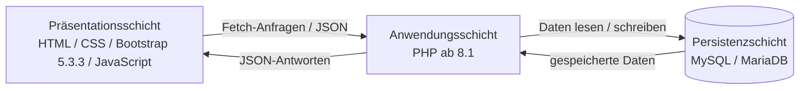
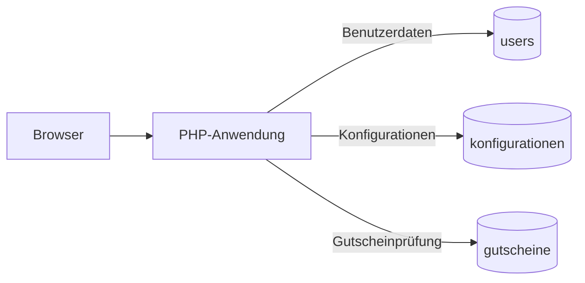

# 4 — Lösungsstrategie

Dieses Kapitel beschreibt die grundlegende Lösungsstrategie des **Pizza Trackers**. Es zeigt, mit welchen architektonischen Ansätzen die funktionalen und nichtfunktionalen Anforderungen umgesetzt werden.

Die Lösungsstrategie basiert insbesondere auf:

* [P1 — Ziele und Rahmenbedingungen](../spec/P1-ziele-rahmenbedingungen.md)
* [P2 — Architekturüberblick](../spec/P2-architekturueberblick.md)
* [F1 — Geschäftsprozesse](../spec/F1-geschaeftsprozesse.md)
* [F2 — Anwendungsfälle](../spec/F2-anwendungsfaelle.md)
* [F3 — Anwendungsfunktionen](../spec/F3-anwendungsfunktionen.md)
* [D1 — Datenmodell](../spec/D1-datenmodell.md)
* [D2 — Datentypenverzeichnis](../spec/D2-datentypen.md)
* [B1 — Dialogspezifikation](../spec/B1-dialogspezifikation.md)
* [N1 — Nichtfunktionale Anforderungen](../spec/N1-nichtfunktional.md)
* [N2 — Querschnittskonzepte](../spec/N2-querschnittskonzepte.md)
* [S3 — Inbetriebnahme](../spec/S3-inbetriebnahme.md)

Die Lösungsstrategie beschreibt die grundlegenden architektonischen Ansätze und Verantwortlichkeiten des Systems. Konkrete Implementierungsdateien und Funktionen werden nur punktuell genannt, wenn sie zur nachvollziehbaren Begründung einer Strategie oder zum Abgleich mit dem vorliegenden Stand erforderlich sind. Die vollständige Zerlegung der Implementierung in Softwarebausteine wird in **A05 — Bausteinsicht** beschrieben.

---

## 4.1 Architektonischer Grundansatz

Der Pizza Tracker wird als **dreischichtige Webanwendung** umgesetzt.

Die drei Schichten sind:

1. Präsentationsschicht
2. Anwendungsschicht
3. Persistenzschicht

Die Trennung der Schichten unterstützt insbesondere:

* klare Verantwortlichkeiten
* nachvollziehbare Struktur
* Trennung von Benutzeroberfläche und Datenhaltung
* einfachere Wartung und Weiterentwicklung
* kontrollierten Zugriff auf persistente Daten

Der Browser greift nicht direkt auf die Datenbank zu. Der Zugriff erfolgt über die serverseitige Anwendungsschicht. Die HTML-, CSS-, JavaScript- und JSON-Dateien werden als statische Projektdateien vom lokalen Webserver ausgeliefert; die PHP-Endpunkte bilden die JSON-basierte API für serverseitige Vorgänge.

---

## 4.2 Strategie der Benutzeroberfläche

Der Pizza Tracker wird als klassische Webanwendung mit mehreren Dialogen beziehungsweise Seiten umgesetzt.

Die zentralen Dialoge sind:

* Startseite
* Konfigurator
* Anmeldung
* Registrierung
* „Meine Pizzen“
* Informationsseite „Allergene & Inhaltsstoffe“

Diese Dialogstruktur entspricht der [B1 — Dialogspezifikation](../spec/B1-dialogspezifikation.md). Die Informationsseite ist dort als eigener Informationsdialog erfasst.

Die Navigation berücksichtigt den Anmeldestatus des Nutzers. Gäste und angemeldete Nutzer sehen daher teilweise unterschiedliche Navigationsmöglichkeiten. Insbesondere steht „Meine Pizzen“ in der Navigation nur angemeldeten Nutzern zur Verfügung.

Für Darstellung und Interaktion werden verwendet:

* HTML
* CSS
* Bootstrap 5.3.3
* JavaScript

Bootstrap 5.3.3 wird für Layout, responsive Rasterstrukturen und wiederverwendbare Oberflächenelemente eingesetzt. Im aktuellen Stand wird die Bibliothek über `cdn.jsdelivr.net` geladen. Ohne vorhandenen Browsercache besteht deshalb beim Laden eine Internetabhängigkeit; dieses Risiko wird in A11 dokumentiert.

JavaScript übernimmt im Konfigurator die unmittelbare Aktualisierung der angezeigten Werte. Beim Speichern einer Konfiguration werden die relevanten Werte serverseitig erneut aus den übermittelten Konfigurationsdaten bestimmt. Die genaue Verantwortungsverteilung wird in A05 und A06 beschrieben.

---

## 4.3 Strategie der Anwendungslogik

Die serverseitige Anwendungslogik wird mit **PHP ab 8.1** umgesetzt.

Die Verantwortung ist im aktuellen Stand zwischen Browser und Server geteilt. JavaScript übernimmt die unmittelbare Konfigurator-Interaktion und die Live-Anzeige. PHP übernimmt die serverseitig maßgeblichen Prüfungen, die Verarbeitung geschützter Funktionen und sämtliche direkten Datenbankzugriffe. Dazu gehören insbesondere:

* Registrierung
* Anmeldung und Abmeldung
* Prüfung des Benutzerstatus
* Prüfung geschützter Funktionen
* Validierung und Normalisierung einer Konfiguration beim Speichern
* erneute serverseitige Berechnung von Preis und Kalorien beim Speichern
* Gutscheinprüfung
* Speicherung von Konfigurationen
* Laden gespeicherter Konfigurationen
* Löschen gespeicherter Konfigurationen
* Datenbankzugriffe

Damit wird verhindert, dass die Benutzeroberfläche unmittelbar auf persistente Daten zugreift oder einen selbst übermittelten Preis als verbindlich speichern kann.

Die konkrete Zerlegung dieser Verantwortlichkeiten in einzelne Softwarebausteine wird in **A05 — Bausteinsicht** beschrieben.

---

## 4.4 Strategie für Pizza-Konfiguration, Preis und Kalorien

Die Pizza-Konfiguration ist der fachliche Kern des Systems.

Der Nutzer kann insbesondere folgende Bestandteile auswählen:

* Größe
* Teig
* Sauce
* Käse
* Beläge
* Extras

Die zulässigen fachlichen Werte für zentrale Auswahlbereiche wie Größe, Teig, Sauce und Käse werden im [D2 — Datentypenverzeichnis](../spec/D2-datentypen.md) festgelegt. Technische Quelle der auswählbaren Optionen und ihrer Preis-, Kalorien- und Nährwertwerte ist `data/pizza_data.json`.

Nach Änderungen der Konfiguration berechnet `js/konfigurator.js` Preis, Kalorien und Makronährwerte unmittelbar im Browser und aktualisiert die Anzeige ohne zusätzlichen API-Aufruf. Ein gültiger Gutschein reduziert dabei nur den angezeigten Preis; Kalorien und Nährwerte bleiben unverändert.

Beim Speichern behandelt der Server diese Browserwerte nicht als verbindlich. `api/save_config.php` normalisiert und validiert die Auswahl. Preis und Kalorien werden anschließend mit `calculatePizzaTotals()` serverseitig erneut aus `data/pizza_data.json` berechnet. Persistiert wird der serverseitig berechnete Preis; Kalorien und Makronährwerte werden nicht in `konfigurationen` gespeichert.

Die Rundung von Rabatt und Endpreis ist im Browser und im Backend derzeit nicht vollständig identisch. Bis zur Behebung ist der beim Speichern serverseitig berechnete Preis maßgeblich; die Abweichung ist als R-02 in A11 dokumentiert.

Diese Strategie unterstützt insbesondere:

* [UC01 — Pizza konfigurieren](../spec/F2-anwendungsfaelle.md#uc01--pizza-konfigurieren)
* [UC02 — Preis berechnen](../spec/F2-anwendungsfaelle.md#uc02--preis-berechnen)
* [UC03 — Kalorien berechnen](../spec/F2-anwendungsfaelle.md#uc03--kalorien-berechnen)

---

## 4.5 Strategie für Gutscheine und Rabatte

Die Gutscheinprüfung wird als eigenständiger fachlicher Verarbeitungsvorgang behandelt.

Die interaktive Gutscheinprüfung erfolgt serverseitig über `api/coupon.php` und die gemeinsame Funktion `validateCoupon()`. Der API-Endpunkt lehnt ein leeres Gutscheinfeld ab. Beim Speichern darf dagegen kein Gutscheincode vorhanden sein; `validateCoupon()` behandelt einen leeren Code in diesem Fall als „kein Gutschein“ mit 0 % Rabatt.

Bei einem angegebenen Gutscheincode wird geprüft:

1. ob der Code in `gutscheine` existiert,
2. ob der Gutschein aktiv ist,
3. ob der Gutschein noch gültig ist,
4. bei `WELCOME` zusätzlich, ob der Nutzer angemeldet ist und in seinen aktuell gespeicherten Konfigurationen bereits `WELCOME` vorkommt,
5. welcher prozentuale Rabatt anzuwenden ist.

Nur ein serverseitig bestätigter Gutschein beeinflusst den Endpreis. Wird ein geprüfter Code abgelehnt oder tritt bei der Gutscheinprüfung ein Verbindungsfehler auf, setzt der Konfigurator den aktiven Gutschein zurück und aktualisiert den angezeigten Preis ohne Rabatt.

Zwei bekannte Grenzen dürfen dabei nicht als bereits gelöst dargestellt werden: Die derzeitige `WELCOME`-Prüfung verliert ihren Nutzungsnachweis, wenn die betreffende Konfiguration gelöscht wird (A11, R-03). Außerdem setzt die bloße erneute Prüfung eines leeren Gutscheinfelds einen zuvor aktiven Gutschein aktuell nicht zurück (A11, R-06).

Die persistierten Gutscheindaten enthalten insbesondere:

* Gutscheincode
* prozentualen Rabatt
* Aktiv-Status
* optionales Gültigkeitsdatum

Eine gespeicherte Pizza-Konfiguration kann zusätzlich den verwendeten Gutscheincode enthalten.

Die genaue fachliche Prüfreihenfolge ist in [F3 — Anwendungsfunktionen](../spec/F3-anwendungsfunktionen.md) beschrieben.

---

## 4.6 Authentifizierungs- und Berechtigungsstrategie

Die Authentifizierung erfolgt gemäß [P2 — Architekturüberblick](../spec/P2-architekturueberblick.md) **session-basiert**.

Nach erfolgreicher Anmeldung oder Registrierung wird eine PHP-Session für den Nutzer geführt. `api/session.php` stellt dem Frontend den aktuellen Anmeldestatus bereit; `js/auth.js` passt daraufhin Navigation und sichtbare Funktionen an.

Das System unterscheidet zwischen:

* Gast
* angemeldetem Nutzer

Geschützte serverseitige Vorgänge verlangen eine aktive Session. Dazu gehören insbesondere:

* Konfiguration speichern
* eigene gespeicherte Konfigurationen laden
* eigene Konfiguration löschen

Die Seite „Meine Pizzen“ kann technisch direkt aufgerufen werden; ohne aktive Session liefert der zugehörige Datenendpunkt jedoch keine Konfigurationen, sondern eine nicht autorisierte Antwort. Der Speichern-Button wird für Gäste zusätzlich im Frontend ausgeblendet.

Gespeicherte Konfigurationen werden einem Benutzerkonto zugeordnet. `load_configs.php` lädt nur Datensätze der aktiven `user_id`; `delete_config.php` löscht nur dann, wenn sowohl Konfigurations-ID als auch `user_id` der aktiven Session übereinstimmen.

---

## 4.7 Validierungs- und Sicherheitsstrategie

Validierung und Schutzmaßnahmen werden überwiegend serverseitig umgesetzt und durch Frontend-Prüfungen ergänzt.

Zu den tatsächlich implementierten Prüfungen gehören insbesondere:

* Prüfung von Pflichtfeldern bei der Registrierung
* Prüfung des E-Mail-Formats
* Prüfung, ob eine E-Mail-Adresse bereits registriert ist
* Mindestlänge des Passworts
* Prüfung der Passwortbestätigung, sofern sie an den Server übermittelt wird
* Normalisierung und Prüfung der auswählbaren Pizza-Werte gegen `data/pizza_data.json`
* Prüfung von Gutscheincodes
* Prüfung des Anmeldestatus für geschützte API-Endpunkte
* Begrenzung des Ladens und Löschens von Konfigurationen auf die aktive `user_id`

Passwörter werden bei der Registrierung mit `password_hash(..., PASSWORD_BCRYPT)` gehasht und beim Login mit `password_verify()` geprüft. Sie werden nicht im Klartext in der Datenbank gespeichert.

Die Datenbankzugriffe erfolgen über PDO Prepared Statements; emulierte Prepared Statements sind deaktiviert. Dadurch werden SQL-Befehle und übergebene Werte getrennt verarbeitet.

Die PHP-Session setzt das Cookie mit `HttpOnly` und `SameSite=Lax`; `Secure` wird gesetzt, wenn die Anwendung über HTTPS läuft. Nach erfolgreicher Anmeldung und Registrierung wird die Session-ID erneuert.

Beim Rendern gespeicherter Konfigurationen maskiert `js/meine-pizzen.js` dynamische Textwerte mit `escapeHtml()`. Diese einzelnen Maßnahmen reduzieren konkrete Risiken, stellen aber für sich allein keinen Nachweis vollständiger Anwendungssicherheit dar. Die technischen Details und Grenzen werden in **A08 — Querschnittliche Konzepte** dokumentiert.

---

## 4.8 Strategie für Fehlerbehandlung und Benutzerfeedback

Erwartete Fehler und ungültige Eingaben werden über die API grundsätzlich als JSON-Antworten mit passenden HTTP-Statuscodes zurückgegeben. In den zentralen Dialogen für Anmeldung, Registrierung, Gutscheinprüfung und Speichern werden diese Rückmeldungen im jeweiligen Kontext angezeigt.

Die Fehlerbehandlung ist im aktuellen Stand jedoch noch nicht vollständig vereinheitlicht. Insbesondere unerwartete Serverfehler sowie Netzwerk- und JSON-Fehler werden nicht in jedem Frontend-Ablauf gleich behandelt. Diese Einschränkung ist in A11 als R-04 beziehungsweise S-04 dokumentiert.

Typische serverseitig behandelte Fehlerfälle sind beispielsweise:

* ungültiger Gutscheincode
* abgelaufener Gutschein
* bereits registrierte E-Mail-Adresse
* ungültige Registrierungsdaten
* falsche Zugangsdaten
* fehlende Pflichtfelder
* fehlende Anmeldung
* ungültige oder nicht dem Nutzer zugeordnete Konfigurations-ID

Serverseitig erkannte ungültige oder nicht autorisierte Aktionen werden abgewiesen. Erfolgreiche Aktionen werden abhängig vom Ablauf durch eine Rückmeldung oder eine aktualisierte Ansicht sichtbar gemacht.

Unwiderrufliche Aktionen werden zusätzlich im Frontend abgesichert. Das Löschen einer gespeicherten Konfiguration erfordert beispielsweise eine Bestätigung durch den Nutzer; der Löschendpunkt begrenzt die Operation zusätzlich auf die `user_id` der aktiven Session.

---

## 4.9 Persistenzstrategie

Für die persistente Datenhaltung wird **MySQL beziehungsweise MariaDB** eingesetzt.

Das Datenmodell enthält drei zentrale Tabellen:

### Benutzer (`users`)

Speichert registrierte Benutzerkonten und die zugehörigen Benutzerdaten. Das Passwortfeld enthält den erzeugten Passwort-Hash.

### Konfigurationen (`konfigurationen`)

Speichert Pizza-Konfigurationen angemeldeter Nutzer.

Jede Konfiguration besitzt eine `user_id` und ist damit genau einem Benutzer zugeordnet. Zwischen `users` und `konfigurationen` besteht eine **1:N-Beziehung**:

> Ein Benutzer kann mehrere Konfigurationen speichern, eine gespeicherte Konfiguration gehört genau einem Benutzer.

Der Fremdschlüssel `fk_konfigurationen_user` ist mit `ON DELETE CASCADE` definiert. Wird ein Benutzer auf Datenbankebene gelöscht, werden damit auch seine zugehörigen Konfigurationen entfernt.

Die mehrwertigen Eigenschaften `belaege` und `extras` werden als JSON in der Tabelle `konfigurationen` gespeichert. Beim Speichern werden die PHP-Arrays mit `json_encode()` serialisiert; beim Laden werden sie mit `json_decode()` wieder in Arrays umgewandelt.

### Gutscheine (`gutscheine`)

Speichert die für die Gutscheinprüfung benötigten Informationen:

* Code
* prozentualer Rabatt
* Aktiv-Status
* optionales Gültigkeitsdatum

`konfigurationen.gutschein_code` ist ein optionales `VARCHAR`-Feld und kein Fremdschlüssel auf `gutscheine`. Es hält den beim Speichern verwendeten Gutscheincode als Information fest.

Der Browser besitzt keinen direkten Datenbankzugriff.

---

## 4.10 Strategie für gespeicherte Konfigurationen

Angemeldete Nutzer können eigene Pizza-Konfigurationen dauerhaft speichern.

Eine gespeicherte Konfiguration enthält unter anderem:

* Name
* Größe
* Teig
* Sauce
* Käse
* Beläge
* Extras
* gegebenenfalls verwendeten Gutscheincode
* serverseitig berechneten Preis
* Speicherzeitpunkt

Die gespeicherte Konfiguration wird dem aktuell angemeldeten Benutzer zugeordnet.

Im Dialog „Meine Pizzen“ werden die eigenen Datensätze über `api/load_configs.php` geladen und als Karten angezeigt. Die Aktion „Erneut bearbeiten“ überträgt die Daten der ausgewählten Konfiguration über `sessionStorage` in den Konfigurator.

Dieser Ablauf ist im aktuellen Stand **kein echtes Aktualisieren eines bestehenden Datensatzes**. `api/save_config.php` führt beim Speichern immer ein `INSERT` aus. Wird eine erneut geladene Pizza verändert und gespeichert, bleibt daher der ursprüngliche Datensatz bestehen und es entsteht eine neue Konfiguration. Diese technische Schuld ist in A11 als S-02 dokumentiert.

Außerdem stellt `applyConfig()` beim erneuten Bearbeiten Größe, Teig, Sauce, Käse, Beläge, Extras und Namen wieder her, aktiviert einen zuvor gespeicherten `gutschein_code` jedoch nicht automatisch erneut. Preis und Nährwerte werden anhand der aktuell geladenen Fachdaten neu angezeigt.

Das Löschen erfolgt über `api/delete_config.php`. Der Server verwendet dabei sowohl die übermittelte Konfigurations-ID als auch die `user_id` der aktiven Session, sodass ein Nutzer über diesen Endpunkt nur eigene Konfigurationen löschen kann.

---

## 4.11 Strategie für den lokalen Betrieb

Der Pizza Tracker ist für einen **lokalen Betrieb** vorgesehen.

Als primär dokumentierte Betriebsumgebung wird XAMPP verwendet. MAMP ist als Alternative vorgesehen, benötigt je nach Standardeinstellung angepasste Datenbankparameter und ist im vorliegenden Repository nicht durch ein eigenes Testprotokoll nachgewiesen.

Für die Inbetriebnahme werden mindestens benötigt:

* der Quellcode des Pizza Trackers
* eine lokale Webserver- und PHP-Umgebung mit PHP ab 8.1
* PDO mit MySQL-Treiber
* die von der Implementierung verwendete `mbstring`-Erweiterung
* eine MySQL-/MariaDB-Datenbank
* ein aktueller Webbrowser
* die statischen Fachdaten aus `data/pizza_data.json`
* das Datenbankschema aus `database/schema.sql`

`pizza_data.json` enthält die im Konfigurator verwendeten Optionen sowie Preis-, Kalorien- und Nährwertwerte. `schema.sql` legt die Datenbanktabellen an und enthält die vorgesehenen Gutschein-Testdaten.

Die Standardwerte der Datenbankverbindung sind auf eine typische XAMPP-Konfiguration ausgerichtet (`127.0.0.1`, Port `3306`, Datenbank `pizza_tracker`, Benutzer `root`, leeres Passwort). Abweichende Werte können über die vorgesehenen `PIZZA_DB_*`-Umgebungsvariablen gesetzt werden.

Für die Abnahme sind insbesondere folgende Funktionen praktisch zu prüfen:

* Registrierung und Anmeldung
* Pizza-Konfiguration
* Preisberechnung
* Kalorienberechnung
* Gutscheinprüfung
* Speicherung und Verwaltung eigener Konfigurationen

Die fachlichen Anforderungen an die Inbetriebnahme sind in [S3 — Inbetriebnahme](../spec/S3-inbetriebnahme.md) beschrieben. Die konkreten Qualitäts- und Testszenarien werden in A10 festgehalten; ihre erfolgreiche Durchführung darf erst nach einem tatsächlich protokollierten Test als nachgewiesen gelten.

---

## 4.12 Bezug zu den Qualitätszielen

Die gewählte Lösungsstrategie unterstützt die in A01 und N1 beschriebenen Qualitätsziele. Sie ersetzt jedoch nicht den praktischen Nachweis durch die vorgesehenen Tests.

| Qualitätsziel               | Beitrag der Lösungsstrategie |
| --------------------------- | ---------------------------- |
| **Sicherheit**              | Session-basierte Zugriffskontrolle, Passwort-Hashing, PDO Prepared Statements, serverseitige Validierung und Beschränkung des Datenzugriffs auf die aktive `user_id` |
| **Funktionale Korrektheit** | Gemeinsame Fachdatenquelle für Konfiguration sowie serverseitige Neuberechnung von Preis und Kalorien beim Speichern; bekannte Abweichungen sind in A11 dokumentiert |
| **Benutzbarkeit**           | Strukturierte Seiten, responsive Bootstrap-Oberfläche und kontextbezogene Rückmeldungen; bekannte Lücken der Fehlerbehandlung bleiben dokumentiert |
| **Performance**             | Preis, Kalorien und Nährwerte werden während der Konfiguration lokal im Browser aktualisiert und benötigen dafür keinen API-Aufruf |
| **Kompatibilität**          | Webbasierter Ansatz für aktuelle Browser; die tatsächlich getestete Browserabdeckung ist durch die praktischen Tests nachzuweisen |
| **Betreibbarkeit**          | Lokale Betriebsumgebung mit PHP ab 8.1, MySQL/MariaDB und primär XAMPP; MAMP bleibt eine alternative, separat zu prüfende Umgebung |

---

## 4.13 Zusammenfassung

| Bereich           | Lösungsstrategie |
| ----------------- | ---------------- |
| Architektur       | Dreischichtige Webanwendung |
| Präsentation      | HTML, CSS, Bootstrap 5.3.3 und JavaScript |
| Dialogstruktur    | Startseite, Konfigurator, Anmeldung, Registrierung, „Meine Pizzen“ und „Allergene & Inhaltsstoffe“ |
| Backend           | PHP ab 8.1 und JSON-basierte API-Endpunkte |
| Persistenz        | MySQL / MariaDB; Beläge und Extras als JSON innerhalb der Konfiguration |
| Authentifizierung | Session-basiert |
| Zugriffsschutz    | Serverseitige Session-Prüfung und Begrenzung gespeicherter Daten auf die aktive `user_id` |
| Preis / Kalorien  | Live-Berechnung im Browser; serverseitige Neuberechnung beim Speichern |
| Gutscheine        | Serverseitige Prüfung; bekannte Grenzen bei `WELCOME` und leerer erneuter Eingabe in A11 dokumentiert |
| Validierung       | Serverseitige Pflichtfeld-, Auswahl-, Gutschein-, Session- und Eigentumsprüfungen, ergänzt durch Frontend-Prüfungen |
| Fehlerbehandlung  | Erwartete API-Fehler mit JSON und HTTP-Statuscodes; bekannte Frontend- und Exception-Lücken in A11 dokumentiert |
| Gespeicherte Pizzen | Laden eigener Datensätze; „Erneut bearbeiten“ erzeugt beim späteren Speichern derzeit einen neuen Datensatz statt eines UPDATEs |
| Betrieb           | Lokal primär mit XAMPP; PHP ab 8.1 und MySQL/MariaDB |
| Versionskontrolle | Git / GitHub |

Diese Lösungsstrategie bildet die Grundlage für **A05 — Bausteinsicht**.

Dort wird die Lösungsstrategie auf konkrete Softwarebausteine des Pizza Trackers abgebildet und mit der tatsächlichen Projektstruktur und Implementierung abgeglichen.

Wesentliche technische Entscheidungen werden zusätzlich in **A09 — Architekturentscheidungen** als ADRs mit Kontext, Alternativen, Begründung und Konsequenzen dokumentiert.
