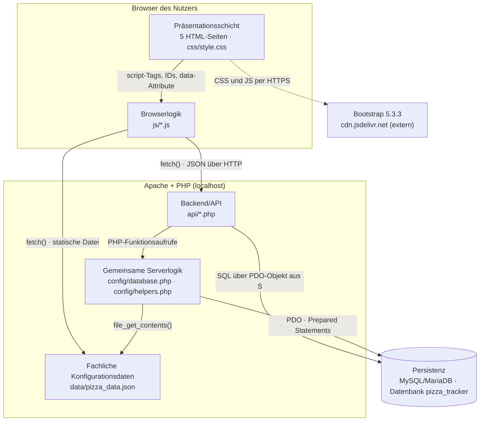
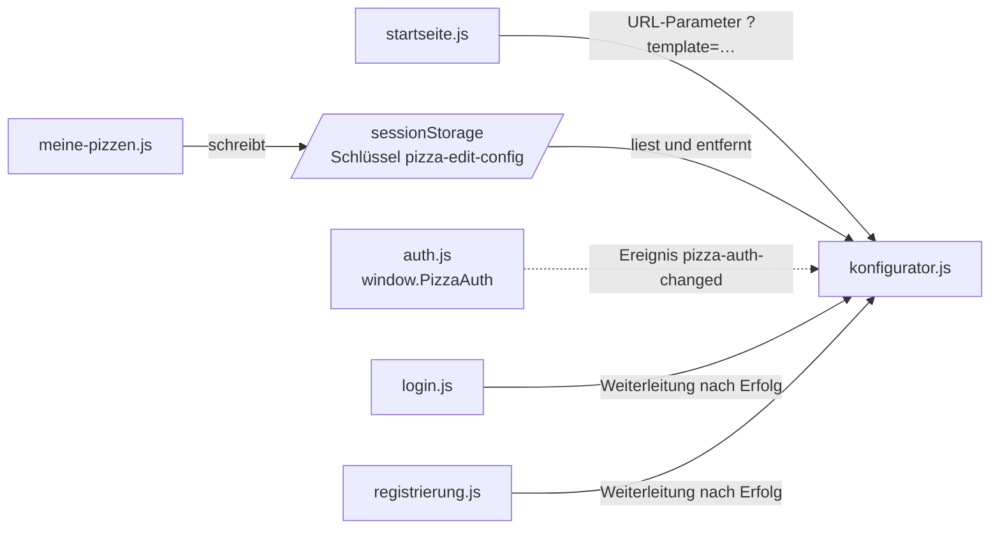
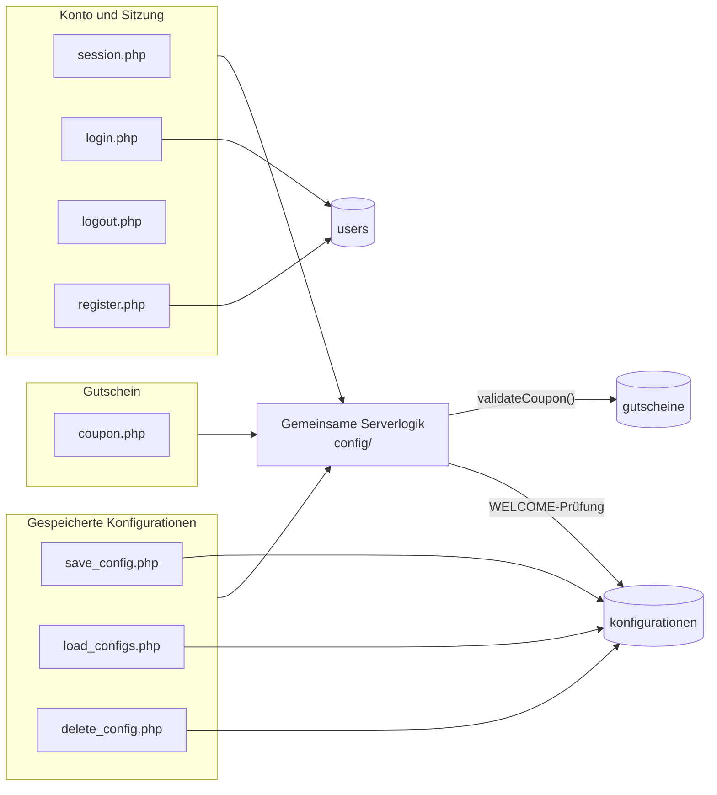

# 5 Bausteinsicht

Die Bausteinsicht zeigt, aus welchen Teilen der Pizza Tracker besteht, welche Verantwortung jeder Teil trägt
und über welche Schnittstellen die Teile zusammenarbeiten. Jeder Baustein ist einem konkreten Verzeichnis
oder einer konkreten Datei im Repository zugeordnet.

> **Grundlage:** Stand des Branches `main`, Commit `619acf4a4fb4d81b9e78fa133e6c9ecf135fa65b`.
> Alle Aussagen sind aus dem Quellcode dieses Stands abgeleitet. Änderungen am Code nach diesem Commit
> erfordern eine erneute Prüfung dieses Kapitels.

**Aufbau des Kapitels.** Die Beschreibung verfeinert das System schrittweise von außen nach innen:

- **Ebene 0** ist der Kontext aus [Kapitel 3](A03-kontext-und-abgrenzung.md): der Pizza Tracker als ein
  einziger Kasten (Blackbox).
- **Ebene 1** (§ 5.1) öffnet diesen Kasten (Whitebox) und beschreibt die sechs enthaltenen Bausteine als
  Blackboxes (§ 5.1.1–§ 5.1.6).
- **Ebene 2** (§ 5.2) öffnet die zwei Bausteine, deren innere Aufteilung für das Verständnis wichtig ist:
  *Browserlogik* und *Backend/API*. Warum die übrigen vier Bausteine nicht weiter zerlegt werden, steht in § 5.2.3.
- **Ebene 3** entfällt (Begründung in § 5.3).

Die Bausteine werden mit den Blackbox- und Whitebox-Vorlagen nach Starke/Hruschka (*Software-Architektur
kompakt*) beschrieben, einer ausführlicheren Form der von [arc42](https://docs.arc42.org/section-5/)
geforderten Angaben. Die Schichtbegriffe *Präsentations-*, *Anwendungs-* und *Persistenzschicht* stammen aus
[§ 4.1](A04-loesungsstrategie.md) und [§ 3.2](A03-kontext-und-abgrenzung.md).

---

## 5.1 Whitebox Gesamtsystem (Ebene 1)

Die Präsentationsschicht und die Browserlogik liegen als Dateien auf dem Server und werden von Apache
ausgeliefert, **ausgeführt** werden sie aber im Browser. Die Zuordnung zu Rechnern und Prozessen beschreibt
[Kapitel 7](A07-deployment-view.md).

| Whitebox | Inhalt |
|----------|--------|
| **Whitebox von** | **Pizza Tracker**, die Blackbox aus [Kapitel 3](A03-kontext-und-abgrenzung.md). |
| **Übersichtsdiagramm** | Abbildung oben. |
| **Enthaltene Bausteine** | Sechs Bausteine, siehe Tabelle unten. |
| **Lokale Beziehungen** | Siehe Tabelle „Lokale Beziehungen“ unten. |
| **Entwurfsentscheidungen** | Dreischichtige Webanwendung ([§ 4.1](A04-loesungsstrategie.md)). PHP als Backend-Sprache, sessionbasierte Anmeldung, Bootstrap für die Gestaltung und mehrere einzelne Seiten statt einer Single-Page-Anwendung ([P2](../spec/P2-architekturueberblick.md)). Begründungen und Alternativen stehen in [Kapitel 9](A09-architecture-decisions.md) (siehe offener Punkt O-1). |
| **Verworfene Alternativen** | Werden in [Kapitel 9](A09-architecture-decisions.md) begründet und hier nicht wiederholt. |
| **Referenzen** | Laufzeit: [Kapitel 6](A06%20-%20Laufzeitsicht.md) · Verteilung: [Kapitel 7](A07-deployment-view.md) · Querschnitt: [Kapitel 8](A08-cross-cutting-concepts.md) · Risiken: [Kapitel 11](A11-risks-and-technical-debts.md) |
| **Offene Punkte** | Siehe § 5.4. |

**Enthaltene Bausteine**

| # | Baustein | Schicht (§ 4.1) | Code-Artefakte | Verantwortung |
|---|----------|-----------------|----------------|---------------|
| 5.1.1 | **Präsentationsschicht** | Präsentation | `startseite.html`, `konfigurator.html`, `login.html`, `registrierung.html`, `meine-pizzen.html`, `css/style.css` | Aufbau und Gestaltung der fünf Dialoge |
| 5.1.2 | **Browserlogik** | Präsentation | `js/auth.js`, `js/startseite.js`, `js/konfigurator.js`, `js/login.js`, `js/registrierung.js`, `js/meine-pizzen.js` | Alles, was im Browser abläuft: Anzeige, Live-Berechnung, Formulare, Aufrufe der API |
| 5.1.3 | **Backend/API** | Anwendung | `api/session.php`, `api/login.php`, `api/logout.php`, `api/register.php`, `api/coupon.php`, `api/save_config.php`, `api/load_configs.php`, `api/delete_config.php` | HTTP-Grenze des Servers: Anfragen annehmen, Anmeldung prüfen, SQL ausführen, JSON antworten |
| 5.1.4 | **Gemeinsame Serverlogik** | Anwendung | `config/database.php`, `config/helpers.php` | Datenbankverbindung, Sitzung, Validierung, Preis- und Gutscheinlogik |
| 5.1.5 | **Fachliche Konfigurationsdaten** | Anwendung (Daten) | `data/pizza_data.json` | Auswahloptionen mit Preis und kcal sowie drei Vorlagen |
| 5.1.6 | **Persistenz** | Persistenz | `database/schema.sql`, Datenbank `pizza_tracker` | Dauerhafte Speicherung von Nutzern, Konfigurationen und Gutscheinen |

**Lokale Beziehungen**

| Schnittstelle | Zwischen | Vertrag |
|---------------|----------|---------|
| DOM-Anbindung | Präsentationsschicht → Browserlogik | Jede Seite bindet `js/auth.js` und ihr eigenes Skript per `<script>` ein. Die Skripte finden ihre Elemente über feste IDs (z. B. `priceValue`, `couponCode`, `saveButton`, `groesseOptions`) und `data-`-Attribute (`data-auth-guest`, `data-auth-user`, `data-template`, `data-action="logout"`). |
| JSON-API | Browserlogik → Backend/API | `fetch()` mit `credentials: 'same-origin'`, damit das Session-Cookie mitgesendet wird. Anfragen und Antworten sind JSON. Jede Antwort enthält `success`, im Fehlerfall zusätzlich `error` und einen passenden HTTP-Status. Einzelheiten in § 5.2.2. |
| Fachdaten im Browser | Browserlogik → Fachdaten | `konfigurator.js` lädt `data/pizza_data.json` per `fetch()` als statische Datei. |
| Fachdaten im Server | Gemeinsame Serverlogik → Fachdaten | `loadPizzaData()` liest dieselbe Datei per `file_get_contents()`, um Eingaben zu prüfen und den Preis beim Speichern neu zu berechnen. |
| Serverfunktionen | Backend/API → Gemeinsame Serverlogik | Jeder Endpunkt bindet `config/helpers.php` per `require_once` ein und ruft dessen Funktionen auf (Übersicht in § 5.1.4). |
| Datenbankzugriff | Backend/API, Gemeinsame Serverlogik → Persistenz | `getDatabase()` liefert ein PDO-Objekt. SQL-Anweisungen stehen direkt in den Endpunkten und in `validateCoupon()` und werden als Prepared Statements mit benannten Platzhaltern ausgeführt. Eine eigene Datenzugriffsschicht gibt es nicht. |
| Anmeldestatus | Browser ↔ Backend/API | PHP-Session. Der Server speichert nach der Anmeldung `user_id`, `vorname` und `email` in `$_SESSION`; der Browser hält nur das Session-Cookie. |
| Gestaltung | Präsentationsschicht → Bootstrap-CDN | Bootstrap 5.3.3 (CSS und `bootstrap.bundle.min.js`) wird in allen fünf Seiten von `cdn.jsdelivr.net` geladen. |

### 5.1.1 Blackbox Präsentationsschicht

| Blackbox | Inhalt |
|----------|--------|
| **Zweck/Verantwortung** | Legt Struktur, Navigation und Aussehen der fünf Dialoge aus [B1](../spec/B1-dialogspezifikation.md) fest (DLG-01 bis DLG-05). Enthält selbst keine Logik. |
| **Angebotene Schnittstellen** | DOM-Elemente mit festen IDs und `data-`-Attributen, die die Browserlogik anspricht. Leere Container (z. B. `groesseOptions`, `pizzaGrid`), die erst durch die Browserlogik gefüllt werden. Navigationslinks zwischen den Seiten. |
| **Benötigte Schnittstellen** | Bootstrap 5.3.3 (CSS und JavaScript) vom CDN. Das Akkordeon im Konfigurator und das Menü auf kleinen Bildschirmen nutzen `data-bs-toggle` und hängen damit vom Bootstrap-JavaScript ab. Browserlogik für alle dynamischen Inhalte. |
| **Qualität/Performance** | Responsive Darstellung über das Bootstrap-Raster (z. B. `col-md-6`, `navbar-expand-lg`) und eigene Regeln in `css/style.css` (u. a. `@media (max-width: 991.98px)`), Bezug zu NFA06 in [N1](../spec/N1-nichtfunktional.md). |
| **Abhängigkeiten** | Bootstrap-CDN, also Internetzugang beim Laden der Seiten (Risiko: [Kapitel 11](A11-risks-and-technical-debts.md)). |
| **Code-Artefakte** | `startseite.html` (DLG-01), `konfigurator.html` (DLG-02), `login.html` (DLG-03), `registrierung.html` (DLG-04), `meine-pizzen.html` (DLG-05), `css/style.css` |
| **Erfüllte Anforderungen** | Dialogstruktur aus [B1](../spec/B1-dialogspezifikation.md). |
| **Variabilität** | Die Navigationsleiste ist in allen fünf HTML-Dateien einzeln enthalten; Änderungen daran müssen an fünf Stellen erfolgen. Die drei Vorlagenkarten der Startseite (Name, Beschreibung, Schlüssel in `data-template`) stehen fest im HTML und müssen bei Änderungen an den Vorlagen in `pizza_data.json` von Hand angepasst werden. |
| **Tests** | Keine automatisierten Tests im Repository. Nachweis über manuelle Funktionstests (O-3). |
| **Offene Punkte** | Keine eigenen; CDN-Abhängigkeit siehe oben. |
| **Verfeinert in** | Nicht weiter verfeinert (§ 5.2.3). |

### 5.1.2 Blackbox Browserlogik

| Blackbox | Inhalt |
|----------|--------|
| **Zweck/Verantwortung** | Führt alle Abläufe im Browser aus: Anmeldestatus anzeigen, Konfigurator aufbauen, Preis und kcal live berechnen, Formulare absenden, gespeicherte Pizzen anzeigen und löschen, Daten zwischen Seiten übergeben. |
| **Angebotene Schnittstellen** | Globales Objekt `window.PizzaAuth` mit `checkSession()`, `logoutUser()` und `getState()` sowie das Ereignis `pizza-auth-changed` (beides aus `auth.js`). |
| **Benötigte Schnittstellen** | DOM der Präsentationsschicht; alle acht API-Endpunkte (§ 5.2.2); `data/pizza_data.json`; der Browserspeicher `sessionStorage`. |
| **Qualität/Performance** | Preis und kcal werden bei jeder Änderung ohne Serveranfrage berechnet (`calculateLocalTotals()` in `konfigurator.js`), Bezug zu NFA01. HTML-Sonderzeichen in gespeicherten Daten werden vor der Ausgabe maskiert (`escapeHtml()` in `meine-pizzen.js`). |
| **Abhängigkeiten** | Keine Bibliotheken außer Bootstrap. Kein Build-Schritt, kein Frontend-Framework. |
| **Code-Artefakte** | `js/auth.js`, `js/startseite.js`, `js/konfigurator.js`, `js/login.js`, `js/registrierung.js`, `js/meine-pizzen.js` |
| **Erfüllte Anforderungen** | UC01–UC11 aus [F2](../spec/F2-anwendungsfaelle.md) auf Browserseite; Zuordnung in § 5.2.1. |
| **Variabilität** | Die Auswahlkarten im Konfigurator werden vollständig aus `pizza_data.json` erzeugt. Neue Optionen erfordern daher keine Änderung an HTML oder JavaScript. |
| **Tests** | Keine automatisierten Tests im Repository (O-3). |
| **Offene Punkte** | Siehe § 5.4 (O-4 bis O-7). |
| **Verfeinert in** | § 5.2.1 |

### 5.1.3 Blackbox Backend/API

| Blackbox | Inhalt |
|----------|--------|
| **Zweck/Verantwortung** | Bildet die Grenze zwischen Browser und Server. Jeder Endpunkt prüft die HTTP-Methode, liest die JSON-Eingabe, prüft bei Bedarf die Anmeldung, führt die fachliche Aktion aus und antwortet mit JSON. |
| **Angebotene Schnittstellen** | Acht JSON-Endpunkte unter `api/`, beschrieben in § 5.2.2. |
| **Benötigte Schnittstellen** | Funktionen der Gemeinsamen Serverlogik (§ 5.1.4); Tabellen `users`, `konfigurationen` (§ 5.1.6). |
| **Qualität/Performance** | Endpunkte für gespeicherte Konfigurationen verlangen eine Anmeldung (`requireLogin()`), Bezug zu NFA05. Löschen berücksichtigt nur Datensätze des angemeldeten Nutzers (`WHERE id = :id AND user_id = :user_id`). Passwörter werden mit `password_hash(…, PASSWORD_BCRYPT)` gespeichert und mit `password_verify()` geprüft (NFA02). Das E-Mail-Format wird mit `FILTER_VALIDATE_EMAIL` geprüft (NFA04). Nach Anmeldung und Registrierung wird die Session-ID erneuert (`session_regenerate_id(true)`). |
| **Abhängigkeiten** | PHP mit den Erweiterungen PDO/`pdo_mysql` und `mbstring`. Der Rückgabetyp `never` in `jsonResponse()` setzt mindestens PHP 8.1 voraus. |
| **Code-Artefakte** | `api/*.php` (acht Dateien, Liste in § 5.1) |
| **Erfüllte Anforderungen** | UC04–UC10 auf Serverseite; UC02/UC03 beim Speichern (Neuberechnung). |
| **Variabilität** | Ein neuer Endpunkt ist eine neue PHP-Datei nach demselben Muster (§ 5.2.2). Es gibt kein Routing und keine zentrale Einstiegsdatei. |
| **Tests** | Keine automatisierten Tests im Repository (O-3). |
| **Offene Punkte** | Siehe § 5.4 (O-4, O-5, O-8). |
| **Verfeinert in** | § 5.2.2 |

### 5.1.4 Blackbox Gemeinsame Serverlogik

| Blackbox | Inhalt |
|----------|--------|
| **Zweck/Verantwortung** | Stellt die Funktionen bereit, die mehrere Endpunkte benötigen: Datenbankverbindung, Sitzungsverwaltung, einheitliche JSON-Antworten und die serverseitige Fachlogik (Eingabeprüfung, Preisberechnung, Gutscheinprüfung). |
| **Angebotene Schnittstellen** | PHP-Funktionen, siehe Tabelle unten. |
| **Benötigte Schnittstellen** | `data/pizza_data.json` (lesend); Tabellen `gutscheine` und `konfigurationen` (lesend, in `validateCoupon()`); Umgebungsvariablen `PIZZA_DB_HOST`, `PIZZA_DB_PORT`, `PIZZA_DB_NAME`, `PIZZA_DB_USER`, `PIZZA_DB_PASS` (optional). |
| **Qualität/Performance** | PDO wird mit `ERRMODE_EXCEPTION`, `FETCH_ASSOC` und `EMULATE_PREPARES = false` konfiguriert, die Verbindung wird pro Request nur einmal aufgebaut. Das Session-Cookie ist `httponly` und `SameSite=Lax`; `secure` wird nur bei HTTPS gesetzt. Auswahlwerte werden nur akzeptiert, wenn sie in `pizza_data.json` vorkommen (`assertChoice()`), Bezug zu NFA03. |
| **Abhängigkeiten** | PHP ≥ 8.1, PDO mit MySQL-Treiber, `mbstring`. |
| **Code-Artefakte** | `config/database.php`, `config/helpers.php` |
| **Erfüllte Anforderungen** | Querschnittskonzepte aus [N2](../spec/N2-querschnittskonzepte.md): Eingabevalidierung, Preisberechnung, Gutscheine. |
| **Variabilität** | Die Datenbankverbindung lässt sich über die genannten Umgebungsvariablen ändern; ohne sie gelten die XAMPP-Standardwerte (`127.0.0.1`, `3306`, `pizza_tracker`, `root`, leeres Passwort). |
| **Tests** | Keine automatisierten Tests im Repository (O-3). |
| **Offene Punkte** | Mehrere Funktionen beenden den Request bei Fehlern direkt mit `jsonResponse()`. Die Fachlogik ist dadurch fest an HTTP gebunden und nicht getrennt nutzbar. Siehe außerdem O-5, O-8 und O-9. |
| **Verfeinert in** | Nicht weiter verfeinert (§ 5.2.3). |

**Angebotene Funktionen**

| Funktion | Datei | Aufgabe | Aufgerufen von |
|----------|-------|---------|----------------|
| `getDatabase()` | `database.php` | Liefert die PDO-Verbindung (einmal pro Request) | `login`, `register`, `save_config`, `load_configs`, `delete_config`, `validateCoupon()` |
| `startAppSession()` | `helpers.php` | Startet die PHP-Session mit den Cookie-Einstellungen | `session`, `login`, `register`, `logout`, `currentUserId()` |
| `jsonResponse()` | `helpers.php` | Sendet JSON mit HTTP-Status und beendet das Skript | allen Endpunkten und Prüffunktionen |
| `requireMethod()` | `helpers.php` | Antwortet mit 405, wenn die HTTP-Methode nicht passt | allen Endpunkten |
| `readJsonBody()` | `helpers.php` | Liest den Request-Body als JSON; 400 bei ungültigem JSON | `login`, `register`, `coupon`, `save_config`, `delete_config` |
| `currentUserId()` | `helpers.php` | Liefert die `user_id` aus der Session oder `null` | `coupon`, `requireLogin()` |
| `requireLogin()` | `helpers.php` | Antwortet mit 401, wenn niemand angemeldet ist | `save_config`, `load_configs`, `delete_config` |
| `cleanString()` | `helpers.php` | Wandelt Eingaben in getrimmte Zeichenketten um | `login`, `register`, `coupon`, `normalizeConfig()` |
| `loadPizzaData()` | `helpers.php` | Liest `pizza_data.json` (einmal pro Request) | `assertChoice()`, `calculatePizzaTotals()` |
| `assertChoice()`, `assertChoices()` | `helpers.php` | Prüft Auswahlwerte gegen `pizza_data.json`; 400 bei unbekanntem Wert | `normalizeConfig()` |
| `normalizeConfig()` | `helpers.php` | Vereinheitlicht die Konfiguration, prüft Pflichtfelder und Namenslänge (≤ 100 Zeichen), setzt „Meine Pizza“ als Standardnamen | `save_config` |
| `calculatePizzaTotals()` | `helpers.php` | Summiert Preis und kcal, zieht den Rabatt ab und rundet auf zwei Nachkommastellen | `save_config` |
| `validateCoupon()` | `helpers.php` | Prüft, ob ein Code existiert, aktiv und nicht abgelaufen ist; bei `WELCOME` zusätzlich Anmeldung und bisherige Nutzung | `coupon`, `save_config` |

### 5.1.5 Blackbox Fachliche Konfigurationsdaten

| Blackbox | Inhalt |
|----------|--------|
| **Zweck/Verantwortung** | Einzige Quelle für die wählbaren Optionen mit Preis und kcal sowie für die Vorlagen. |
| **Angebotene Schnittstellen** | JSON-Objekt mit den Abschnitten `groessen`, `teige`, `saucen`, `kaese`, `belaege` und `extras`. Jeder Abschnitt ordnet einem Optionsnamen ein Objekt `{ "preis": …, "kcal": … }` zu; Größen haben zusätzlich `label`. Der Abschnitt `vorlagen` ordnet einem Schlüssel (`margherita`, `salami`, `hawaii`) eine vollständige Konfiguration zu. |
| **Benötigte Schnittstellen** | Keine. |
| **Qualität/Performance** | Da Browser und Server dieselbe Datei nutzen, verwenden beide dieselben Preise und kcal-Werte. Die Werte für Größe, Teig, Sauce und Käse entsprechen [D2](../spec/D2-datentypen.md). |
| **Abhängigkeiten** | Keine. Die Datei wird vom Browser direkt über Apache abgerufen und muss deshalb öffentlich erreichbar sein. |
| **Code-Artefakte** | `data/pizza_data.json` |
| **Erfüllte Anforderungen** | Datengrundlage für UC01–UC03 und UC11. |
| **Variabilität** | Preise, kcal-Werte und neue Optionen lassen sich ohne Codeänderung pflegen. Die Optionsnamen sind zugleich die Werte, die in der Tabelle `konfigurationen` gespeichert werden; eine Umbenennung passt daher nicht mehr zu bereits gespeicherten Konfigurationen. Das Feld `label` bei den Größen wird im aktuellen Code nicht verwendet. |
| **Tests** | Keine automatisierten Tests im Repository (O-3). |
| **Offene Punkte** | Keine. |
| **Verfeinert in** | Nicht weiter verfeinert (§ 5.2.3). |

### 5.1.6 Blackbox Persistenz

| Blackbox | Inhalt |
|----------|--------|
| **Zweck/Verantwortung** | Speichert Nutzerkonten, gespeicherte Konfigurationen und Gutscheine dauerhaft. |
| **Angebotene Schnittstellen** | Datenbank `pizza_tracker` (Zeichensatz `utf8mb4`) mit den Tabellen unten, erreichbar über SQL. |
| **Benötigte Schnittstellen** | Keine. |
| **Qualität/Performance** | InnoDB-Tabellen mit Fremdschlüssel `konfigurationen.user_id → users.id` (`ON DELETE CASCADE`). E-Mail-Adressen und Gutscheincodes sind eindeutig (`UNIQUE`). |
| **Abhängigkeiten** | MySQL oder MariaDB mit Unterstützung für den Spaltentyp `JSON`. |
| **Code-Artefakte** | `database/schema.sql` (legt Datenbank und Tabellen an und füllt vier Gutscheine ein) |
| **Erfüllte Anforderungen** | Datenmodell aus [D1](../spec/D1-datenmodell.md). |
| **Variabilität** | `schema.sql` verwendet `CREATE TABLE IF NOT EXISTS`; ein erneuter Import ändert bestehende Tabellen nicht. Die Gutscheine werden bei erneutem Import über `ON DUPLICATE KEY UPDATE` aktualisiert. |
| **Tests** | Keine automatisierten Tests im Repository (O-3). |
| **Offene Punkte** | Siehe O-9. |
| **Verfeinert in** | Nicht weiter verfeinert (§ 5.2.3). |

**Tabellen**

| Tabelle | Inhalt | Schlüssel | Genutzt von |
|---------|--------|-----------|-------------|
| `users` | Vorname, Nachname, E-Mail, Passwort-Hash, Adresse, optionale Telefonnummer, Erstellzeitpunkt | `id` (PK), `email` (UNIQUE) | `login.php`, `register.php` |
| `konfigurationen` | Name, Größe, Teig, Sauce, Käse, Beläge (`JSON`), Extras (`JSON`), Gutscheincode, Preis (`DECIMAL(8,2)`), Erstellzeitpunkt. **Keine** kcal-Spalte. | `id` (PK), `user_id` (FK → `users`) | `save_config.php`, `load_configs.php`, `delete_config.php`, `validateCoupon()` |
| `gutscheine` | Code, Rabatt in Prozent, aktiv, gültig bis, Erstellzeitpunkt | `id` (PK), `code` (UNIQUE) | `validateCoupon()` |

`konfigurationen.gutschein_code` speichert den Code als Text; ein Fremdschlüssel auf `gutscheine.code` existiert nicht.

---

## 5.2 Ebene 2

### 5.2.1 Whitebox Browserlogik

| Whitebox | Inhalt |
|----------|--------|
| **Whitebox von** | Browserlogik (§ 5.1.2) |
| **Übersichtsdiagramm** | Abbildung oben. Die Aufrufe der API zeigt die Tabelle „Lokale Blackboxes“. |
| **Enthaltene Bausteine** | Ein gemeinsames Skript (`auth.js`), das auf jeder Seite geladen wird, und ein Skript pro Seite. |
| **Lokale Beziehungen** | Siehe Tabelle unten. |
| **Entwurfsentscheidungen** | Aufteilung nach Seiten, passend zur Entscheidung für mehrere einzelne Seiten ([P2](../spec/P2-architekturueberblick.md)). Seitenübergreifende Daten werden ohne Server übergeben. |
| **Verworfene Alternativen** | Siehe [Kapitel 9](A09-architecture-decisions.md). |
| **Referenzen** | Abläufe im Detail: [Kapitel 6](A06%20-%20Laufzeitsicht.md). |
| **Offene Punkte** | O-4 bis O-7 |

**Lokale Blackboxes**

| Baustein | Verantwortung | Ruft auf | Anwendungsfälle |
|----------|---------------|----------|-----------------|
| `auth.js` | Fragt beim Laden jeder Seite den Anmeldestatus ab, blendet Elemente mit `data-auth-guest` / `data-auth-user` ein oder aus, zeigt den Vornamen am Abmelden-Link und löst `pizza-auth-changed` aus. Meldet nach Klick auf „Abmelden“ ab und leitet zur Startseite. | `GET api/session.php`, `POST api/logout.php` | UC07 |
| `startseite.js` | Leitet beim Klick auf eine Vorlage zu `konfigurator.html?template=<Schlüssel>` weiter. | – | UC11 |
| `konfigurator.js` | Lädt `pizza_data.json` und erzeugt daraus die Auswahlkarten. Hält die Auswahl im Objekt `state`, berechnet Preis und kcal lokal, prüft Gutscheine und speichert Konfigurationen. Übernimmt beim Laden entweder eine Konfiguration aus `sessionStorage` oder eine Vorlage aus dem URL-Parameter. Zeigt den Speichern-Button nur angemeldeten Nutzern. | `GET data/pizza_data.json`, `POST api/coupon.php`, `POST api/save_config.php` | UC01, UC02, UC03, UC04, UC08, UC11 |
| `login.js` | Sendet E-Mail und Passwort, zeigt Fehlermeldungen an und leitet nach Erfolg zum Konfigurator. Schaltet die Passwortanzeige um. | `POST api/login.php` | UC06 |
| `registrierung.js` | Prüft vorab, ob beide Passwörter übereinstimmen, sendet das Formular als JSON und leitet nach Erfolg zum Konfigurator. | `POST api/register.php` | UC05 |
| `meine-pizzen.js` | Lädt die gespeicherten Konfigurationen und zeigt sie als Karten an; zeigt bei fehlender Anmeldung einen Hinweis und bei leerer Liste die leere Ansicht. „Erneut bearbeiten“ legt die Konfiguration in `sessionStorage` ab und öffnet den Konfigurator. „Löschen“ fragt nach und entfernt nach Erfolg die Karte. | `GET api/load_configs.php`, `POST api/delete_config.php` | UC09, UC10 |

**Lokale Beziehungen**

| Schnittstelle | Zwischen | Vertrag |
|---------------|----------|---------|
| Vorlagenübergabe | `startseite.js` → `konfigurator.js` | URL-Parameter `template` mit einem Schlüssel aus `vorlagen` in `pizza_data.json`. Unbekannte Schlüssel werden ignoriert. |
| „Erneut bearbeiten“ | `meine-pizzen.js` → `konfigurator.js` | `sessionStorage`-Eintrag `pizza-edit-config` mit der vollständigen gespeicherten Konfiguration als JSON. Der Konfigurator übernimmt Name, Größe, Teig, Sauce, Käse, Beläge und Extras und entfernt den Eintrag danach. `id` und `gutschein_code` werden nicht übernommen. Ist der Eintrag vorhanden, hat er Vorrang vor dem URL-Parameter. |
| Anmeldestatus | `auth.js` → `konfigurator.js` | Ereignis `pizza-auth-changed` mit `{ loggedIn, user }`; der Konfigurator blendet damit `saveButton` ein oder aus. |

### 5.2.2 Whitebox Backend/API

| Whitebox | Inhalt |
|----------|--------|
| **Whitebox von** | Backend/API (§ 5.1.3) |
| **Übersichtsdiagramm** | Abbildung oben |
| **Enthaltene Bausteine** | Acht Endpunkte, gruppiert nach fachlichem Bereich. |
| **Lokale Beziehungen** | Die Endpunkte rufen sich nicht gegenseitig auf. Sie sind nur über die Gemeinsame Serverlogik, die PHP-Session und die Datenbank verbunden. |
| **Entwurfsentscheidungen** | Eine PHP-Datei pro Vorgang, jeweils nach demselben Muster: `declare(strict_types=1)` → `require_once config/helpers.php` → `requireMethod()` → bei Bedarf `requireLogin()` → Eingabe lesen und prüfen → SQL ausführen → `jsonResponse()`. |
| **Verworfene Alternativen** | Siehe [Kapitel 9](A09-architecture-decisions.md). |
| **Referenzen** | Sitzung und Zugriffsschutz: [Kapitel 8](A08-cross-cutting-concepts.md) |
| **Offene Punkte** | O-4, O-5, O-8 |

**Lokale Blackboxes (Endpunkte)**

Jeder Endpunkt antwortet bei falscher HTTP-Methode mit **405** und bei ungültigem JSON im Body mit **400**.
Alle Antworten enthalten `success`; Fehlerantworten zusätzlich `error` mit einer deutschen Meldung.

| Endpunkt | Methode | Anmeldung | Eingabe (JSON) | Erfolg | Weitere Fehler | Anwendungsfall |
|----------|---------|-----------|----------------|--------|----------------|----------------|
| `session.php` | GET | nein | – | 200 `{ loggedIn: false }` oder `{ loggedIn: true, user: { id, vorname, email } }` | – | Hilfsfunktion für alle Seiten |
| `login.php` | POST | nein | `email`, `passwort` | 200 `{ user }`; Session enthält `user_id`, `vorname`, `email` | 400 Felder leer · 401 falsche Zugangsdaten | UC06 |
| `register.php` | POST | nein | `vorname`, `nachname`, `email`, `passwort`, `strasse`, `hausnummer`, `plz`, `stadt`; optional `passwort_bestaetigung`, `telefon` | 201 `{ user }`; Nutzer ist sofort angemeldet | 400 Pflichtfeld leer, E-Mail ungültig, Passwort kürzer als 6 Zeichen, Passwörter verschieden · 409 E-Mail bereits registriert | UC05 |
| `logout.php` | POST | nein | – | 200; Session-Daten und Session-Cookie werden gelöscht | – | UC07 |
| `coupon.php` | POST | nur für `WELCOME` | `code` | 200 `{ coupon: { code, rabatt_prozent } }` | 400 leer oder nicht aktiv · 401 `WELCOME` ohne Anmeldung · 404 unbekannt · 409 `WELCOME` bereits verwendet · 410 abgelaufen | UC04 |
| `save_config.php` | POST | ja | `name`, `groesse`, `teig`, `sauce`, `kaese`, `belaege[]`, `extras[]`, `gutschein_code` | 201 `{ id, preis, kcal }` | 400 Pflichtfeld fehlt, unbekannter Wert, Name zu lang · 401 nicht angemeldet · Gutscheinfehler wie bei `coupon.php` | UC08 |
| `load_configs.php` | GET | ja | – | 200 `{ configs: [ … ] }`, neueste zuerst | 401 nicht angemeldet | UC09 |
| `delete_config.php` | POST | ja | `id` | 200 | 400 ungültige ID · 401 nicht angemeldet · 404 nicht vorhanden oder gehört einem anderen Nutzer | UC10 |

Zwei Eigenschaften von `save_config.php` sind für das Verständnis wichtig:

- Der Browser sendet **keinen Preis**. Der Server prüft alle Werte gegen `pizza_data.json`, prüft den Gutschein
  erneut und berechnet den Preis selbst (`calculatePizzaTotals()`). Gespeichert wird nur dieser Serverpreis.
- Der Endpunkt führt **immer ein `INSERT`** aus. Eine Funktion zum Ändern (`UPDATE`) einer bestehenden
  Konfiguration gibt es nicht (O-4).

### 5.2.3 Nicht verfeinerte Bausteine

| Baustein | Begründung |
|----------|------------|
| Präsentationsschicht | Die fünf HTML-Dateien entsprechen eins zu eins den Dialogen aus [B1](../spec/B1-dialogspezifikation.md) und enthalten keine Logik. Eine Zerlegung würde nur B1 wiederholen. |
| Gemeinsame Serverlogik | Zwei Dateien mit einzelnen Funktionen; die Tabelle in § 5.1.4 beschreibt sie bereits vollständig. Eine weitere Ebene würde nur den Code nacherzählen. |
| Fachliche Konfigurationsdaten | Eine einzelne Datendatei ohne Verhalten; ihre Struktur ist in § 5.1.5 beschrieben. |
| Persistenz | Drei Tabellen; die Einzelheiten stehen in [D1](../spec/D1-datenmodell.md) und in § 5.1.6. |

---

## 5.3 Ebene 3

Eine dritte Ebene wird nicht beschrieben. Die Bausteine der Ebene 2 sind einzelne Dateien mit wenigen
Funktionen. Eine weitere Zerlegung würde nur einzelne Funktionen aufzählen und damit den Quellcode wiederholen,
ohne zusätzliche Architekturinformation zu liefern.

---

## 5.4 Offene Punkte und Abhängigkeiten

Die folgenden Punkte sind im Code von Commit `619acf4` belegt oder hängen von anderen Kapiteln ab.
Die Bewertung als Risiko oder technische Schuld erfolgt in [Kapitel 11](A11-risks-and-technical-debts.md).

| # | Punkt | Beleg | Betrifft |
|---|-------|-------|----------|
| O-1 | Die Architekturentscheidungen sind noch nicht in Kapitel 9 ausgearbeitet; bis dahin verweist § 5.1 auf [P2](../spec/P2-architekturueberblick.md). | `A09-architecture-decisions.md` | Kapitel 9 |
| O-2 | Die Links auf andere Kapitel verwenden die aktuellen Dateinamen. Werden Dateien umbenannt, müssen die Links angepasst werden. | `docs/arch/` | alle Kapitel |
| O-3 | Es gibt keine automatisierten Tests. Die Funktionsnachweise erfolgen manuell; die zugehörigen Test-IDs sind nachzutragen, sobald das Testprotokoll vorliegt. | Repository | Testprotokoll |
| O-4 | „Erneut bearbeiten“ füllt den Konfigurator vor; beim Speichern entsteht ein **neuer** Datensatz. Ein zuvor gespeicherter Gutschein wird nicht übernommen. | `save_config.php` (nur `INSERT`), `applyConfig()` in `konfigurator.js` | § 5.2.1, § 5.2.2 |
| O-5 | Preis im Browser und gespeicherter Preis können bei Gutscheinen um einen Cent abweichen: Der Browser zieht den Rabatt ungerundet ab und rundet erst bei der Anzeige, der Server rundet den Rabattbetrag vorher. Beispiel: Margherita M mit `STUDENT5` zeigt im Browser 7,13 €, die Serverregel ergibt 7,12 €. | `calculateLocalTotals()` in `konfigurator.js`, `calculatePizzaTotals()` in `helpers.php` | § 5.1.2, § 5.1.4 |
| O-6 | Jede Änderung an der Auswahl setzt einen aktiven Gutschein zurück. | Change-Handler in `renderOptions()` | § 5.2.1 |
| O-7 | Die `fetch()`-Aufrufe in `konfigurator.js`, `login.js`, `registrierung.js` und `meine-pizzen.js` fangen Netzwerkfehler und Antworten ohne gültiges JSON nicht ab. Ein fehlgeschlagenes Löschen wird dem Nutzer nicht angezeigt. | genannte Dateien | § 5.1.2 |
| O-8 | Fehler beim Lesen von `pizza_data.json` (`RuntimeException`) und Datenbankfehler (`PDOException`) werden nicht abgefangen; der Endpunkt antwortet dann nicht mit JSON. | `loadPizzaData()`, `getDatabase()` | § 5.1.3, § 5.1.4 |
| O-9 | Die `WELCOME`-Sperre prüft, ob eine **noch vorhandene** gespeicherte Konfiguration des Nutzers diesen Code enthält. Nach dem Löschen dieser Konfiguration ist der Code erneut verwendbar. Die Tabelle `konfigurationen` speichert keine kcal-Werte. | `validateCoupon()`, `schema.sql` | § 5.1.4, § 5.1.6 |
