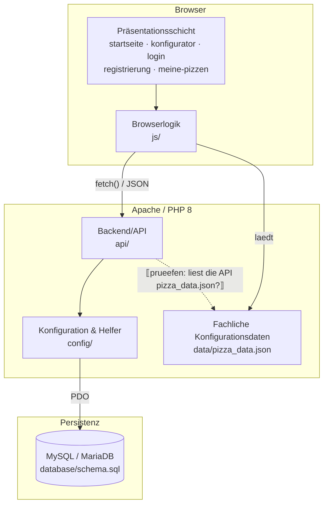

# 5 Bausteinsicht

> **STATUS: GERÜST — NOCH KEINE DOKUMENTATION.**
> Dieses Dokument überträgt ausschließlich *Struktur, Templates und Verfeinerungsschema* des
> Herold-Beispiels auf den Pizza Tracker. Alle mit ⟦…⟧ markierten Stellen sind ungeprüft und
> müssen aus dem aktuellen Repository belegt werden. Technologien, Bausteine und Beziehungen
> aus Herold wurden **nicht** übernommen.

Die Bausteinsicht verfeinert das System top-down, im Wechsel von Blackbox- und Whitebox-Beschreibungen
je Verfeinerungsebene (Starke/Hruschka, *SW-Arch kompakt*, Kap. 5):

- **Ebene 0** ist die Kontextsicht aus [Kapitel 3](A03-kontextabgrenzung.md) — der Pizza Tracker als eine Blackbox. ⟦Dateinamen A03 prüfen⟧
- **Ebene 1** ([§ 5.1](#51-whitebox-gesamtsystem)) öffnet diese Blackbox: die Whitebox *Pizza Tracker* und die Blackbox-Beschreibungen der sechs enthaltenen Bausteine (§ 5.1.1–§ 5.1.6).
- **Ebene 2** ([§ 5.2](#52-ebene-2)) öffnet ⟦Anzahl⟧ dieser Bausteine als Whiteboxes.
- **Ebene 3** ([§ 5.3](#53-ebene-3)) — ⟦prüfen, ob überhaupt nötig; Begründung siehe dort⟧.

Jeder Baustein bildet auf ein konkretes Verzeichnis oder eine konkrete Datei im Repository ab.
Ein Zweig endet, sobald weitere Zerlegung nur noch Code wiederholen würde (Begründung jeweils am Ende der Ebene).

**Beschreibungstemplates.** Bausteine werden mit den Templates aus Starke/Hruschka beschrieben
(S. 35 Blackbox, S. 39 Whitebox), der reichhaltigeren Variante der von
[arc42 v8](https://docs.arc42.org/section-5/) geforderten Felder:

| Template | Zeilen |
|----------|--------|
| **Blackbox** (§§ 5.1.1–5.1.6) | Zweck/Verantwortung · Angebotene Schnittstellen · Benötigte Schnittstellen · Qualität/Performance · Abhängigkeiten · Code-Artefakte · Erfüllte Anforderungen · Variabilität · Tests · Offene Punkte · Verfeinert in |
| **Whitebox** (§ 5.1, §§ 5.2.x) | Whitebox von · Übersichtsdiagramm · Enthaltene Bausteine · Lokale Beziehungen · Entwurfsentscheidungen · Verworfene Alternativen · Referenzen · Offene Punkte |

Die beiden listenwertigen Whitebox-Zeilen werden als eigene Tabellen unterhalb der Template-Tabelle
gerendert; lokale Blackboxes ab Ebene 2 nutzen die tabellarische Kurzform. Globale Entscheidungen
stehen in [Kapitel 9](A09-architekturentscheidungen.md) und werden referenziert, nicht wiederholt.

---

## 5.1 Whitebox Gesamtsystem

> ⟦Diagramm gegen ZIP verifizieren: Lädt die API `pizza_data.json` serverseitig ein (nötig für
> die serverseitige Preisberechnung laut A08)? Gestrichelte Kante entsprechend setzen oder entfernen.
> Bootstrap-CDN als externe Abhängigkeit ergänzen, falls im HTML per CDN eingebunden.⟧

| Whitebox | Inhalt |
|----------|--------|
| **Whitebox von** | **Pizza Tracker** — die Ebene-0-Blackbox aus [Kapitel 3](A03-kontextabgrenzung.md). |
| **Übersichtsdiagramm** | Abbildung oben. |
| **Enthaltene Bausteine** | Sechs Bausteine — Tabelle unten, beschrieben als Blackboxes in §§ 5.1.1–5.1.6. |
| **Lokale Beziehungen** | Die blockübergreifenden Schnittstellen — Tabelle unten. |
| **Entwurfsentscheidungen** | ⟦Verweise auf ADRs aus A09: PHP als Backend, JSON-basierte API, sessionbasierte Auth, MySQL/MariaDB, pizza_data.json als zentrale Datenquelle. Erst ausfüllen, wenn A09 steht.⟧ |
| **Verworfene Alternativen** | ⟦aus A09 referenzieren, nicht hier begründen⟧ |
| **Referenzen** | Laufzeit: [Kapitel 6](A06-laufzeitsicht.md). Verteilung: [Kapitel 7](A07-verteilungssicht.md). Querschnitt: [Kapitel 8](A08-querschnittliche-konzepte.md). |
| **Offene Punkte** | ⟦z. B. „Erneut bearbeiten": UPDATE oder neuer Datensatz? → A11⟧ |

**Enthaltene Bausteine** (Blackboxes dieser Ebene):

| # | Baustein | Code-Artefakte | Verantwortung (eine Zeile) |
|---|----------|----------------|----------------------------|
| [5.1.1](#511-blackbox-präsentationsschicht) | **Präsentationsschicht** | ⟦*.html — vollständige Liste aus ZIP⟧ | Struktur und Auslieferung der Oberfläche. |
| [5.1.2](#512-blackbox-browserlogik) | **Browserlogik** | `js/` ⟦Dateien verifizieren⟧ | Alles, was im Browser des Nutzers ausgeführt wird. |
| [5.1.3](#513-blackbox-backendapi) | **Backend/API** | `api/` ⟦Endpunkte verifizieren⟧ | HTTP-Grenze, Session-Prüfung, serverseitige Validierung und Berechnung. |
| [5.1.4](#514-blackbox-konfiguration-und-helfer) | **Konfiguration & Helfer** | `config/database.php`, `config/helpers.php` | DB-Verbindung via PDO und geteilte Hilfsfunktionen. |
| [5.1.5](#515-blackbox-fachliche-konfigurationsdaten) | **Fachliche Konfigurationsdaten** | `data/pizza_data.json` | Optionen, Preise, kcal, Vorlagen. |
| [5.1.6](#516-blackbox-persistenz) | **Persistenz** | `database/schema.sql`, MySQL/MariaDB | Dauerhafter Zustand: ⟦Tabellen aus schema.sql⟧. |

**Lokale Beziehungen:**

| Schnittstelle | Zwischen | Vertrag |
|---------------|----------|---------|
| DOM-Anbindung | Präsentationsschicht ↔ Browserlogik | ⟦Wie werden die JS-Dateien eingebunden, welche IDs/Selektoren bilden den Vertrag?⟧ |
| JSON-API | Browserlogik → Backend/API | `fetch()` gegen ⟦Endpunkte⟧; Request-/Response-Format ⟦aus Code belegen⟧. |
| Datenquelle | Browserlogik → Fachdaten | ⟦Wie wird pizza_data.json geladen — fetch oder eingebettet?⟧ |
| Datenbankzugriff | Backend/API → Konfiguration/Helfer → Persistenz | PDO mit Prepared Statements ⟦Funktionsnamen aus database.php⟧. |
| Session | Präsentationsschicht/Browserlogik ↔ Backend/API | ⟦api/session.php: was liefert es zurück, wer ruft es auf?⟧ |
| ⟦sessionStorage?⟧ | Browserlogik ↔ Browserlogik | ⟦Briefing-Glossar nennt sessionStorage — Verwendung im Code prüfen (z. B. Vorlagenübergabe)⟧ |

### 5.1.1 Blackbox Präsentationsschicht

| Blackbox | Inhalt |
|----------|--------|
| **Zweck/Verantwortung** | ⟦…⟧ |
| **Angebotene Schnittstellen** | ⟦…⟧ |
| **Benötigte Schnittstellen** | ⟦…⟧ |
| **Qualität/Performance** | ⟦Bezug zu A10: Responsive, keine Full-Page-Reloads⟧ |
| **Abhängigkeiten** | ⟦Bootstrap 5.3 — CDN oder lokal? → A11⟧ |
| **Code-Artefakte** | ⟦…⟧ |
| **Erfüllte Anforderungen** | ⟦Verweise in docs/spec/⟧ |
| **Variabilität** | ⟦…⟧ |
| **Tests** | ⟦laut Briefing: keine automatisierten Tests → hier ehrlich benennen⟧ |
| **Offene Punkte** | ⟦…⟧ |
| **Verfeinert in** | ⟦§ 5.2.x oder „nicht weiter verfeinert" + Begründung⟧ |

### 5.1.2 Blackbox Browserlogik

⟦Template wie oben. Besonders zu belegen: Zustandshaltung im Konfigurator, Live-Berechnung von
Preis/kcal, Übernahme des URL-Parameters `?template=`.⟧

### 5.1.3 Blackbox Backend/API

⟦Template wie oben. Besonders zu belegen: Welche Endpunkte prüfen die Session? Wo findet die
Eigentumsprüfung beim Löschen statt? Rechnet `save_config.php` den Preis wirklich serverseitig neu?⟧

### 5.1.4 Blackbox Konfiguration und Helfer

⟦Template wie oben.⟧

### 5.1.5 Blackbox Fachliche Konfigurationsdaten

⟦Template wie oben. Struktur der JSON-Datei aus dem ZIP beschreiben, nicht raten.⟧

### 5.1.6 Blackbox Persistenz

⟦Template wie oben. Tabellen, Schlüssel und Beziehungen aus schema.sql belegen.
Briefing-Hinweis: Beläge/Extras evtl. als JSON-Spalten → prüfen und ggf. nach A11 verlinken.⟧

---

## 5.2 Ebene 2

⟦Entscheidung nach der Bestandsaufnahme: Welche Ebene-1-Blackboxes lohnen eine Whitebox?
Kandidaten sind Browserlogik (Zerlegung nach Seiten/Zuständigkeiten) und Backend/API
(Zerlegung nach Endpunkten). Nicht verfeinerte Bausteine hier explizit begründen —
das Herold-Beispiel macht das vor und es ist ein Bewertungskriterium.⟧

### 5.2.1 Whitebox ⟦…⟧

⟦Whitebox-Template + Mermaid-Diagramm + Tabelle der lokalen Blackboxes + Tabelle der lokalen Beziehungen.⟧

---

## 5.3 Ebene 3

⟦Vermutlich nicht erforderlich. Falls weggelassen: hier begründen, warum die Zerlegung auf
Ebene 2 endet (weitere Verfeinerung würde nur Code wiederholen). Eine bewusst begründete
Nicht-Verfeinerung ist besser als eine erzwungene dritte Ebene.⟧

---

## Was noch aus dem Repository belegt werden muss

| # | Offene Frage | Quelle im ZIP |
|---|--------------|---------------|
| 1 | Vollständige Liste der HTML-Seiten und JS-Dateien | Ordnerlisting |
| 2 | Tatsächlich vorhandene API-Endpunkte + Request/Response je Endpunkt | `api/*.php` |
| 3 | Tabellen, Spalten, Fremdschlüssel | `database/schema.sql` |
| 4 | Struktur von `pizza_data.json` | `data/pizza_data.json` |
| 5 | Wer prüft Session/Eigentum und wie | `api/session.php`, `api/delete_config.php` |
| 6 | Serverseitige Preisberechnung vorhanden? | `api/save_config.php` |
| 7 | Bootstrap per CDN oder lokal | HTML-`<head>` |
| 8 | „Erneut bearbeiten" — UPDATE oder INSERT | `konfigurator.js`, `api/save_config.php` |
| 9 | Wird `sessionStorage` verwendet und wofür | `js/*.js` |
| 10 | Abweichungen zwischen Spec, A01–A04 und Code | `docs/spec/`, `docs/arch/` |
