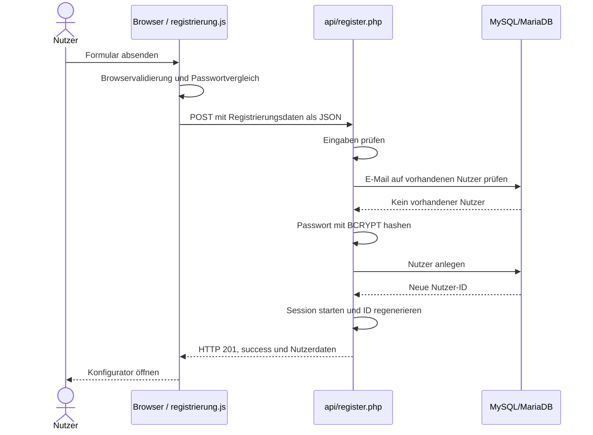
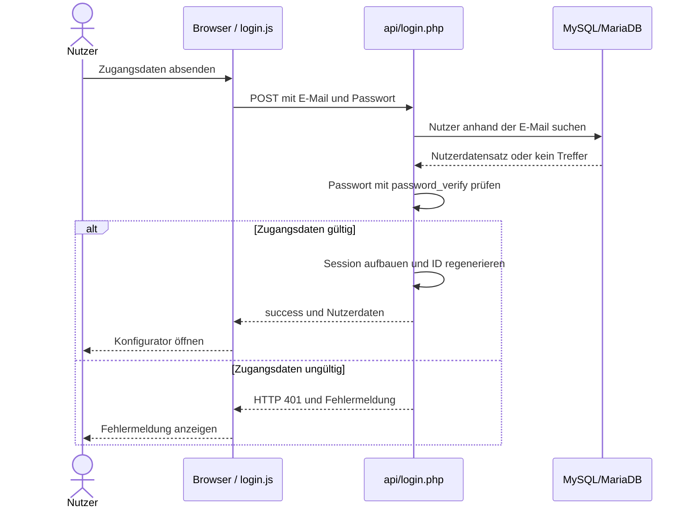
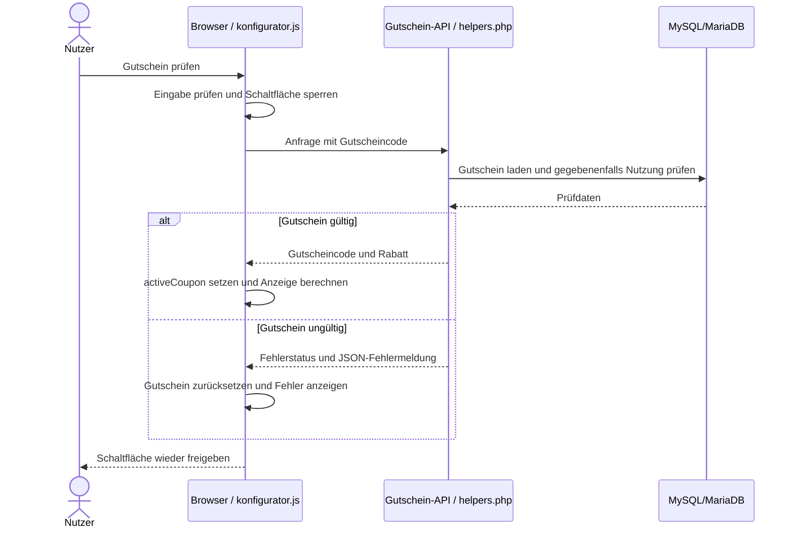
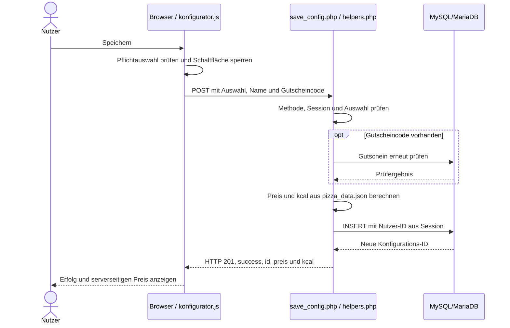

# A06 – Laufzeitsicht

Die Laufzeitsicht beschreibt, wie die Bausteine aus [Kapitel 5](A05%20-%20Bausteinsicht.md) während der Nutzung zusammenarbeiten. Sie unterscheidet zwischen Verarbeitung im Browser, Prüfungen in der PHP-API und Speicherung in MySQL/MariaDB. Die beschriebenen Abläufe sind aus dem vorliegenden Quellcode abgeleitet; sie ersetzen keine dokumentierten Funktionstests.

Die Anwendung arbeitet anfrageorientiert: JavaScript sendet bei Bedarf einzelne HTTP-Anfragen über `fetch()`. Die API verarbeitet JSON und antwortet mit JSON. Es gibt keine Hintergrundjobs, kein Polling und keine WebSocket-Kommunikation. Ein normaler Seitenaufruf liefert zunächst HTML; JavaScript ergänzt Daten und Interaktionen.

| Szenario | Use Case | Wesentliche Zusammenarbeit |
|---|---|---|
| Registrierung | UC05 | Browser → API → Nutzertabelle; anschließend Session-Aufbau |
| Login | UC06 | Zugangsdaten prüfen und Session aufbauen |
| Vorlage laden | UC11 | URL-Parameter und Fachdaten im Browser auswerten |
| Konfigurieren | UC01–UC03 | Auswahl, Berechnung und Darstellung im Browser |
| Gutschein einlösen | UC04 | Gutschein durch die API gegen die Datenbank prüfen |
| Konfiguration speichern | UC08 | Session prüfen, Auswahl validieren, Preis neu berechnen und Datensatz anlegen |
| Eigene Konfigurationen laden | UC09 | Datenbankabfrage auf den angemeldeten Nutzer begrenzen |
| Konfiguration löschen | UC10 | Löschen nur bei passender ID und Nutzerzuordnung |
| Logout | UC07 | Session und Session-Cookie aufheben |

## 6.1 Registrierung

**Auslöser:** Ein Gast sendet das Formular in `registrierung.html` ab.

Das folgende Diagramm zeigt den erfolgreichen Ablauf. Bei einer fehlgeschlagenen Prüfung wird vorher mit einer Fehlerantwort abgebrochen.

1. HTML-Feldregeln prüfen beispielsweise Pflichtfelder und das E-Mail-Format. `js/registrierung.js` verhindert den normalen Formular-Postback und vergleicht Passwort und Bestätigung.
2. `api/register.php` akzeptiert `POST` und prüft die Daten erneut. Vorname, Nachname, E-Mail, Passwort und die vorgesehenen Adressfelder sind Pflicht; die Telefonnummer ist optional.
3. Die E-Mail wird kleingeschrieben und auf gültiges Format geprüft. Das Passwort muss mindestens sechs Zeichen lang sein. Eine nicht leere Passwortbestätigung muss übereinstimmen; ein direkter API-Aufruf kann die Bestätigung jedoch weglassen.
4. Die API prüft die E-Mail mit einem vorbereiteten SQL-Statement auf einen vorhandenen Nutzer. Sie speichert das neue Passwort ausschließlich als BCRYPT-Hash.
5. Nach dem Einfügen werden `user_id`, `vorname` und `email` in der PHP-Session hinterlegt. `session_regenerate_id(true)` erneuert die Session-ID. Der Nutzer ist direkt angemeldet.

**Fehlerverhalten:** Ungültige Eingaben führen zu HTTP 400, eine bereits registrierte E-Mail zu HTTP 409. Die Oberfläche zeigt die von der API gemeldeten Fehler an. Für Netzwerkfehler oder nicht lesbare JSON-Antworten besitzt `registrierung.js` keinen eigenen `try/catch`.

**Codebelege:** `registrierung.html`, `js/registrierung.js`, `api/register.php`, `config/helpers.php`, `database/schema.sql`.

## 6.2 Login

**Auslöser:** Ein registrierter Nutzer sendet E-Mail und Passwort über `login.html` ab.

Fehlende Zugangsdaten führen zu HTTP 400. Eine unbekannte E-Mail und ein falsches Passwort erhalten dieselbe Fehlermeldung mit HTTP 401. Bei Erfolg speichert die Session die Nutzer-ID, den Vornamen und die E-Mail. Der Passwort-Hash wird nicht an den Browser zurückgegeben.

Beim Laden der Seiten fragt `js/auth.js` zusätzlich `api/session.php` ab. Das Ergebnis steuert die sichtbaren Navigationselemente. Ein Fehler bei dieser Abfrage wird als Gastzustand behandelt. Diese Anzeige ist **keine Zugriffskontrolle**: Geschützte API-Endpunkte prüfen die Session unabhängig davon erneut.

`login.js` zeigt fachliche API-Fehler an, fängt Netzwerkfehler und fehlerhafte JSON-Antworten aber nicht mit einem eigenen `try/catch` ab.

**Codebelege:** `js/login.js`, `js/auth.js`, `api/login.php`, `api/session.php`, `config/helpers.php`.

## 6.3 Vorlage laden

**Auslöser:** Auf der Startseite wird eine Pizza-Vorlage ausgewählt.

1. `js/startseite.js` öffnet den Konfigurator mit einem `template`-Parameter in der URL.
2. `js/konfigurator.js` lädt `data/pizza_data.json` und erzeugt die verfügbaren Auswahlmöglichkeiten.
3. Eine zuvor unter `pizza-edit-config` in `sessionStorage` abgelegte Konfiguration hat Vorrang vor der URL-Vorlage. Der gespeicherte Eintrag wird beim Lesen entfernt.
4. Ohne diesen Eintrag wird eine passende Vorlage aus den geladenen Fachdaten angewendet. Ein unbekannter Vorlagenname aktiviert keine Vorlage.
5. Die Auswahl wird in den lokalen Zustand übernommen; Berechnungen und Darstellung werden aktualisiert.

Die Vorlage wird im Browser ausgewertet, nicht durch eine PHP-Fachfunktion oder eine Datenbankabfrage. Der URL-Parameter wird dennoch beim Abruf von `konfigurator.html` an den Webserver übertragen. Unabhängig von der Vorlagenauswahl kann `auth.js` die Session-API aufrufen.

Kann die Fachdaten-Datei nicht geladen oder verarbeitet werden, zeigt der Konfigurator eine Fehlermeldung. Fehler beim Einlesen einer gespeicherten Bearbeitungskonfiguration werden dagegen abgefangen, ohne eine eigene Meldung anzuzeigen; in diesem Fall erfolgt auch kein automatischer Rückfall auf die URL-Vorlage.

**Codebelege:** `js/startseite.js`, `js/konfigurator.js`, `js/auth.js`, `data/pizza_data.json`.

## 6.4 Konfigurieren und Live-Berechnung

**Auslöser:** Größe, Teig, Sauce, Käse, Beläge oder Extras werden geändert.

1. Ein Änderungsereignis aktualisiert den lokalen JavaScript-Zustand.
2. Ein zuvor angewendeter Gutschein wird zurückgesetzt; Gutscheinfeld und zugehörige Meldung werden geleert. Der Gutschein muss für die geänderte Zusammenstellung erneut geprüft werden.
3. Die ausgewählten Einträge werden aus den bereits geladenen Fachdaten gelesen. Der Browser summiert Preise, Kalorien und Makronährwerte einschließlich vorhandener Ballaststoffwerte.
4. `updateTotals()` aktualisiert die sichtbaren Werte sowie Vorschau, Auswahlkennzeichnungen, Zusammenfassung und Nährwertdarstellung.

Die Neuberechnung benötigt weder eine API-Anfrage noch eine Datenbankabfrage oder einen vollständigen Seitenreload. Ein anderes Vorschaubild kann allerdings einen zusätzlichen Abruf einer statischen Bilddatei verursachen.

Die Vorschau verwendet vorhandene Pizza-Fotos. Der Abgleich mit Vorlagen berücksichtigt Teig, Sauce, Käse, Beläge und Extras, nicht die Größe. Bei fehlender Übereinstimmung wird ein als Beispiel gekennzeichnetes Margherita-Bild verwendet. Größe und Durchmesser werden gesondert dargestellt; Dip und Chili-Öl erscheinen als separate Kennzeichnungen. Das Foto ist somit keine exakte bildliche Zusammensetzung sämtlicher gewählter Zutaten.

Kennzeichnungen wie „High Protein“, „Low Carb“, „Vegan“ oder „Vegetarisch“ entstehen aus den im JavaScript hinterlegten Regeln und den Fachdaten. Ein Rabatt verändert den Preis, nicht die Nährwerte. Diese Browserberechnungen dienen der Anzeige; der Server übernimmt beim Speichern keine vom Browser vorgegebenen Preiswerte.

**Codebelege:** `js/konfigurator.js` (`selectedEntries`, `calculateLocalTotals`, `updateTotals`, Vorschaufunktionen), `data/pizza_data.json`, `konfigurator.html`.

## 6.5 Gutschein einlösen

**Auslöser:** Der Nutzer gibt einen Gutscheincode ein und löst die Prüfung aus.

Die serverseitige Prüfung vereinheitlicht den Code und prüft Existenz, Aktivierung und Ablaufdatum. Unbekannte Codes führen zu HTTP 404, inaktive zu HTTP 400 und abgelaufene zu HTTP 410.

Für `WELCOME` ist eine Anmeldung erforderlich. Die Prüfung sucht nach einer bereits gespeicherten Konfiguration desselben Nutzers mit diesem Code; bei einem Treffer wird HTTP 409 geliefert. Es gibt kein davon unabhängiges Einlöseprotokoll. Wird der entsprechende Datensatz gelöscht, kann diese Prüfung eine frühere Nutzung nicht mehr erkennen.

Die Browserfunktion besitzt `try/catch/finally`: Während der Anfrage ist die Schaltfläche gesperrt. API-Fehler sowie Netzwerk- oder JSON-Fehler setzen den aktiven Gutschein zurück; anschließend wird die Schaltfläche wieder freigegeben. **Sonderfall:** Bei leerer Eingabe endet die Funktion bereits vor der Anfrage mit einer Warnung; ein zuvor aktiver Gutschein wird in diesem Zweig nicht ausdrücklich gelöscht.

Beim späteren Speichern prüft der Server den Gutschein erneut. Eine erfolgreiche Vorschauprüfung reserviert keinen Rabatt und ersetzt diese Prüfung nicht.

**Codebelege:** `js/konfigurator.js` (`validateCoupon`), `api/coupon.php`, `config/helpers.php` (`validateCoupon`).

## 6.6 Konfiguration speichern

**Auslöser:** Ein angemeldeter Nutzer speichert seine Zusammenstellung.

Das Diagramm zeigt den Erfolgsfall; eine fehlgeschlagene Prüfung beendet den Ablauf vor dem Einfügen.

1. Die Oberfläche prüft die Pflichtauswahl und sendet Name, Optionskennungen sowie gegebenenfalls den Gutscheincode. Der reguläre Request enthält weder Nutzer-ID noch vorgegebenen Preis oder Kalorienwert.
2. `requireLogin()` ermittelt den Nutzer aus der Session. Nicht angemeldete Aufrufe werden mit HTTP 401 abgewiesen.
3. `normalizeConfig()` und die Auswahlprüfungen kontrollieren die übergebenen Optionskennungen anhand der Fachdaten. Der Konfigurationsname erhält einen Standardwert, falls er leer ist, und wird in seiner Länge begrenzt.
4. Nach einer erneuten Gutscheinprüfung berechnet `calculatePizzaTotals()` den Preis und die Kalorien selbst. Ein zusätzlich eingeschleuster Preiswert wird nicht als Speicherpreis verwendet.
5. Ein vorbereitetes SQL-Statement legt eine neue Zeile in `konfigurationen` an. Gespeichert werden Nutzerzuordnung, Name, Auswahl, Gutscheincode und Preis. **Kalorien und Makronährwerte werden dabei nicht gespeichert**; die Antwort enthält neben dem Preis die serverseitig berechneten Kalorien.

Der Server rundet Gesamtpreis, Rabattbetrag und Endpreis auf Cent. Die Browserberechnung verwendet nicht dieselben Rundungsschritte; daher sind Abweichungen bei Centbeträgen möglich. Maßgeblich für den gespeicherten Preis ist der Server.

Die Browserfunktion behandelt API-Fehler sowie Netzwerk- und JSON-Fehler. `finally` gibt die während des Speicherns gesperrte Schaltfläche wieder frei. Diese Sperre verhindert kein erneutes Speichern nach Abschluss; jeder erfolgreiche Aufruf führt zu einem neuen `INSERT`.

**Codebelege:** `js/konfigurator.js` (`getPayload`, `saveConfig`), `api/save_config.php`, `config/helpers.php`, `database/schema.sql`.

## 6.7 Eigene Konfigurationen laden

**Auslöser:** Der Nutzer öffnet „Meine Pizzen“.

1. `js/meine-pizzen.js` ruft `api/load_configs.php` mit `GET` auf.
2. Die API prüft die Session und liest ausschließlich Zeilen mit `user_id` des angemeldeten Nutzers. Die Sortierung erfolgt nach Erstellungszeitpunkt und ID absteigend.
3. In der Datenbank als JSON gespeicherte Beläge und Extras werden für die Antwort in Listen umgewandelt. Die API liefert die Konfigurationen einschließlich ihres gespeicherten Preises.
4. JavaScript erzeugt die Karten oder zeigt einen Leerzustand. Beim Aufbau des Karten-HTML werden eingesetzte Textwerte mit `escapeHtml()` maskiert.

Bei HTTP 401 erscheint ein Hinweis auf die fehlende Anmeldung. Andere ausgewertete API-Fehler erhalten eine Fehlermeldung. Netzwerkfehler oder ungültige JSON-Antworten sind in diesem Ablauf nicht durch einen eigenen `try/catch` abgesichert.

**Erneut öffnen:** Die Bearbeiten-Aktion legt die Konfiguration in `sessionStorage` unter `pizza-edit-config` ab und öffnet den Konfigurator. Dieser übernimmt Name und Auswahl, aber weder die Datensatz-ID als Aktualisierungsziel noch den früheren Gutschein als aktiven Rabatt. Ein anschließendes Speichern erstellt eine neue Konfiguration; es aktualisiert nicht die bisherige Zeile. Der alte gespeicherte Preis bleibt unverändert, während die neue Anzeige mit aktuellen Fachdaten berechnet wird.

**Codebelege:** `js/meine-pizzen.js`, `api/load_configs.php`, `js/konfigurator.js` (`applyConfig`).

## 6.8 Konfiguration löschen

**Auslöser:** Der Nutzer bestätigt die Löschabfrage für eine gespeicherte Pizza.

1. JavaScript sendet die Konfigurations-ID als JSON per `POST` an `api/delete_config.php`.
2. Der Endpunkt prüft die Session und eine gültige positive ID.
3. Das vorbereitete SQL-Statement löscht nur bei gleichzeitig passender `id` **und** `user_id` aus der Session.
4. Wenn keine Zeile betroffen ist, antwortet die API mit HTTP 404. Eine nicht vorhandene ID und eine fremde Konfiguration werden dabei nicht unterschieden.
5. Bei Erfolg entfernt JavaScript die Karte; nach der letzten Karte erscheint der Leerzustand.

Die Eigentumsprüfung findet auf dem Server statt und kann nicht durch eine im Browser geänderte ID umgangen werden. Im Browser fehlt jedoch eine eigene Fehlermeldung für erfolglose Löschanfragen; auch Netzwerkfehler werden nicht gezielt abgefangen. Die Karte wird nur bei `response.ok` entfernt.

**Codebelege:** `js/meine-pizzen.js`, `api/delete_config.php`, `config/helpers.php` (`requireLogin`).

## 6.9 Logout

**Auslöser:** Der Nutzer wählt „Abmelden“.

`js/auth.js` sendet einen `POST` an `api/logout.php`. PHP leert die Session-Daten, lässt das Session-Cookie ablaufen und zerstört die Session. Die API antwortet mit `success: true`; JavaScript navigiert nach Abschluss der Anfrage zur Startseite.

Der Browser prüft dabei weder HTTP-Erfolgsstatus noch Antwortinhalt und besitzt für diesen Ablauf keinen eigenen `try/catch`. Die Navigation allein ist deshalb kein belastbarer Nachweis eines erfolgreichen serverseitigen Logouts. Ein entsprechender Test muss prüfen, ob geschützte API-Aufrufe anschließend tatsächlich abgewiesen werden.

**Codebelege:** `js/auth.js`, `api/logout.php`, `config/helpers.php`.

## 6.10 Zusammenfassung der Verantwortlichkeiten

| Bestandteil | Verantwortung zur Laufzeit |
|---|---|
| HTML und JavaScript | Formulare, Auswahlzustand, Darstellung, Live-Berechnung und API-Aufrufe |
| `data/pizza_data.json` | Gemeinsame Fachdatenquelle für Browser und Backend |
| PHP-Session | Serverseitige Zuordnung eines Aufrufs zum angemeldeten Nutzer |
| PHP-API und Hilfsfunktionen | Eingabeprüfung, Zugriffskontrolle, Gutscheinprüfung und verbindliche Preisberechnung beim Speichern |
| MySQL/MariaDB | Nutzer, Gutscheine und gespeicherte Konfigurationen |

Eine normale Auswahländerung wird lokal verarbeitet. Registrierung, Login, Gutscheinprüfung, Speichern, Laden und Löschen beziehen die API und die Datenbank ein. Sessionprüfung und Logout verwenden PHP, aber keine fachliche Datenbankabfrage. Das Anwenden einer Vorlage ist browserseitig; der Seitenaufbau kann daneben unabhängig eine Sessionprüfung auslösen.

## 6.11 Bekannte Grenzen und Nachweise

Die Laufzeitsicht dokumentiert den vorhandenen Ablauf und keine zugesagten zukünftigen Korrekturen. Für die Bewertung und Weiterentwicklung sind insbesondere folgende Grenzen relevant:

- Browser und Server verwenden unterschiedliche Rundungsschritte bei Rabatten.
- Die WELCOME-Nutzungsprüfung hängt von noch vorhandenen gespeicherten Konfigurationen ab.
- Erneutes Öffnen und Speichern erzeugt einen neuen Datensatz; es gibt in diesem Ablauf kein `UPDATE` und keine Wiederherstellung des aktiven Gutscheins.
- Die Fehlerbehandlung ist nicht in allen Browserabläufen gleich vollständig. Gutscheinprüfung und Speichern behandeln Netzwerkfehler bereits, andere Abläufe teilweise nicht.
- Eine Foto-Vorschau stellt nicht jede individuelle Zutatenkombination exakt dar.

Diese Punkte sind mit [Kapitel 11](A11-risks-and-technical-debts.md) abzugleichen. Die Qualitätsszenarien aus [Kapitel 10](A10-quality-requirements.md) liefern Prüfkriterien für die praktische Durchführung. Erst protokollierte Tests belegen das tatsächliche Verhalten in der verwendeten Laufzeitumgebung; die Quellcodeanalyse allein belegt insbesondere keine erfolgreiche Installation oder vollständige Browserkompatibilität.
