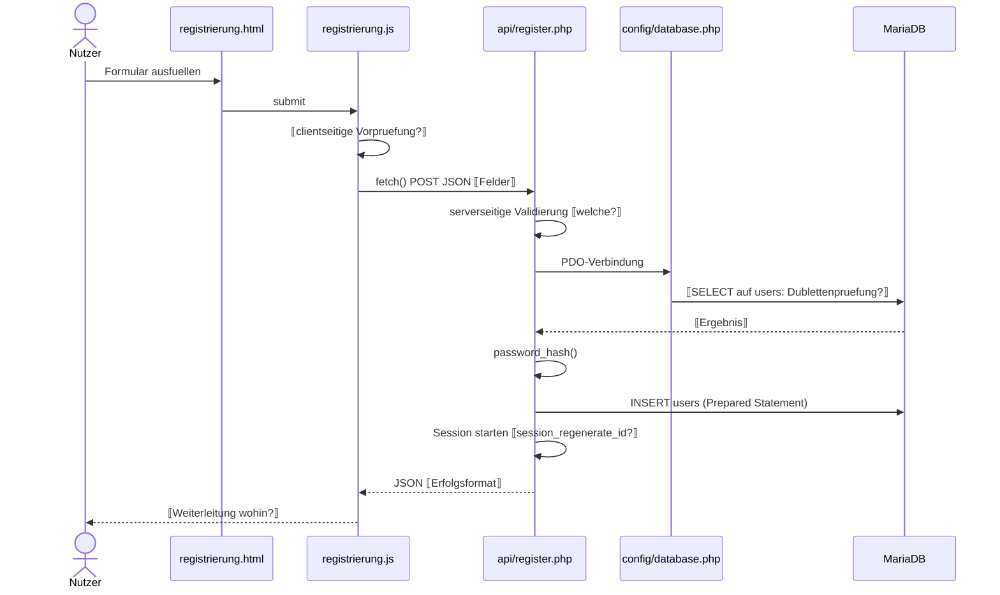

# 6 Laufzeitsicht

> **STATUS: GERÜST — NOCH KEINE DOKUMENTATION.**
> Übernommen wurden ausschließlich Gliederung, Auswahllogik und Beschreibungsformat des
> Herold-Beispiels. Alle ⟦…⟧-Stellen müssen aus dem aktuellen Repository belegt werden.
> Diagramme sind Skelette und zeigen die zu prüfende Struktur, keine bestätigten Abläufe.

Die Laufzeitsicht zeigt, wie die Bausteine aus [Kapitel 5](A05-bausteinsicht.md) in den
architektonisch entscheidenden Szenarien zusammenwirken. Auswahlkriterium nach arc42:
**Relevanz, nicht Vollständigkeit**.

> ⟦**Zu entscheiden:** Das Aufgabenbriefing listet neun Abläufe. Davon tragen nicht alle eine
> eigene Architekturaussage — „Logout" ist ein Session-Abbruch, „Meine Pizzen laden" ein
> Standard-Lesezugriff. Zwei mögliche Wege:
> (a) alle neun dokumentieren, aber nur die architektonisch tragenden mit Sequenzdiagramm;
> (b) alle neun mit Diagramm, wie das Briefing es nahelegt.
> Empfehlung: (a), mit expliziter Begründung der Nicht-Diagrammierung — genau das macht das
> Herold-Beispiel und es ist die arc42-konforme Variante. Vorher mit dem Team/Dozenten abgleichen.⟧

| Szenario | Use Case | Warum architektonisch relevant |
|----------|----------|-------------------------------|
| [6.1](#61-registrierung) Registrierung | ⟦UC-…⟧ | Erstmalige Anlage eines Nutzers; `password_hash()`; Session-Aufbau. |
| [6.2](#62-login) Login | ⟦UC-…⟧ | Einziger Zugangsmechanismus; `password_verify()`; `session_regenerate_id(true)`. |
| [6.3](#63-vorlage-laden) Vorlage laden | ⟦UC-…⟧ | Seitenübergreifende Zustandsübergabe ohne Server ⟦URL-Parameter, ggf. sessionStorage⟧. |
| [6.4](#64-konfigurieren-und-live-berechnung) Konfigurieren | ⟦UC-…⟧ | Rein clientseitige Neuberechnung ohne Reload — trägt A10 „Benutzbarkeit"/„Performance". |
| [6.5](#65-gutschein-einlösen) Gutschein einlösen | ⟦UC-…⟧ | Erste Prüfung, die dem Client nicht überlassen werden darf. |
| [6.6](#66-konfiguration-speichern) Speichern | ⟦UC-…⟧ | Der zentrale Schreibpfad: Session-Prüfung, serverseitige Neuberechnung, INSERT. |
| [6.7](#67-eigene-konfigurationen-laden) Meine Pizzen laden | ⟦UC-…⟧ | ⟦prüfen: Standard-Lesezugriff oder trägt es eine eigene Aussage?⟧ |
| [6.8](#68-konfiguration-löschen) Löschen | ⟦UC-…⟧ | Eigentumsprüfung serverseitig — direkter Bezug zum Sicherheitsszenario in A10. |
| [6.9](#69-logout) Logout | ⟦UC-…⟧ | ⟦prüfen: eigenes Szenario oder in § 6.2 mitbehandelt?⟧ |

⟦Satz zur Laufzeitcharakteristik ergänzen, sobald belegt — z. B. „Alle serverseitigen Schritte
laufen innerhalb eines einzelnen Apache/PHP-Requests; es gibt kein Polling und keine
Hintergrundverarbeitung." Nur schreiben, wenn im Code tatsächlich so.⟧

---

## 6.1 Registrierung

**Bemerkenswerte Aspekte** ⟦je Punkt aus dem Code belegen, sonst streichen⟧:

- ⟦Wird der Nutzer nach der Registrierung direkt eingeloggt oder muss er sich anmelden?⟧
- ⟦Wie wird eine bereits vergebene E-Mail/Nutzername behandelt — welcher HTTP-Status, welche Meldung?⟧
- ⟦Welche Validierung ist clientseitig, welche serverseitig? Der Unterschied ist die Aussage, nicht die Liste.⟧

## 6.2 Login

⟦Sequenzdiagramm nach obigem Muster: login.html → login.js → api/login.php → SELECT users →
password_verify() → Session → JSON → Browser.⟧

**Bemerkenswerte Aspekte:**

- ⟦`session_regenerate_id(true)` — wo genau aufgerufen? Session Fixation ist die Aussage dahinter.⟧
- ⟦Wird bei falschem Passwort und unbekanntem Nutzer dieselbe Meldung ausgegeben? Falls ja: bewusste Entscheidung, benennen. Falls nein: nach A11.⟧
- ⟦Wie erfährt die restliche Anwendung vom Login-Zustand — `api/session.php` + `auth.js`?⟧

## 6.3 Vorlage laden

⟦Sequenzdiagramm: startseite.js → URL-Parameter `?template=…` → konfigurator.js → pizza_data.json
→ vorbefüllter State.⟧

**Bemerkenswerte Aspekte:**

- ⟦Zustandsübergabe zwischen zwei Seiten ohne Server-Roundtrip — der eigentliche Architekturpunkt.⟧
- ⟦Wird `sessionStorage` genutzt oder nur der URL-Parameter? Das Briefing-Glossar nennt beides.⟧
- ⟦Verhalten bei unbekanntem oder manipuliertem Vorlagennamen.⟧

## 6.4 Konfigurieren und Live-Berechnung

⟦Ggf. ohne Sequenzdiagramm — falls rein clientseitig, ist ein Flussdiagramm ehrlicher.
Entscheidung begründen.⟧

**Bemerkenswerte Aspekte:**

- ⟦Der Ablauf verlässt den Browser nicht — das ist die Aussage und die Grundlage für A10 „Performance".⟧
- ⟦Wo liegt der Zustand des Konfigurators? Eine Datenstruktur in `konfigurator.js` ⟦belegen⟧.⟧
- ⟦Wann genau werden Preis und kcal neu berechnet — pro Änderung, debounced?⟧

## 6.5 Gutschein einlösen

⟦Sequenzdiagramm: konfigurator.js → api/coupon.php → Tabelle `gutscheine` → Prüfung → JSON → Rabatt.⟧

**Bemerkenswerte Aspekte:**

- ⟦Was prüft der Server: Existenz, Gültigkeitszeitraum, Einlösestatus? Nur belegte Punkte nennen.⟧
- ⟦Wird der Rabatt beim Speichern erneut serverseitig geprüft oder vertraut `save_config.php` dem Client?
  Das ist der sicherheitsrelevanteste offene Punkt in diesem Kapitel — Ergebnis ggf. nach A11.⟧

## 6.6 Konfiguration speichern

⟦Sequenzdiagramm: konfigurator.js → api/save_config.php → Session-/Validierungsprüfung →
serverseitige Berechnung → INSERT `konfigurationen` → JSON.⟧

**Bemerkenswerte Aspekte:**

- ⟦Rechnet der Server den Preis wirklich neu, oder übernimmt er den Clientwert? A08 behauptet
  „Server vertraut Clientpreis nicht blind" — im Code verifizieren, sonst Widerspruch dokumentieren.⟧
- ⟦Was passiert bei „Erneut bearbeiten": UPDATE oder zweiter INSERT? (Briefing A11 nennt das
  ausdrücklich als zu prüfen.)⟧
- ⟦Wie werden Beläge/Extras abgelegt — eigene Tabelle oder JSON-Spalte?⟧
- ⟦Verhalten für Gäste ohne Session: 401, Weiterleitung, oder lokal gespeichert?⟧

## 6.7 Eigene Konfigurationen laden

⟦Kurz halten. Falls Standard-Lesezugriff: kein Diagramm, dafür ein Satz zur Begründung.⟧

**Bemerkenswerter Aspekt:**

- ⟦Die `user_id` stammt aus der Session, nicht aus dem Request — falls im Code so, ist genau das
  die dokumentationswürdige Aussage.⟧

## 6.8 Konfiguration löschen

⟦Sequenzdiagramm mit dem Eigentums-Check als eigenständigem Schritt.⟧

**Bemerkenswerte Aspekte:**

- ⟦Wo findet die Eigentumsprüfung statt — in der WHERE-Klausel oder als separates SELECT?
  Der Unterschied ist architektonisch relevant (Race Condition, Informationsleck über den Statuscode).⟧
- ⟦Antwortverhalten bei fremder oder nicht existenter ID: unterscheidbar oder einheitlich?⟧

## 6.9 Logout

⟦Vermutlich in wenigen Sätzen erledigt: auth.js → api/logout.php → Session beenden →
Navigation aktualisieren. Falls kein Diagramm: begründen.⟧

---

## Was noch aus dem Repository belegt werden muss

| # | Offene Frage | Quelle im ZIP |
|---|--------------|---------------|
| 1 | Genaue Request-/Response-Formate je Endpunkt | `api/*.php` |
| 2 | Reihenfolge von Validierung, Session-Prüfung und DB-Zugriff je Endpunkt | `api/*.php` |
| 3 | Serverseitige Preisneuberechnung — vorhanden oder nicht | `api/save_config.php` |
| 4 | Prüfumfang der Gutscheinlogik | `api/coupon.php` |
| 5 | Ort der Eigentumsprüfung beim Löschen | `api/delete_config.php` |
| 6 | Mechanismus der Vorlagenübergabe (URL-Parameter / sessionStorage) | `startseite.js`, `konfigurator.js` |
| 7 | „Erneut bearbeiten": UPDATE oder INSERT | `konfigurator.js`, `api/save_config.php` |
| 8 | Einheitliche Fehlerbehandlung / HTTP-Statuscodes | alle `api/*.php`, `config/helpers.php` |
| 9 | Zuordnung der Szenarien zu den UC-Nummern der Spezifikation | `docs/spec/` |
