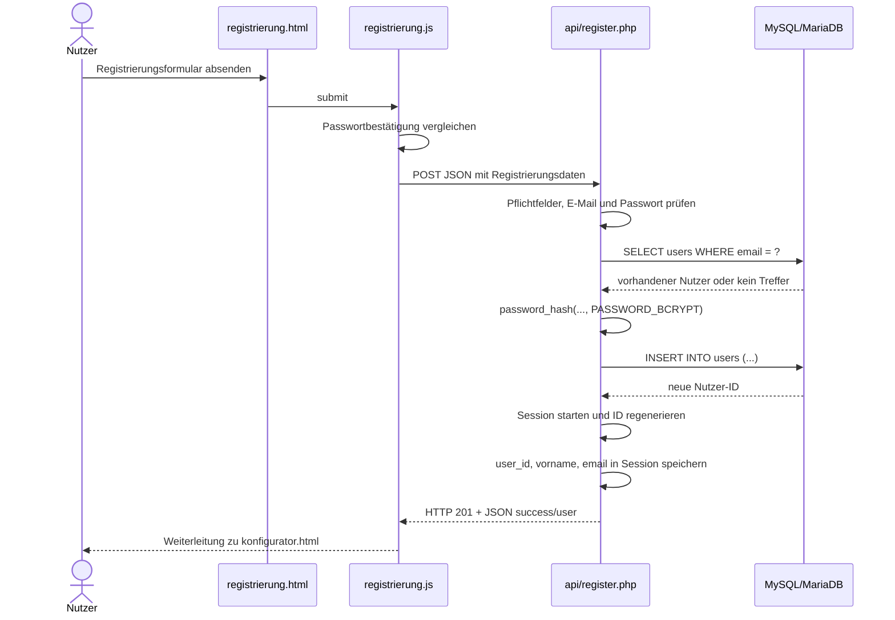
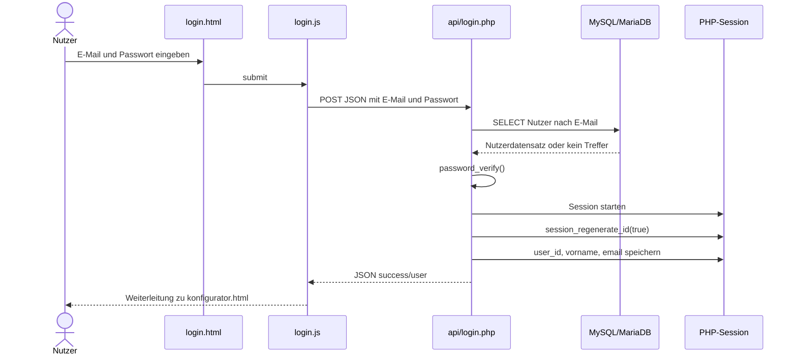
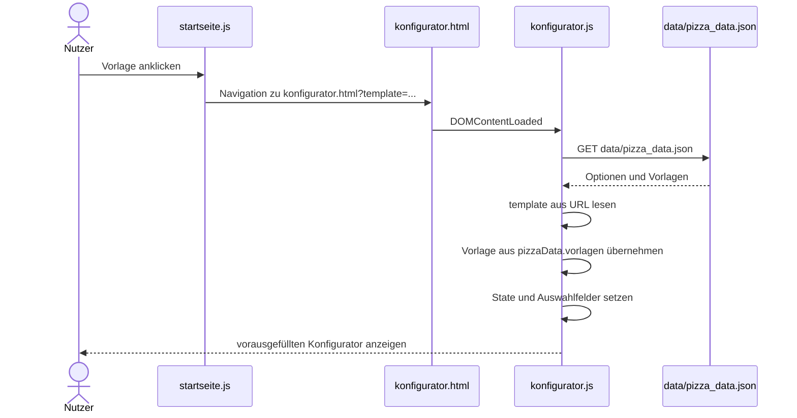
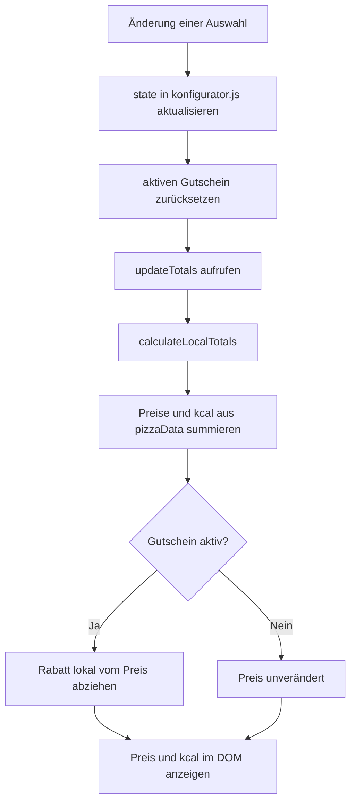
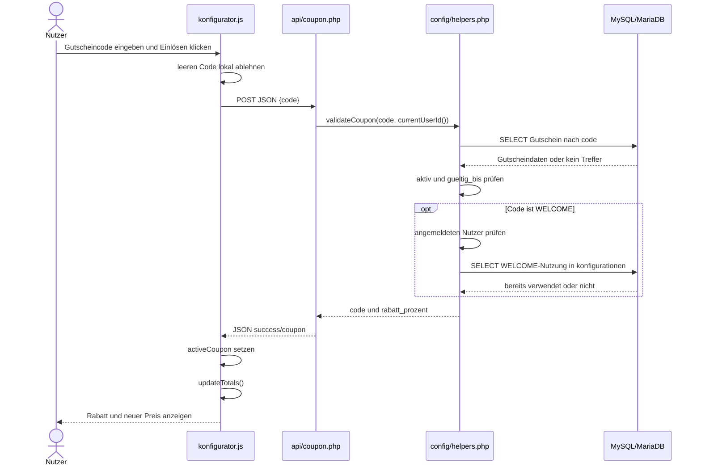
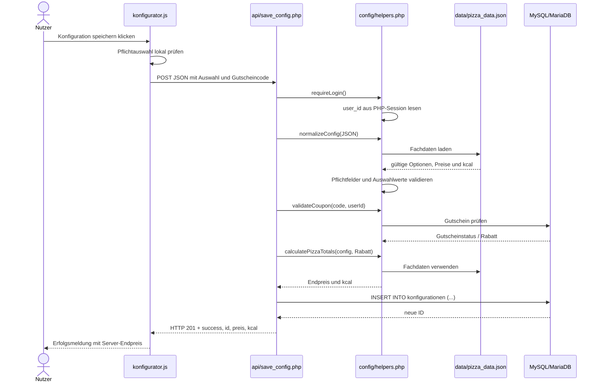
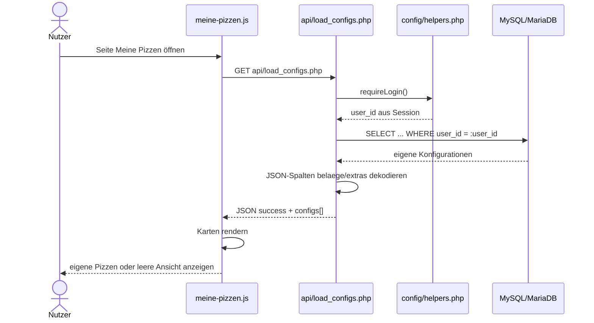
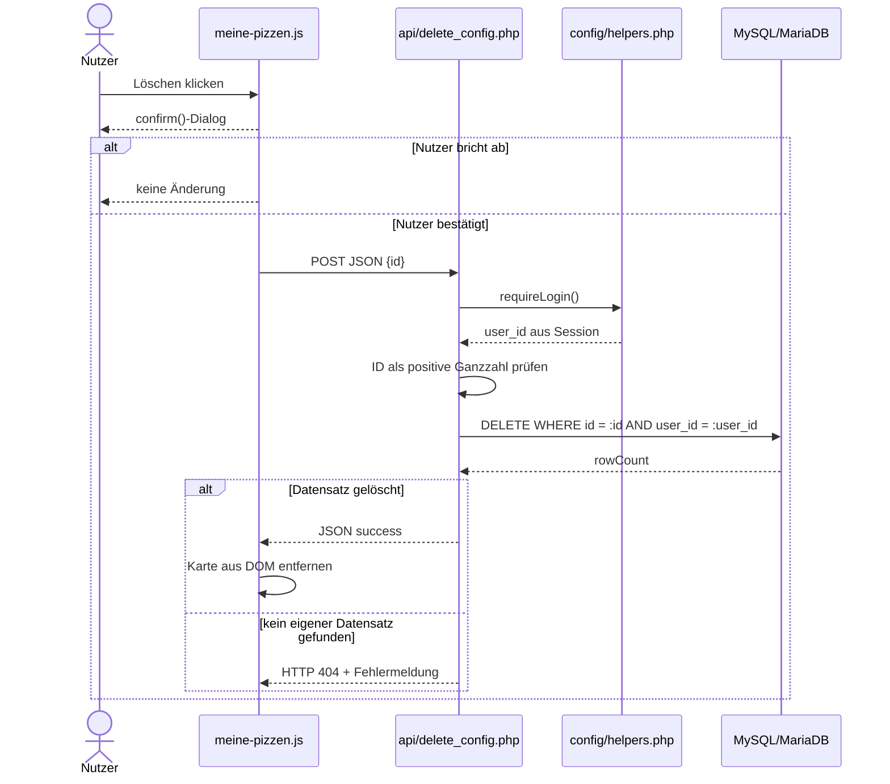
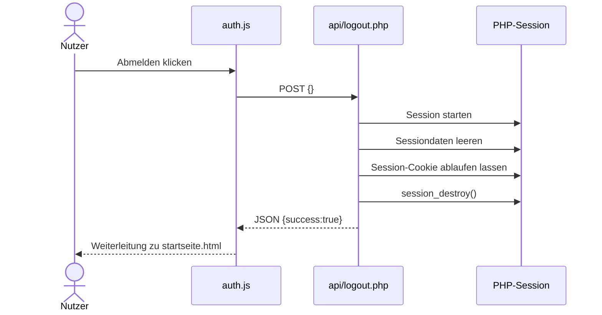

# A06 – Laufzeitsicht

Die Laufzeitsicht beschreibt, wie die Bausteine aus [Kapitel 5](A05%20-%20Bausteinsicht.md) während der wichtigsten Nutzungsszenarien zusammenarbeiten. Dokumentiert werden die im Projekt relevanten Abläufe aus der Spezifikation. Dabei wird zwischen rein clientseitigen Abläufen im Browser und Abläufen mit PHP-API und Datenbankzugriff unterschieden.

Die Anwendung arbeitet im geprüften Stand anfrageorientiert: Browseraktionen lösen bei Bedarf einzelne HTTP-Anfragen an PHP-Endpunkte aus. Es gibt keine Hintergrundjobs, kein Polling und keine WebSocket-Kommunikation. Statische Seiten werden als HTML ausgeliefert; JavaScript übernimmt Interaktion und Kommunikation mit den PHP-Endpunkten über `fetch()` und JSON.

| Szenario | Use Case | Architekturaussage |
|---|---|---|
| [6.1 Registrierung](#61-registrierung) | UC05 | Nutzeranlage, Passwort-Hashing und direkter Aufbau einer PHP-Session |
| [6.2 Login](#62-login) | UC06 | Prüfung der Zugangsdaten, `password_verify()` und Session-Aufbau |
| [6.3 Vorlage laden](#63-vorlage-laden) | UC11 | Seitenübergabe über URL-Parameter ohne PHP- oder Datenbankzugriff |
| [6.4 Konfigurieren und Live-Berechnung](#64-konfigurieren-und-live-berechnung) | UC01, UC02, UC03 | Lokaler Zustand und unmittelbare Preis-/kcal-Berechnung im Browser |
| [6.5 Gutschein einlösen](#65-gutschein-einlösen) | UC04 | Serverseitige Gutscheinprüfung mit Datenbankzugriff |
| [6.6 Konfiguration speichern](#66-konfiguration-speichern) | UC08 | Authentifizierung, Validierung, serverseitige Neuberechnung und `INSERT` |
| [6.7 Eigene Konfigurationen laden](#67-eigene-konfigurationen-laden) | UC09 | Nutzerbezogener Lesezugriff anhand der Session |
| [6.8 Konfiguration löschen](#68-konfiguration-löschen) | UC10 | Serverseitige Eigentumsprüfung über `id` und `user_id` |
| [6.9 Logout](#69-logout) | UC07 | Beenden der PHP-Session und Rückkehr zur Startseite |

> **Standhinweis:** Grundlage dieses Kapitels ist der bereitgestellte Projektstand `Pizza-Tracker--main(1).zip`. Angekündigte Änderungen von Person 1 an Rabatt-Rundung, WELCOME-Regel und Fehlerbehandlung sind in diesem Stand noch nicht als umgesetzt belegt. Diese Stellen müssen vor der finalen M3-Abgabe gegen den zusammengeführten `main`-Stand geprüft werden.

---

## 6.1 Registrierung

**Auslöser:** Ein Gast füllt das Formular in `registrierung.html` aus und sendet es ab.

### Ablauf

1. `js/registrierung.js` fängt das `submit`-Ereignis des Formulars ab und verhindert den normalen Formular-Postback.
2. JavaScript prüft zusätzlich, ob Passwort und Passwortbestätigung übereinstimmen. Die HTML-Felder besitzen außerdem Browser-Validierungen wie `required`, `type="email"` und `minlength="6"`.
3. Die Formulardaten werden als JSON per `POST` an `api/register.php` gesendet.
4. `register.php` akzeptiert nur `POST` und prüft serverseitig die Pflichtfelder, das E-Mail-Format, die Mindestlänge des Passworts und gegebenenfalls die Passwortbestätigung.
5. Über ein PDO Prepared Statement wird geprüft, ob die E-Mail bereits in `users` vorhanden ist.
6. Bei einer neuen E-Mail wird das Passwort mit `password_hash(..., PASSWORD_BCRYPT)` gehasht und der Nutzer mit einem Prepared Statement in `users` eingefügt.
7. Anschließend startet PHP die Session, führt `session_regenerate_id(true)` aus und speichert `user_id`, `vorname` und `email` in `$_SESSION`.
8. Erfolgreich antwortet der Server mit HTTP 201 und einem JSON-Objekt der Form `{"success":true,"user":{...}}`.
9. JavaScript leitet danach zu `konfigurator.html` weiter. Der Nutzer ist damit direkt angemeldet.

### Fehlerverhalten

- Fehlende Pflichtfelder: HTTP 400.
- Ungültige E-Mail-Adresse: HTTP 400.
- Passwort kürzer als sechs Zeichen: HTTP 400.
- Abweichende Passwortbestätigung: HTTP 400.
- Bereits registrierte E-Mail-Adresse: HTTP 409.
- Die API liefert bei diesen fachlich behandelten Fehlern JSON mit `success: false` und einer Fehlermeldung.
- `registrierung.js` hat im aktuellen Stand keinen eigenen `try/catch` für Netzwerkfehler oder ungültige JSON-Antworten.

**Codebelege:** `registrierung.html`, `js/registrierung.js`, `api/register.php`, `config/helpers.php`, `config/database.php`, `database/schema.sql`.

---

## 6.2 Login

**Auslöser:** Ein registrierter Nutzer sendet das Loginformular in `login.html` ab.

### Ablauf

1. `js/login.js` fängt das Absenden des Formulars ab.
2. E-Mail und Passwort werden als JSON mit `POST` an `api/login.php` gesendet.
3. `login.php` prüft, ob beide Werte vorhanden sind.
4. Der Nutzer wird über ein PDO Prepared Statement anhand der E-Mail aus der Tabelle `users` gelesen.
5. Das eingegebene Passwort wird mit `password_verify()` gegen den gespeicherten Hash geprüft.
6. Bei Erfolg startet PHP eine Session, regeneriert die Session-ID und speichert `user_id`, `vorname` und `email` in `$_SESSION`.
7. Der Endpunkt antwortet mit `{"success":true,"user":{...}}`.
8. `login.js` leitet zu `konfigurator.html` weiter.
9. Auf Seiten, die `js/auth.js` laden, ruft `checkSession()` zusätzlich `api/session.php` auf. Dadurch wird der Loginzustand für Navigation und Bedienelemente ermittelt. `api/session.php` liefert entweder `loggedIn: false` oder bei aktiver Session `loggedIn: true` zusammen mit den Session-Nutzerdaten.

### Fehlerverhalten

- Leere E-Mail oder leeres Passwort: HTTP 400.
- Unbekannte E-Mail und falsches Passwort führen beide zur gleichen Antwort `E-Mail oder Passwort ist falsch.` mit HTTP 401. Dadurch wird über die Fehlermeldung nicht unterschieden, welcher Teil der Zugangsdaten falsch war.
- `login.js` zeigt fachliche API-Fehler an, besitzt aber keine eigene Behandlung für Netzwerkfehler oder ungültige JSON-Antworten.

**Codebelege:** `login.html`, `js/login.js`, `api/login.php`, `js/auth.js`, `api/session.php`, `config/helpers.php`.

---

## 6.3 Vorlage laden

**Auslöser:** Der Nutzer klickt auf der Startseite auf eine Pizza-Vorlage.

### Ablauf

1. `js/startseite.js` liest beim Klick den Wert aus `data-template` des jeweiligen Buttons.
2. Der Browser navigiert zu `konfigurator.html?template=<Vorlagenname>`. Der Vorlagenname wird mit `encodeURIComponent()` in die URL geschrieben.
3. Beim Laden des Konfigurators lädt `js/konfigurator.js` zunächst `data/pizza_data.json` per HTTP-GET als statische JSON-Datei.
4. Danach wird der URL-Parameter `template` über `URLSearchParams` gelesen.
5. Nur wenn unter `pizzaData.vorlagen[templateKey]` eine passende Vorlage existiert, wird sie mit `applyConfig()` in den lokalen Zustand übernommen.
6. `applyConfig()` setzt Name, Größe, Teig, Sauce, Käse, Beläge und Extras, markiert die entsprechenden Eingabefelder und aktualisiert Preis und Kalorien.
7. Für diesen Ablauf werden weder PHP noch die Datenbank benötigt.

### Abgrenzung zu `sessionStorage`

Vorlagen werden **nicht** über `sessionStorage` übertragen. `sessionStorage` wird ausschließlich beim Ablauf „Erneut bearbeiten“ aus „Meine Pizzen“ verwendet. Befindet sich dort `pizza-edit-config`, lädt der Konfigurator zunächst diese gespeicherte Konfiguration und entfernt den Eintrag anschließend. Nur wenn kein solcher Eintrag vorliegt, wird der URL-Parameter `template` ausgewertet.

### Fehlerverhalten

Ein unbekannter oder manipulierter Vorlagenname wird nicht an einen Server geschickt. Wenn der Schlüssel nicht in `pizzaData.vorlagen` existiert, wird keine Vorlage angewendet; der Konfigurator bleibt im normalen Ausgangszustand.

**Codebelege:** `startseite.html`, `js/startseite.js`, `konfigurator.html`, `js/konfigurator.js`, `data/pizza_data.json`.

---

## 6.4 Konfigurieren und Live-Berechnung

**Auslöser:** Der Nutzer ändert Größe, Teig, Sauce, Käse, Beläge oder Extras im Konfigurator.

Da dieser Ablauf nach dem initialen Laden der Fachdaten vollständig im Browser stattfindet, zeigt das folgende Flussdiagramm den Ablauf genauer als ein Server-Sequenzdiagramm.

### Ablauf

1. Beim Laden des Konfigurators wird `data/pizza_data.json` geladen und in `pizzaData` gespeichert.
2. `renderOptions()` erzeugt aus diesen Daten die Auswahlfelder für Größe, Teig, Sauce, Käse, Beläge und Extras.
3. Der aktuelle Zustand der Pizza liegt im JavaScript-Objekt `state` in `js/konfigurator.js`.
4. Jede Änderung eines Auswahlfeldes aktualisiert unmittelbar den entsprechenden Wert in `state`.
5. Bei jeder Zutatenänderung wird ein zuvor aktiver Gutschein im aktuellen Code zurückgesetzt und das Gutscheinfeld geleert.
6. Danach wird `updateTotals()` aufgerufen. Diese Funktion verwendet `calculateLocalTotals()`.
7. `calculateLocalTotals()` summiert Preis und Kalorien aus den bereits geladenen Daten für alle ausgewählten Bestandteile. Falls ein Gutschein aktiv ist, wird dessen prozentualer Rabatt lokal vom Preis abgezogen.
8. `updateTotals()` schreibt den Preis und die gerundete Kalorienanzeige direkt in die HTML-Oberfläche.
9. Es erfolgt bei einer normalen Auswahländerung **keine** PHP- oder Datenbankanfrage und kein Seitenreload.

### Architekturaussage

Die Live-Berechnung ist eine UI-Funktion im Browser. Sie dient der unmittelbaren Rückmeldung an den Nutzer. Der beim späteren Speichern maßgebliche Preis wird dagegen im Backend erneut berechnet; die Clientanzeige ist nicht die verbindliche Datenquelle für den gespeicherten Preis.

**Codebelege:** `js/konfigurator.js`, `data/pizza_data.json`, `konfigurator.html`.

---

## 6.5 Gutschein einlösen

**Auslöser:** Der Nutzer gibt einen Gutscheincode ein und klickt auf „Einlösen“.

### Ablauf

1. `validateCoupon()` in `js/konfigurator.js` liest den eingegebenen Code.
2. Bei leerem Eingabefeld wird lokal eine Warnung angezeigt; es erfolgt keine Serveranfrage.
3. Ansonsten wird `{"code":"..."}` als JSON per `POST` an `api/coupon.php` gesendet.
4. `coupon.php` ruft `validateCoupon()` aus `config/helpers.php` auf. Für die WELCOME-Regel wird zusätzlich die aktuelle Session-Nutzer-ID über `currentUserId()` berücksichtigt.
5. Der Server normalisiert den Code auf Großbuchstaben und sucht ihn per Prepared Statement in `gutscheine`.
6. Geprüft werden Existenz, `aktiv` und `gueltig_bis`.
7. Für `WELCOME` gilt im aktuellen Stand zusätzlich: Der Nutzer muss angemeldet sein. Danach wird in `konfigurationen` gesucht, ob dieser Nutzer bereits einen Datensatz mit `gutschein_code = 'WELCOME'` besitzt.
8. Bei Erfolg antwortet der Endpunkt mit `{"success":true,"coupon":{"code":"...","rabatt_prozent":...}}`.
9. JavaScript speichert den Gutschein in `activeCoupon`, zeigt die Erfolgsmeldung an und berechnet den angezeigten Preis neu.

### Fehlerverhalten

- Leere Eingabe: lokale Warnung, keine Anfrage.
- Nicht vorhandener Code: HTTP 404.
- Inaktiver Code: HTTP 400.
- Abgelaufener Code: HTTP 410.
- `WELCOME` als Gast: HTTP 401.
- Bereits verwendetes `WELCOME`: HTTP 409.
- Bei fachlichen Fehlern setzt das Frontend `activeCoupon` auf `null` und zeigt die Servermeldung an.
- Netzwerkfehler und ungültige JSON-Antworten werden im aktuellen Frontend nicht mit `try/catch` abgefangen.

### Sicherheitsrelevanter Punkt

Die Gutscheinprüfung im Browser ist nicht die einzige Prüfung. Beim Speichern wird der Gutscheincode in `api/save_config.php` **erneut** serverseitig über dieselbe Funktion `validateCoupon()` geprüft. Das Backend vertraut daher nicht allein darauf, dass der Client zuvor einen gültigen Gutschein erhalten hat.

### Offener Punkt zur WELCOME-Regel

Der aktuelle Nutzungsnachweis hängt an vorhandenen Datensätzen in `konfigurationen`. Wird eine mit WELCOME gespeicherte Konfiguration gelöscht, kann dieser Nachweis verschwinden. Eine angekündigte Änderung durch Person 1 muss vor der finalen Dokumentation erneut geprüft werden.

**Codebelege:** `js/konfigurator.js`, `api/coupon.php`, `config/helpers.php`, `database/schema.sql`.

---

## 6.6 Konfiguration speichern

**Auslöser:** Ein angemeldeter Nutzer klickt auf „Konfiguration speichern“.

### Ablauf

1. Der Speicherbutton wird durch `js/auth.js` und das Ereignis `pizza-auth-changed` nur für einen als angemeldet erkannten Nutzer eingeblendet. Dies ist eine UI-Funktion und ersetzt keine serverseitige Zugriffskontrolle.
2. `saveConfig()` prüft lokal, ob Größe, Teig, Sauce und Käse gewählt wurden.
3. `getPayload()` erzeugt ein JSON-Objekt aus Name, Größe, Teig, Sauce, Käse, Belägen, Extras und dem gegebenenfalls aktiven Gutscheincode.
4. **Preis, Kalorien und Benutzer-ID werden nicht vom Client an den Server übertragen.**
5. Das JSON wird per `POST` an `api/save_config.php` gesendet.
6. `save_config.php` ruft zuerst `requireLogin()` auf. Die Benutzer-ID wird damit aus der PHP-Session gelesen. Ohne aktive Anmeldung antwortet der Server mit HTTP 401.
7. `normalizeConfig()` liest die Eingaben, setzt gegebenenfalls den Standardnamen `Meine Pizza`, prüft die Pflichtfelder und validiert alle gewählten Optionen gegen `data/pizza_data.json`.
8. Der gegebenenfalls mitgesendete Gutschein wird serverseitig erneut durch `validateCoupon()` geprüft.
9. `calculatePizzaTotals()` berechnet Preis und Kalorien serverseitig erneut aus `pizza_data.json`.
10. Anschließend speichert ein PDO Prepared Statement die Konfiguration mit `INSERT INTO konfigurationen`. `belaege` und `extras` werden als JSON kodiert und in den JSON-Spalten der Tabelle gespeichert.
11. Bei Erfolg liefert PHP HTTP 201 mit `success`, der neuen `id`, dem serverseitig berechneten `preis` und den `kcal` zurück.
12. Das Frontend zeigt eine Erfolgsmeldung mit dem **vom Server zurückgegebenen** Endpreis an.

### Fehlerverhalten

- Fehlende Session: HTTP 401.
- Ungültiges JSON: HTTP 400.
- Fehlende Pflichtauswahl oder ungültige Optionswerte: HTTP 400.
- Gutscheinfehler werden mit den in Abschnitt 6.5 beschriebenen Statuscodes zurückgegeben.
- Fachlich behandelte API-Fehler werden vom Frontend angezeigt.
- Netzwerkfehler, ein Serverabbruch oder eine ungültige JSON-Antwort werden in `saveConfig()` aktuell nicht gesondert abgefangen.

### Rundung

Im aktuellen Stand unterscheiden sich Client- und Serverregel bei bestimmten Rabatten. Der Browser zieht den Prozentwert direkt vom lokalen Preis ab. Der Server rundet dagegen zunächst den Ausgangspreis auf Cent, dann den Rabattbetrag auf Cent und anschließend den Endpreis. Deshalb kann die Anzeige vor dem Speichern in einzelnen Fällen um einen Cent vom serverseitig gespeicherten Preis abweichen. Dieser Punkt muss nach der angekündigten Person-1-Korrektur erneut geprüft werden.

### „Erneut bearbeiten“ ist kein Update

Beim Klick auf „Erneut bearbeiten“ in „Meine Pizzen“ wird die vorhandene Konfiguration als JSON in `sessionStorage` unter `pizza-edit-config` abgelegt und der Konfigurator geöffnet. `applyConfig()` übernimmt dort die Werte. Eine vorhandene Datenbank-ID wird aber nicht in den Speicher-Payload aufgenommen. `api/save_config.php` enthält ausschließlich einen `INSERT` und keinen `UPDATE`. Wird eine wieder geöffnete Pizza gespeichert, entsteht daher im aktuellen Stand ein **neuer Datensatz**.

Ein in der alten Konfiguration gespeicherter Gutscheincode wird durch `applyConfig()` ebenfalls nicht automatisch als `activeCoupon` reaktiviert.

**Codebelege:** `js/auth.js`, `js/konfigurator.js`, `api/save_config.php`, `config/helpers.php`, `data/pizza_data.json`, `database/schema.sql`, `js/meine-pizzen.js`.

---

## 6.7 Eigene Konfigurationen laden

**Auslöser:** Ein Nutzer öffnet `meine-pizzen.html`.

### Ablauf

1. `loadConfigs()` wird bei `DOMContentLoaded` aufgerufen.
2. JavaScript sendet einen `GET` an `api/load_configs.php`.
3. Der PHP-Endpunkt verlangt über `requireLogin()` eine aktive Session.
4. Die `user_id` wird ausschließlich aus der Session genommen; der Browser sendet keine Nutzer-ID für die Abfrage.
5. Mit einem Prepared Statement werden nur Datensätze aus `konfigurationen` geladen, deren `user_id` der angemeldeten Person entspricht. Die Sortierung erfolgt nach `erstellt_am DESC, id DESC`.
6. PHP wandelt `id` in Integer und `preis` in Float um und dekodiert die JSON-Spalten `belaege` und `extras` wieder zu Arrays.
7. Der Endpunkt antwortet mit `{"success":true,"configs":[...]}`.
8. Das Frontend erzeugt daraus Pizza-Karten. Bei einer leeren Liste wird die leere Ansicht angezeigt.

### Fehlerverhalten

- Ohne Anmeldung: HTTP 401; `meine-pizzen.js` zeigt den nicht autorisierten Zustand an.
- Andere nicht erfolgreiche HTTP-Antworten werden mit einer Fehlermeldung im selben Bereich angezeigt.
- Netzwerkfehler oder ungültige JSON-Antworten werden aktuell nicht separat abgefangen; dadurch kann beispielsweise die Ladeanzeige stehen bleiben.

### „Erneut bearbeiten“

Nach erfolgreichem Laden kann eine Karte mit „Erneut bearbeiten“ geöffnet werden. JavaScript speichert dafür die Konfigurationsdaten in `sessionStorage` unter `pizza-edit-config` und navigiert zu `konfigurator.html`. Dies ist ein anderer Mechanismus als das Laden einer Vorlage über `?template=...`.

**Codebelege:** `meine-pizzen.html`, `js/meine-pizzen.js`, `api/load_configs.php`, `config/helpers.php`.

---

## 6.8 Konfiguration löschen

**Auslöser:** Ein angemeldeter Nutzer klickt bei einer gespeicherten Pizza auf „Löschen“ und bestätigt den Browserdialog.

### Ablauf

1. Beim Klick auf „Löschen“ zeigt `meine-pizzen.js` mit `confirm()` zunächst einen Bestätigungsdialog mit dem Namen der Pizza an.
2. Bei Abbruch erfolgt keine Serveranfrage.
3. Bei Bestätigung sendet JavaScript die numerische Konfigurations-ID als JSON per `POST` an `api/delete_config.php`.
4. Der Server prüft zuerst die aktive Session und liest daraus `user_id`.
5. Danach wird die übermittelte ID mit `FILTER_VALIDATE_INT` geprüft und muss größer als 0 sein.
6. Die Eigentumsprüfung ist direkt in die `DELETE`-Bedingung eingebaut: `WHERE id = :id AND user_id = :user_id`.
7. Dadurch kann nur ein Datensatz gelöscht werden, der sowohl die angegebene ID besitzt als auch dem angemeldeten Nutzer gehört.
8. Wenn `rowCount()` 0 ist, antwortet der Endpunkt mit HTTP 404 und `Konfiguration nicht gefunden.`. Fremde und nicht vorhandene IDs werden damit über dieselbe Antwort behandelt.
9. Bei erfolgreichem Löschen lautet die Antwort `{"success":true}`.
10. Nur bei `response.ok` entfernt das Frontend die Karte aus der Ansicht. Wenn danach keine Karte mehr vorhanden ist, wird die leere Ansicht eingeblendet.

### Fehlerverhalten

- Nicht angemeldet: HTTP 401.
- Ungültige ID: HTTP 400.
- Fremde oder nicht existierende ID: HTTP 404 mit derselben Meldung.
- Im aktuellen Frontend wird die Fehlerantwort beim Löschen nicht ausgewertet oder sichtbar angezeigt. Bei einer nicht erfolgreichen Antwort bleibt die Karte stehen, der Nutzer erhält aber keine konkrete Fehlermeldung.
- Netzwerkfehler werden nicht abgefangen.

**Codebelege:** `js/meine-pizzen.js`, `api/delete_config.php`, `config/helpers.php`.

---

## 6.9 Logout

**Auslöser:** Ein angemeldeter Nutzer klickt auf ein Element mit `data-action="logout"`.

### Ablauf

1. `js/auth.js` registriert auf allen passenden Logout-Elementen einen Klick-Handler.
2. `logoutUser()` sendet einen `POST` mit einem leeren JSON-Objekt an `api/logout.php`.
3. Der PHP-Endpunkt startet die vorhandene Session, setzt `$_SESSION` auf ein leeres Array und lässt bei Cookie-basierten Sessions das Session-Cookie ablaufen.
4. Danach wird `session_destroy()` aufgerufen.
5. PHP antwortet mit `{"success":true}`.
6. JavaScript navigiert anschließend zu `startseite.html`.
7. Beim Laden einer Seite mit `auth.js` stellt `checkSession()` über `api/session.php` fest, dass keine aktive `user_id` mehr in der Session vorhanden ist. Die Navigation wird entsprechend auf Gastzustand gesetzt.

### Fehlerverhalten

`logoutUser()` prüft im aktuellen Stand den HTTP-Status der Logout-Antwort nicht. Solange `fetch()` technisch eine Antwort erhält, wird anschließend zur Startseite weitergeleitet. Schlägt die Netzwerkanfrage selbst fehl, existiert kein eigener `try/catch` für den Logout-Ablauf.

**Codebelege:** `js/auth.js`, `api/logout.php`, `api/session.php`, `config/helpers.php`.

---

## 6.10 Zusammenfassung der Laufzeitarchitektur

Die neun Szenarien zeigen drei unterschiedliche Arten von Laufzeitabläufen:

1. **Rein clientseitige Abläufe:** Das Laden einer Vorlage und die Live-Berechnung arbeiten nach dem Laden von `pizza_data.json` ohne PHP- oder Datenbankzugriff. Der Zustand liegt im JavaScript des Browsers.
2. **Lesende bzw. prüfende API-Aufrufe:** Sessionstatus, Gutscheinprüfung und das Laden gespeicherter Pizzen verwenden `fetch()`, JSON und PHP-Endpunkte. Datenbankzugriffe erfolgen ausschließlich im Backend über PDO.
3. **Schreibende API-Aufrufe:** Registrierung, Speichern und Löschen validieren serverseitig, verwenden Prepared Statements und verändern die Datenbank. Die Identität eines angemeldeten Nutzers wird aus der PHP-Session genommen und nicht vom Client vorgegeben.

Besonders sicherheitsrelevant sind die serverseitige Sessionprüfung beim Speichern/Laden/Löschen, die erneute Gutscheinprüfung beim Speichern sowie die Eigentumsbedingung beim Löschen. Die Benutzeroberfläche blendet Funktionen abhängig vom Loginstatus ein oder aus, die eigentliche Zugriffskontrolle erfolgt jedoch im PHP-Backend.

---

## 6.11 Offene Prüfpunkte vor der finalen Abgabe

Die folgenden Punkte sind im aktuellen Code belegt, können aber durch angekündigte Arbeiten von Person 1 noch geändert werden:

- **Rabatt-Rundung:** Client und Server verwenden derzeit nicht in allen Fällen dieselbe Cent-Rundung.
- **WELCOME-Regel:** Der Einmalnachweis basiert derzeit auf noch vorhandenen `konfigurationen`-Datensätzen mit `gutschein_code = 'WELCOME'`.
- **Fehlerbehandlung:** Mehrere `fetch()`-Aufrufe besitzen derzeit keinen `try/catch`; beim Löschen wird eine Serverfehlermeldung im Frontend nicht angezeigt.
- **„Erneut bearbeiten“:** Aktuell führt anschließendes Speichern zu einem neuen `INSERT`; es existiert keine UPDATE-Funktion.
- **Gespeicherter Gutschein:** Beim Wiederöffnen einer Pizza wird ein gespeicherter Gutscheincode nicht automatisch als aktiver Gutschein angewendet.

Vor dem finalen M3-Tag ist A06 gegen den zusammengeführten `main`-Stand abzugleichen. Änderungen in diesen Punkten müssen nur dort angepasst werden, wo der tatsächliche Code sich geändert hat.
