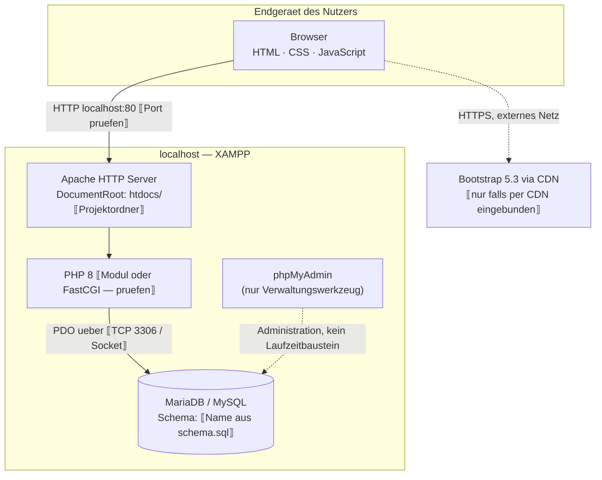

# 7 Verteilungssicht

> **STATUS: GERÜST — NOCH KEINE DOKUMENTATION.**
> Übernommen wurde nur die Beschreibungsmechanik des Herold-Beispiels
> (Motivation → Knoten/Kanäle → Baustein-Zuordnung → Qualitätsmerkmale).
> **Nicht übernommen:** die dortige Zweiteilung Produktion/Entwicklung, die Container-Umgebung
> und die Release-Pipeline. Der Pizza Tracker hat eine einzige, lokale Umgebung.
> Alle ⟦…⟧-Stellen sind aus dem Repository zu belegen.

Die Verteilungssicht bildet die Bausteine aus [Kapitel 5](A05-bausteinsicht.md) auf die
Ausführungsumgebung ab, die tatsächlich existiert: eine **lokale XAMPP-Installation** auf dem
Rechner des Entwicklers bzw. Prüfers. Es gibt keine Produktionsumgebung, kein Staging, kein
Deployment und keine Containerisierung — die Anwendung wird nicht im Internet betrieben.
Diese Einschränkung ist keine Lücke, sondern eine bewusste Rahmenbedingung des Projekts
⟦Beleg in A02 / docs/spec/ suchen und verlinken⟧ und wird in
[Kapitel 11](A11-risiken-und-technische-schulden.md) als solche geführt.

---

## 7.1 Infrastruktur Ebene 1 — lokale XAMPP-Umgebung

⟦Diagramm gegen die tatsächliche Installation prüfen: Port, Ordnername unter `htdocs/`,
CDN-Einbindung. Gestrichelte Kanten kennzeichnen bewusst, was **nicht** zum Laufzeitkern gehört.⟧

**Motivation.** ⟦Warum lokal und nicht gehostet? Aus dem Projektkontext begründen — z. B.
Hochschulprojekt ohne Betriebsauftrag, Nachvollziehbarkeit für die Bewertung, kein Budget für
Infrastruktur. Nicht als allgemeine Wahrheit formulieren. Verweis auf den entsprechenden ADR
in [Kapitel 9](A09-architekturentscheidungen.md), falls dort geführt.⟧

**Knoten und Kanäle.**

| Element | Realisierung |
|---------|--------------|
| Client | Beliebiger moderner Browser auf demselben Rechner; führt Präsentationsschicht und Browserlogik aus. ⟦Bezug zum Kompatibilitätsszenario in A10⟧ |
| Web-Zugang | Apache aus dem XAMPP-Paket, ⟦HTTP, kein TLS — prüfen und, falls zutreffend, als bewusste Einschränkung benennen⟧. DocumentRoot ⟦Pfad⟧. |
| Anwendungslaufzeit | PHP 8 ⟦Version aus der XAMPP-Installation⟧, pro Request ausgeführt. Kein Cron, kein Worker, keine Hintergrundverarbeitung. |
| Persistente Flächen | ⟦Datenbankdateien von MariaDB — Pfad nur nennen, wenn relevant⟧; das Datenbankschema selbst stammt aus `database/schema.sql`. ⟦Werden sonst irgendwo Dateien geschrieben? Uploads, Logs? Prüfen.⟧ |
| Datenbankzugang | PDO aus `config/database.php`; Verbindungsparameter ⟦Host, Port, Nutzer — Zugangsdaten NICHT dokumentieren, nur die Mechanik⟧. |
| Administration | phpMyAdmin — ausschließlich Werkzeug zum Anlegen und Inspizieren der Datenbank. **Kein Laufzeitbaustein**: die Anwendung ruft es nie auf und funktioniert ohne es. |
| Ausgehende Verbindungen | ⟦Nur falls Bootstrap per CDN geladen wird: HTTPS zu `cdn.jsdelivr.net` o. ä. — exakte URL aus dem HTML. Sonst: „keine".⟧ |

**Zuordnung der Bausteine.** ⟦Tabelle oder Fließtext: Welcher Baustein aus § 5.1 läuft auf welchem
Knoten? Kernaussage, die belegt werden muss: Präsentationsschicht wird vom Apache *ausgeliefert*,
aber im *Browser ausgeführt*; Backend/API, Konfiguration/Helfer und die Fachdaten ⟦falls
serverseitig gelesen⟧ laufen im PHP-Prozess; die Persistenz ist ein eigener Dienst auf demselben
Rechner. Es gibt keine zweite Maschine.⟧

**Qualitätsmerkmale.** ⟦Nur belegbare Aussagen:
Verfügbarkeit = läuft, solange XAMPP läuft; keine Redundanz und keine gefordert.
Performance dominiert durch lokale Ausführung, keine Netzlatenz — außer beim CDN-Abruf.
Sicherheit: kein TLS, keine Exposition ins Netz ⟦prüfen⟧ — das ist genau der Grund, warum der
Betrieb lokal bleibt. Bezug zu den Szenarien in [Kapitel 10](A10-qualitaetsanforderungen.md).⟧

---

## 7.2 Infrastruktur Ebene 2 — der XAMPP-Knoten

⟦Optional, aber empfohlen: XAMPP ist ein Bündel, kein einzelner Prozess. Eine Verfeinerung in
Apache-Prozess, PHP-Laufzeit und MariaDB-Dienst macht sichtbar, dass Web- und Datenbankdienst
getrennte Prozesse mit eigener Lebensdauer sind — relevant für die Inbetriebnahme unten.
Falls du hier nichts Substanzielles zu sagen hast: Abschnitt streichen und begründen,
statt ihn mit Selbstverständlichkeiten zu füllen.⟧

| Dienst | Rolle | Lebenszyklus |
|--------|-------|--------------|
| Apache | ⟦…⟧ | ⟦über XAMPP Control Panel gestartet/gestoppt⟧ |
| PHP | ⟦Modul in Apache oder eigener Prozess? Prüfen.⟧ | ⟦…⟧ |
| MariaDB | ⟦…⟧ | ⟦unabhängig von Apache startbar⟧ |

---

## 7.3 Inbetriebnahme

⟦Direkter Bezug zum Qualitätsziel „Betreibbarkeit" aus A10 („nachvollziehbare lokale
Inbetriebnahme"). Hier gehört die *Architektur* der Inbetriebnahme hin, nicht das
Schritt-für-Schritt-Handbuch — das gehört in eine README. Zu belegen:⟧

- ⟦Welche Schritte sind nötig, bis die Anwendung läuft? Projekt nach `htdocs/`, Datenbank aus
  `database/schema.sql` anlegen, ⟦Testdaten? Gutscheine? Gibt es Seed-Daten im Repository?⟧⟧
- ⟦Wie werden die DB-Zugangsdaten gesetzt — fest in `config/database.php` oder über eine
  ignorierte lokale Datei? Das Briefing nennt unter A08 ausdrücklich „keine Zugangsdaten ins
  Repository / .gitignore beachten". **Im Repository verifizieren.** Falls Zugangsdaten
  eingecheckt sind: nicht beschönigen, sondern als Befund nach
  [Kapitel 11](A11-risiken-und-technische-schulden.md).⟧
- ⟦Gibt es einen Migrationsweg bei Schemaänderungen oder wird die Datenbank neu angelegt?⟧

---

## Was noch aus dem Repository belegt werden muss

| # | Offene Frage | Quelle |
|---|--------------|--------|
| 1 | PHP-Version und Einbindung (Modul/FastCGI), Apache-Port | XAMPP-Installation, `php -v` |
| 2 | Datenbankname, Zeichensatz, Verbindungsparameter | `database/schema.sql`, `config/database.php` |
| 3 | Bootstrap per CDN oder lokal ausgeliefert — inkl. exakter URL | `<head>` der HTML-Seiten |
| 4 | Weitere externe Ressourcen (Fonts, Icons, Bibliotheken) | alle HTML-Dateien |
| 5 | Zugangsdaten im Repository? `.gitignore` vorhanden und wirksam? | Repo-Wurzel, `config/` |
| 6 | Seed-/Testdaten für `gutscheine` o. ä. vorhanden? | `database/` |
| 7 | Schreibt die Anwendung Dateien außerhalb der Datenbank? | `api/*.php`, `config/helpers.php` |
| 8 | Wird `.htaccess` verwendet (Rewrites, Zugriffsschutz auf `config/`, `data/`)? | Projektwurzel und Unterordner |
