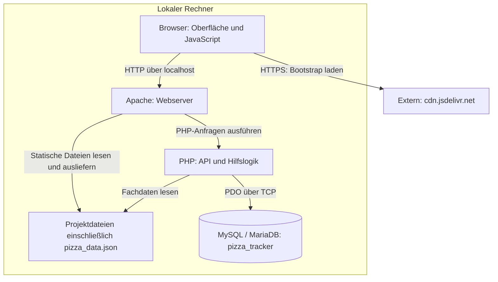

# 7 Verteilungssicht

Dieses Kapitel ordnet die Bausteine aus [Kapitel 5](A05%20-%20Bausteinsicht.md) ihrer Ausführungsumgebung zu. Beim vorgesehenen lokalen Betrieb laufen Browser, Webserver und Datenbank auf demselben Rechner. Die Anwendung wird durch Bereitstellen der Projektdateien und Einrichten der Datenbank installiert; ein Build-Schritt oder Container ist nicht erforderlich.

Der lokale Betrieb ist eine **projektspezifische Randbedingung** aus [P1](../spec/P1-ziele-rahmenbedingungen.md) und [Kapitel 2](02-randbedingungen.md), keine allgemeine Vorgabe des Moduls für alle Projekte. Öffentliches Hosting, Staging und Hochverfügbarkeit gehören nicht zum vereinbarten Umfang.

## 7.1 Infrastruktur und Kommunikationswege

Die Pfeile kennzeichnen Aufrufe und Zugriffe; Antworten laufen jeweils zurück. Die PHP-Ausführung wird hier logisch vom Webserver getrennt dargestellt. Daraus folgt keine Festlegung auf Apache-Modul oder FastCGI.

| Verbindung | Zweck und Konfiguration |
|---|---|
| Browser → Apache | HTML, CSS, JavaScript, Bilder und Fachdaten laden sowie API-Aufrufe senden. Die in `INSTALL.md` genannte Adresse `http://localhost/pizza-tracker/startseite.html` verwendet HTTP auf Port 80. Bei geändertem Apache-Port muss die Adresse angepasst werden. |
| PHP → Datenbank | Benutzer, gespeicherte Konfigurationen und Gutscheine lesen beziehungsweise schreiben. `config/database.php` verwendet standardmäßig `127.0.0.1:3306` und die Datenbank `pizza_tracker`. |
| Browser → Bootstrap-CDN | Bootstrap 5.3.3 per HTTPS laden. Diese externe Verbindung ist trotz lokaler Anwendung erforderlich, sofern keine verwendbare Browser-Cache-Kopie vorliegt. |

Der Browser greift nicht direkt auf die Datenbank zu. Datenbankzugriffe erfolgen ausschließlich durch PHP. Die JSON-Fachdaten sind dagegen als statische Datei für den Browser erreichbar und werden zusätzlich vom Backend aus dem Dateisystem gelesen.

## 7.2 Zuordnung der Bausteine und Laufzeitvoraussetzungen

| Bestandteil | Ausführungsort und Aufgabe |
|---|---|
| Präsentationsschicht und Browserlogik | Der Browser stellt HTML und CSS dar und führt `js/*.js` aus. Die lokale Berechnung aktualisiert Preis, Kalorien und Nährwertanzeige. |
| Webserver | Apache liefert statische Projektdateien aus und ermöglicht die Ausführung der PHP-Endpunkte. Die Projektdateien liegen in einem Unterverzeichnis seines DocumentRoot. |
| Backend und gemeinsame Serverlogik | PHP führt `api/*.php` sowie die eingebundenen Dateien unter `config/` anfragebezogen aus. Die Anwendung besitzt keine Worker, Scheduler oder dauerhaft laufenden eigenen Hintergrundprozesse. |
| Fachdaten | `data/pizza_data.json` liegt im Projektverzeichnis. Browser und Backend lesen diese Datei; die Anwendung verändert sie nicht zur Laufzeit. |
| Persistenz | MySQL beziehungsweise MariaDB läuft als eigener Dienst und speichert die Tabellen `users`, `konfigurationen` und `gutscheine`. Diese Daten bleiben über einzelne HTTP-Anfragen hinaus erhalten. |
| Sitzungszustand | PHP verwaltet den Anmeldestatus serverseitig über Sessions. Der Speicherort richtet sich nach der PHP-Konfiguration und ist nicht im Projekt festgelegt. |

Apache und der Datenbankdienst werden unter XAMPP getrennt gestartet. Statische Seiten können bei gestoppter Datenbank noch ausgeliefert werden; Funktionen mit Datenbankzugriff, etwa Anmeldung oder Speichern, stehen dann nicht zur Verfügung. PHP muss über den Webserver nutzbar sein und der PDO-MySQL-Treiber muss aktiviert sein. Der Rückgabetyp `never` in `config/helpers.php` setzt **PHP 8.1 oder neuer** voraus.

phpMyAdmin dient lediglich zur Administration und zum Import des Schemas. Es ist kein Laufzeitbestandteil des Pizza Trackers und kann durch ein anderes geeignetes Datenbankwerkzeug ersetzt werden.

Die bisherige Projektdokumentation nennt eine vom Team gemeldete Windows-Umgebung mit Apache 2.4.58, PHP 8.2.12 und MariaDB 10.4.32. Diese Versionsangaben beschreiben die gemeldete Umgebung, sind aber weder im Repository technisch festgeschrieben noch ein eigenständiger Testnachweis. Die für die Abnahme tatsächlich verwendeten Versionen werden mit dem geprüften Commit im Testprotokoll festgehalten.

## 7.3 Inbetriebnahme

Die praktische Anleitung steht in [INSTALL.md](../../INSTALL.md). Für die Verteilung sind folgende Schritte relevant:

1. **Dateien bereitstellen:** Das Projekt beispielsweise nach `C:\xampp\htdocs\pizza-tracker` kopieren. Bei dieser Einrichtung ist `htdocs` der DocumentRoot und `pizza-tracker` das Projektunterverzeichnis. Nach dem Entpacken eines GitHub-Archivs muss der Ordner passend benannt oder die Startadresse angepasst werden.
2. **Dienste starten:** Apache und MySQL/MariaDB starten. Bei Portkonflikten Serverkonfiguration und verwendete Adressen aufeinander abstimmen.
3. **Datenbank initialisieren:** `database/schema.sql` importieren. Das Skript legt Datenbank und Tabellen an und enthält vier Gutscheine als Startdaten: `PIZZA10`, `SPARE20`, `WELCOME` und `STUDENT5`. Nutzer und gespeicherte Pizzen entstehen erst bei der Benutzung.
4. **Datenbankverbindung einstellen:** Die Werte aus `config/database.php` müssen zur lokalen Installation passen. Abweichende Werte können über Umgebungsvariablen gesetzt werden, die dem PHP-Prozess zur Verfügung stehen.
5. **Anwendung über HTTP aufrufen:** `http://localhost/pizza-tracker/startseite.html` öffnen. Ein Doppelklick auf eine HTML-Datei ersetzt den Webserver nicht und führt die PHP-Endpunkte nicht aus.

### Datenbankkonfiguration

| Umgebungsvariable | Vorgabewert im Code |
|---|---|
| `PIZZA_DB_HOST` | `127.0.0.1` |
| `PIZZA_DB_PORT` | `3306` |
| `PIZZA_DB_NAME` | `pizza_tracker` |
| `PIZZA_DB_USER` | `root` |
| `PIZZA_DB_PASS` | leeres Passwort |

Dies sind lokale Entwicklungswerte, keine Empfehlung für einen öffentlich erreichbaren Server. Tatsächliche Zugangsdaten dürfen nicht im Repository veröffentlicht werden.

Eine `.env`-Datei wird vom Anwendungscode **nicht automatisch eingelesen**. Der Ausschluss von `.env` in `.gitignore` verhindert lediglich deren versehentliche Versionierung; er ist kein Widerspruch zur Nutzung von `getenv()`.

MAMP ist laut Projektspezifikation als alternative lokale Umgebung vorgesehen. Die vorhandene Schritt-für-Schritt-Anleitung beschreibt jedoch Windows/XAMPP. Eine erfolgreiche MAMP-Installation ist durch den hier geprüften Dateistand nicht nachgewiesen; insbesondere DocumentRoot, Ports und Datenbankzugang müssen zur jeweiligen Installation passen.

## 7.4 Betriebsgrenzen und Nachweise

- **Externe Darstellungskomponenten:** Alle sechs HTML-Seiten binden Bootstrap über das CDN ein. Bei fehlendem Internetzugang kann die Darstellung beziehungsweise Navigation beeinträchtigt sein. Dieses Risiko ist in [Kapitel 11](A11-risks-and-technical-debts.md) beschrieben.
- **Lokaler Zugriff:** Die dokumentierte Startadresse verwendet unverschlüsseltes HTTP. `localhost` in der Anleitung garantiert nicht, dass Apache und Datenbank ausschließlich lokal lauschen. Für den vorgesehenen Betrieb müssen Netzwerkfreigaben und Dienstkonfiguration eine unbeabsichtigte Erreichbarkeit von außen verhindern. Eine Absicherung für öffentlichen Produktivbetrieb ist nicht Bestandteil des Projekts.
- **Keine automatische Schemaaktualisierung:** `CREATE TABLE IF NOT EXISTS` verändert vorhandene Tabellen nicht. Ein erneuter Import ersetzt daher keine Migration; außerdem aktualisiert das Skript die hinterlegten Gutschein-Startdaten. Vor Änderungen an einer bereits genutzten Datenbank sind deren Auswirkungen zu prüfen und die Daten zu sichern.
- **Keine Redundanz:** Es gibt nur einen lokalen Rechner und keine Ausweichinstanz. Ein Ausfall des Rechners oder benötigter Dienste unterbricht die entsprechenden Funktionen.
- **Abnahmenachweis:** Das Installationsszenario QS-09 aus [Kapitel 10](A10-quality-requirements.md) ist durch eine dokumentierte Einrichtung zu prüfen. Datum, Umgebung, geprüfter Commit, tatsächliche Dauer und Ergebnis gehören in das Testprotokoll. Eine vorhandene Anleitung oder eine informelle Erfolgsmeldung ersetzt diesen Nachweis nicht.
