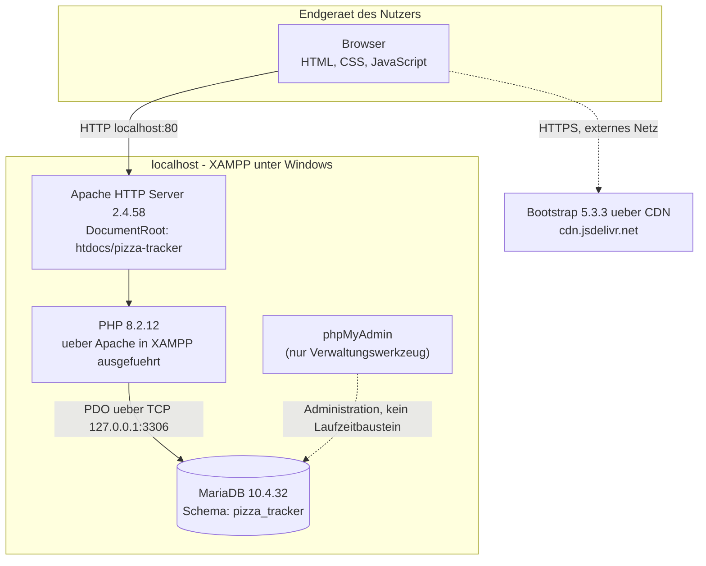

# 7 Verteilungssicht

Die Verteilungssicht bildet die Bausteine aus [Kapitel 5](A05%20-%20Bausteinsicht.md) auf die
Ausführungsumgebung ab, die tatsächlich existiert: eine **lokale XAMPP-Installation** auf dem
Rechner des Entwicklers bzw. Prüfers. Es gibt keine Produktionsumgebung, kein Staging, kein
Deployment und keine Containerisierung — die Anwendung wird nicht im Internet betrieben.

Das ist keine Lücke, sondern eine ausdrückliche Randbedingung des Projekts: TECH-05 und TECH-09 in
[Kapitel 2](02-randbedingungen.md) legen den Betrieb mit XAMPP oder MAMP und ausdrücklich **keinen**
Cloud- oder Produktivbetrieb fest. Diese Randbedingung wird in [Kapitel 11](A11-risks-and-technical-debts.md)
als bewusste Einschränkung geführt, nicht als offenes Risiko.

> **Grundlage:** Struktur und Konfigurationswerte sind aus dem Code des Branches `main`, Commit
> `619acf4a4fb4d81b9e78fa133e6c9ecf135fa65b`, abgeleitet. Die konkreten Umgebungswerte (PHP-Version,
> Apache-Port, Betriebssystem) stammen von der Installation, mit der **Person 1** die Anwendung
> tatsächlich ausgeführt hat, und sind unten so gekennzeichnet. Ich selbst habe keinen Zugriff auf
> diese Installation und kann sie nicht nachprüfen.

---

## 7.1 Infrastruktur Ebene 1 — lokale XAMPP-Umgebung



Gestrichelte Kanten kennzeichnen, was **nicht** zum Laufzeitkern gehört: phpMyAdmin wird von der
Anwendung selbst nie aufgerufen, und die CDN-Verbindung wird nur beim Laden einer Seite im Browser
benötigt, nicht vom PHP-Prozess.

**Motivation.** Der lokale Betrieb ist keine freie Architekturentscheidung, sondern eine
Modulvorgabe: TECH-05 und TECH-09 ([Kapitel 2](02-randbedingungen.md)) schreiben XAMPP/MAMP und
ausdrücklich lokalen Betrieb vor, weil das Projekt ohne Betriebsauftrag als Hochschulprojekt
bewertet wird. Eine gehostete Umgebung wäre für die M3-Bewertung nicht erforderlich und ist damit
kein sinnvoller Aufwand. Eine begründete Alternativenabwägung als ADR steht noch aus
(offener Punkt O-1, siehe [Kapitel 9](A09-architecture-decisions.md)).

**Knoten und Kanäle.**

| Element | Realisierung |
|---------|--------------|
| Client | Beliebiger moderner Browser auf demselben Rechner; führt Präsentationsschicht und Browserlogik aus (§ 5.1.1, § 5.1.2). |
| Web-Zugang | Apache 2.4.58 aus dem XAMPP-Paket. Läuft über **HTTP ohne TLS**; XAMPP bringt zwar Port 443 mit, die bestätigte Startadresse `http://localhost/pizza-tracker/startseite.html` nutzt aber Port 80 ohne Verschlüsselung. DocumentRoot: `C:\xampp\htdocs\pizza-tracker`. |
| Anwendungslaufzeit | PHP 8.2.12, über Apache in XAMPP ausgeführt. Ob als Apache-Modul (`mod_php`) oder über PHP-FPM/FastCGI, wurde nicht mit `phpinfo()` bestätigt (offener Punkt O-2) — für die Architektur ist nur relevant, dass PHP **pro Request** ausgeführt wird: kein Cron, kein Worker, keine Hintergrundverarbeitung. |
| Persistente Flächen | Die Datenbankdateien liegen im MariaDB-Datenverzeichnis von XAMPP; ihr genauer Pfad ist für die Architektur nicht relevant. Das Datenbankschema selbst stammt aus `database/schema.sql` und wird über phpMyAdmin importiert. Die Anwendung schreibt keine weiteren Dateien: Es gibt im Code keinen Aufruf von `file_put_contents()`, `fopen()` im Schreibmodus oder vergleichbaren Funktionen; `data/pizza_data.json` wird nur gelesen (§ 5.1.5). |
| Datenbankzugang | PDO aus `config/database.php`. Host, Port, Datenbankname, Nutzer und Passwort werden über die Umgebungsvariablen `PIZZA_DB_HOST`, `PIZZA_DB_PORT`, `PIZZA_DB_NAME`, `PIZZA_DB_USER`, `PIZZA_DB_PASS` gelesen; ohne gesetzte Variablen gelten die XAMPP-Standardwerte (`127.0.0.1`, `3306`, `pizza_tracker`, `root`, leeres Passwort). Die konkreten Zugangsdaten der getesteten Installation sind hier bewusst nicht dokumentiert. |
| Administration | phpMyAdmin — ausschließlich Werkzeug zum Anlegen und Inspizieren der Datenbank, hier genutzt für den Import von `schema.sql`. **Kein Laufzeitbaustein**: Die Anwendung ruft es nie auf und funktioniert ohne es. |
| Ausgehende Verbindungen | Bootstrap 5.3.3 (CSS und `bootstrap.bundle.min.js`) wird in allen fünf HTML-Seiten von `cdn.jsdelivr.net` per HTTPS geladen. Weitere externe Ressourcen (Fonts, Icon-Bibliotheken) sind in keiner der fünf HTML-Dateien vorhanden. |

**Auffällig, unabhängig vom A05-Befund:** `.gitignore` schließt `.env` aus, der Code liest aber
nirgends eine `.env`-Datei ein — `getenv()` liest ausschließlich echte Prozessumgebungsvariablen.
Der Eintrag in `.gitignore` bezieht sich also auf einen Mechanismus, den es im Code nicht gibt.
Das ist keine Sicherheitslücke — im Repository selbst stehen keine Zugangsdaten, `config/database.php`
enthält nur den öffentlich unkritischen XAMPP-Standardwert `root`/leer als Fallback — aber ein
Widerspruch zwischen `.gitignore` und Code, den Person 1 einordnen sollte (Übergabe unten).

**Zuordnung der Bausteine zu den Knoten.**

| Knoten | Bausteine aus § 5.1 | Bemerkung |
|--------|----------------------|-----------|
| Browser (Client) | Präsentationsschicht, Browserlogik | Wird von Apache **ausgeliefert**, aber im **Browser ausgeführt**. |
| PHP-Prozess (Host) | Backend/API, Gemeinsame Serverlogik | Beide Bausteine laufen im selben PHP-Prozess; es gibt keine Trennung in mehrere Dienste. |
| PHP-Prozess (Host) | Fachliche Konfigurationsdaten | Wird sowohl vom Browser per `fetch()` als statische Datei über Apache geladen als auch von der Serverlogik per `file_get_contents()` gelesen (§ 5.1.5) — liegt also auf demselben Knoten wie Backend/API, wird aber von zwei verschiedenen Stellen aus zwei verschiedenen Bausteinen heraus gelesen. |
| MariaDB-Dienst (Host) | Persistenz | Eigener Dienst auf demselben Rechner, unabhängig vom Apache-Prozess startbar. |

Es gibt keine zweite Maschine und keine Verteilung über ein Netzwerk hinaus dem Zugriff des lokalen
Browsers auf den lokalen Apache.

**Qualitätsmerkmale.**

- **Verfügbarkeit:** Die Anwendung läuft, solange Apache und MariaDB über das XAMPP Control Panel
  gestartet sind. Keine Redundanz vorhanden und für den Projektumfang auch nicht gefordert (TECH-09).
- **Performance:** Da Browser, Webserver und Datenbank auf demselben Rechner laufen, entsteht keine
  Netzlatenz zwischen den Knoten. Die einzige externe Netzwerklatenz entsteht beim Laden von
  Bootstrap über das CDN.
- **Sicherheit:** Die Verbindung zwischen Browser und Apache läuft unverschlüsselt über HTTP. Das ist
  für einen rein lokalen Betrieb ohne Netzexposition angemessen und der Grund, warum der Betrieb
  bewusst lokal bleibt — ein Bezug zu Sicherheitsszenarien in [Kapitel 10](A10-quality-requirements.md)
  steht noch aus, weil A10 selbst noch ein Gerüst ist.

---

## 7.2 Infrastruktur Ebene 2 — der XAMPP-Knoten

XAMPP ist ein Bündel unabhängiger Dienste, kein einzelner Prozess. Diese Verfeinerung macht sichtbar,
dass Web- und Datenbankdienst getrennt gestartet und gestoppt werden — relevant für die
Inbetriebnahme in § 7.3.

| Dienst | Rolle | Lebenszyklus |
|--------|-------|--------------|
| Apache | Nimmt HTTP-Anfragen des Browsers entgegen, liefert die fünf HTML-Seiten, `css/style.css`, `js/*.js` und `data/pizza_data.json` unverändert aus und leitet Anfragen an `api/*.php` an den PHP-Interpreter weiter. | Über das XAMPP Control Panel einzeln gestartet und gestoppt, unabhängig von MariaDB. |
| PHP | Führt bei jeder Anfrage an eine `.php`-Datei den jeweiligen Endpunkt aus (§ 5.1.3) und stellt danach keinen Zustand mehr bereit außer der PHP-Session. | Läuft nur während einer Anfrage; kein eigenständig sichtbarer Dienst im Control Panel, da über Apache eingebunden. |
| MariaDB | Hält die drei Tabellen aus § 5.1.6 dauerhaft vor und beantwortet SQL-Anfragen von PHP über PDO. | Unabhängig von Apache über das XAMPP Control Panel startbar; muss laufen, bevor ein Endpunkt mit Datenbankzugriff aufgerufen wird. |

---

## 7.3 Inbetriebnahme

Dieser Abschnitt beschreibt die **Architektur** der Inbetriebnahme — welche Knoten in welcher
Reihenfolge bereitstehen müssen. Die Schritt-für-Schritt-Anleitung für Personen ohne Architekturwissen
steht in [INSTALL.md](../../INSTALL.md) (mein anderer Zuständigkeitsbereich) und wird hier nicht
wiederholt.

- Das Projekt muss unter `htdocs/` liegen, damit Apache es ausliefert. Bestätigter Pfad:
  `C:\xampp\htdocs\pizza-tracker`. Der Ordnername `pizza-tracker` muss exakt zur Startadresse passen;
  die ZIP aus dem Repository entpackt dagegen nach `Pizza-Tracker--main/` und muss von Hand umbenannt
  werden (Übergabe an INSTALL.md, siehe unten).
- Die Datenbank muss vor der ersten Nutzung aus `database/schema.sql` angelegt werden. Das Schema
  legt die Datenbank `pizza_tracker` selbst an (`CREATE DATABASE IF NOT EXISTS`) und enthält bereits
  vier Gutscheine als Startdaten (`PIZZA10`, `SPARE20`, `WELCOME`, `STUDENT5`) — eigene Testdaten für
  Gutscheine sind also nicht zusätzlich nötig. Für Nutzerkonten und gespeicherte Konfigurationen gibt
  es keine Seed-Daten; diese entstehen erst durch Registrierung und Speichern zur Laufzeit.
- Zugangsdaten werden nicht in einer Konfigurationsdatei fest hinterlegt, sondern optional über
  Umgebungsvariablen gesetzt (siehe Tabelle in § 7.1). Ohne gesetzte Variablen greifen die
  XAMPP-Standardwerte. Ein produktiver Migrationsweg bei Schemaänderungen existiert nicht: `schema.sql`
  verwendet `CREATE TABLE IF NOT EXISTS` und verändert bestehende Tabellenstrukturen nicht automatisch.
  Schemaänderungen erfordern derzeit einen manuellen Eingriff (Übergabe an Person 1, falls
  Schemaänderungen geplant sind).
- Ob eine Verschlüsselung eingesetzt wird: nein. Es existiert kein SSL-Zertifikat im Repository und
  keine Konfiguration, die Apache zu HTTPS zwingt. Das ist konsistent mit dem rein lokalen Betrieb.

**Bestätigte erfolgreiche Inbetriebnahme.** Person 1 hat die Anwendung mit den in diesem Kapitel
genannten Werten unter Windows tatsächlich gestartet. Nach eigener Aussage wurden dabei Registrierung,
Login, Gutscheinanwendung, Speichern, „Erneut bearbeiten" und Löschen erfolgreich ausgeführt. Das ist
eine wertvolle informelle Bestätigung, dass die Verteilungssicht so tatsächlich lauffähig ist —
**kein** Ersatz für die formalen Testnachweise mit Test-ID, Datum, geprüftem Commit und dokumentiertem
Ist-Ergebnis, die Person 4 im Testprotokoll führt. Ich trage diese sechs Funktionen als informell
bestätigt an Person 4 weiter (siehe Übergaben).

---

## 7.4 Offene Punkte

| # | Punkt | Beleg |
|---|-------|-------|
| O-1 | Der lokale Betrieb ist als Randbedingung belegt (TECH-05/TECH-09), aber noch nicht als eigener ADR mit Alternativen und Konsequenzen in Kapitel 9 geführt. | `02-randbedingungen.md`, `A09-architecture-decisions.md` (noch Gerüst) |
| O-2 | Ob PHP als Apache-Modul oder über PHP-FPM/FastCGI läuft, wurde nicht mit `phpinfo()` bestätigt. Für die hier getroffenen Aussagen (Ausführung pro Request, kein Hintergrundprozess) ist der Unterschied nicht relevant, für eine vollständige Infrastrukturbeschreibung aber offen. | Rückmeldung Person 1 |
| O-3 | Widerspruch zwischen `.gitignore` (schließt `.env` aus) und Code (`getenv()` liest keine `.env`-Datei ein, sondern nur echte Umgebungsvariablen). | `.gitignore`, `config/database.php` |
| O-4 | Kein formales Testprotokoll für die in § 7.3 genannte erfolgreiche Inbetriebnahme; nur mündliche Bestätigung durch Person 1. | Angabe von Person 1 im Chat, weitergereicht an Person 4 |

---

## Übergaben

- **An Person 1:** Bitte klären, ob `.env`/Umgebungsvariablen künftig tatsächlich genutzt werden
  sollen (dann Code ergänzen) oder ob der `.gitignore`-Eintrag als Vorsichtsmaßnahme ohne aktuelle
  Wirkung bestehen bleibt (dann reicht ein kurzer Kommentar). Betrifft O-3.
- **An Person 4:** Die sechs von Person 1 genannten erfolgreich getesteten Abläufe (Registrierung,
  Login, Gutschein, Speichern, „Erneut bearbeiten", Löschen) sind bisher nur informell bestätigt.
  Für das Testprotokoll fehlen Test-ID, Datum, genauer Testschritt und Ist-Ergebnis je Fall. Betrifft O-4.
- **An alle:** Sobald A09 ausgearbeitet ist, sollte der Verweis in § 7.1 („Motivation") um den
  konkreten ADR-Bezug ergänzt werden. Betrifft O-1.

## Verbleibende Grenzen dieses Schritts

- Ich habe die Umgebung nicht selbst geprüft. Betriebssystem, Apache-Version, PHP-Version, MariaDB-Version,
  Ports, Projektpfad und Startadresse stammen aus deiner Angabe zu Person 1s Installation, nicht aus
  eigener Ausführung.
- Die sechs genannten Funktionstests sind entsprechend als informelle Bestätigung, nicht als
  geprüfter Testnachweis übernommen.
- Kein Code und keine andere Architekturdatei wurden verändert.

**Geänderte Datei:** `docs/arch/A07-deployment-view.md` (Entwurf unten, noch nicht eingecheckt)

**Commit-Nachricht:**
```
docs(arch): A07 Verteilungssicht anhand der bestätigten XAMPP-Umgebung ausgearbeitet
```

**Drei Verständnisfragen:**
1. Warum steht die CDN-Verbindung zu Bootstrap als gestrichelte Kante im Diagramm, die Verbindung zur Datenbank aber als durchgezogene?
2. Was würde sich an diesem Kapitel ändern, wenn die Anwendung künftig auch von einem anderen Gerät im selben Netzwerk aus aufgerufen werden sollte?
3. Warum reicht der Fallback `root`/leeres Passwort in `config/database.php` nicht als Beleg, dass „keine Zugangsdaten im Repository“ stehen — was genau wäre der Unterschied zu einem echten Verstoß gegen CONV-09?

**Nächster Schritt:** Nach deiner Prüfung dieses Entwurfs würde ich mit A12 (Glossar) weitermachen, da README und INSTALL von den dort geklärten Begriffen profitieren. Alternativ zuerst README/INSTALL, falls die für dich dringender sind — deine Entscheidung.
