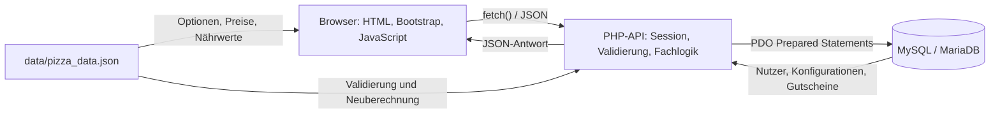

# A08 – Querschnittliche Konzepte

> **Nachweisgrenze:** Die beschriebenen Mechanismen sind aus dem vorliegenden Quellcode abgeleitet. Vorhandene Schutzmaßnahmen werden von bekannten Grenzen getrennt; eine erfolgreiche Durchführung der Qualitätstests wird damit nicht behauptet.

Dieses Kapitel beschreibt technische Konzepte, die in mehreren Bausteinen des Pizza Trackers verwendet werden. Die fachlichen Vorgaben stammen insbesondere aus [N2 – Querschnittskonzepte](../spec/N2-querschnittskonzepte.md), [P2 – Architekturüberblick](../spec/P2-architekturueberblick.md) und [A04 – Lösungsstrategie](A04-loesungsstrategie.md). Die konkrete Realisierung wird hier anhand des aktuellen Codes beschrieben.

| Abschnitt | Konzept | Wichtige Code-Artefakte |
|---|---|---|
| [8.1](#81-datenmodell-und-persistenz) | Datenmodell und Persistenz | `database/schema.sql` |
| [8.2](#82-zentrale-fachdaten--pizza_datajson) | Zentrale Fachdaten | `data/pizza_data.json`, `js/konfigurator.js`, `config/helpers.php` |
| [8.3](#83-frontend-backend-kommunikation) | HTTP, `fetch()` und JSON | `js/*.js`, `api/*.php` |
| [8.4](#84-validierung) | Client- und Servervalidierung | `js/*.js`, `config/helpers.php`, `api/*.php` |
| [8.5](#85-authentifizierung-und-session) | Anmeldung und PHP-Session | `js/auth.js`, `api/login.php`, `api/register.php`, `api/session.php`, `config/helpers.php` |
| [8.6](#86-autorisierung) | Zugriff auf eigene Konfigurationen | `api/load_configs.php`, `api/delete_config.php`, `api/save_config.php` |
| [8.7](#87-passwortschutz) | Hashing und Verifikation | `api/register.php`, `api/login.php` |
| [8.8](#88-datenbankzugriff) | PDO und Prepared Statements | `config/database.php`, `api/*.php`, `config/helpers.php` |
| [8.9](#89-preis--und-kalorienberechnung) | Live- und Serverberechnung | `js/konfigurator.js`, `config/helpers.php` |
| [8.10](#810-fehlerbehandlung-und-benutzerfeedback) | Fehlerantworten und UI-Rückmeldungen | `config/helpers.php`, `api/*.php`, `js/*.js` |
| [8.11](#811-responsive-benutzeroberfläche) | Bootstrap und eigenes CSS | HTML-Dateien, `css/style.css` |
| [8.12](#812-datenbankkonfiguration-und-zugangsdaten) | Lokale DB-Konfiguration | `config/database.php`, `.gitignore` |

---

## 8.1 Datenmodell und Persistenz

Die dauerhafte Speicherung erfolgt in einer MySQL-/MariaDB-Datenbank. Das Schema wird in `database/schema.sql` definiert. Die Datenbank verwendet `utf8mb4` mit der Collation `utf8mb4_unicode_ci`.

Es existieren drei Tabellen:

### `users`

Die Tabelle `users` enthält die Benutzerkonten.

Wichtige Spalten sind:

- `id` als Primärschlüssel,
- `vorname`,
- `nachname`,
- `email` mit `UNIQUE`-Einschränkung,
- `passwort` für den Passwort-Hash,
- Adressdaten,
- optional `telefon`,
- `erstellt_am`.

Das Passwort wird nicht als eigenes Klartextfeld gespeichert. In `passwort` wird der von PHP erzeugte Passwort-Hash abgelegt.

### `konfigurationen`

Die Tabelle `konfigurationen` speichert die Pizzen eines Nutzers.

Wichtige Spalten sind:

- `id` als Primärschlüssel,
- `user_id` als Fremdschlüssel,
- `name`,
- `groesse`,
- `teig`,
- `sauce`,
- `kaese`,
- `belaege` als JSON-Spalte,
- `extras` als JSON-Spalte,
- optional `gutschein_code`,
- `preis` als `DECIMAL(8,2)`,
- `erstellt_am`.

Beläge und Extras werden nicht in eigenen Zuordnungstabellen gespeichert. Vor dem Speichern werden die PHP-Arrays mit `json_encode()` in JSON umgewandelt. Beim Laden werden sie in `api/load_configs.php` mit `json_decode()` wieder in Arrays zurückverwandelt.

Der gespeicherte Preis ist der zum Speicherzeitpunkt berechnete Endpreis. Spätere Änderungen der Fachdaten ändern diesen Wert nicht automatisch. Kalorien, Makronährwerte und die vollständigen damaligen Fachdaten werden nicht gespeichert. Beim erneuten Öffnen wird die Anzeige mit den dann geladenen Fachdaten berechnet; der Datensatz ist deshalb kein vollständiger historischer Nährwert-Schnappschuss.

Zwischen `konfigurationen.user_id` und `users.id` besteht ein Fremdschlüssel mit `ON DELETE CASCADE`. Wird ein Benutzer in der Datenbank gelöscht, werden seine gespeicherten Konfigurationen deshalb durch die Datenbankbeziehung mitgelöscht.

### `gutscheine`

Die Tabelle `gutscheine` enthält:

- `id`,
- `code` als eindeutigen Gutscheincode,
- `rabatt_prozent`,
- `aktiv`,
- optional `gueltig_bis`,
- `erstellt_am`.

Zwischen `gutscheine` und `konfigurationen` besteht im aktuellen Schema kein Fremdschlüssel. Eine Konfiguration speichert einen eventuell verwendeten Gutscheincode lediglich als Text in `gutschein_code`.

### Konsequenz der JSON-Spalten

Die JSON-Spalten vereinfachen das Speichern einer variablen Anzahl von Belägen und Extras, weil dafür keine zusätzlichen Zwischentabellen benötigt werden. Der Nachteil ist, dass einzelne Beläge oder Extras nicht wie normalisierte relationale Datensätze über eigene Fremdschlüssel abgesichert sind. Ihre fachliche Gültigkeit wird deshalb vor dem Speichern durch die Anwendungslogik geprüft.

---

## 8.2 Zentrale Fachdaten – `pizza_data.json`

Die Datei `data/pizza_data.json` enthält die fachlichen Daten für den Konfigurator.

Sie enthält die Bereiche:

- `groessen`,
- `teige`,
- `saucen`,
- `kaese`,
- `belaege`,
- `extras`,
- `vorlagen`.

Für die auswählbaren Bestandteile sind Preis, Kalorien und ergänzende Nährwerte (`protein`, `kohlenhydrate`, `fett`, `ballaststoffe`) sowie Allergene und Ernährungsmerkmale hinterlegt. Größen besitzen außerdem einen Durchmesser in Zentimetern. Die Vorlagen definieren vorkonfigurierte Pizzen wie Margherita, Salami und Hawaii.

### Verwendung im Browser

`js/konfigurator.js` lädt die Datei beim Start des Konfigurators:

```javascript
// Schematisch: Die konkrete Ladefunktion prüft zusätzlich die Antwort.
const response = await fetch('data/pizza_data.json');
pizzaData = await response.json();
```

Das Frontend verwendet diese Daten, um:

- die auswählbaren Optionen zu erzeugen,
- Preise, Kalorien und Makronährwerte während der Konfiguration live zu berechnen,
- Kennzeichnungen und die Zusammenfassung zu aktualisieren,
- Vorlagen zu laden.

### Verwendung im Backend

Auch das Backend liest dieselbe Datei. `config/helpers.php` enthält dafür die Funktion `loadPizzaData()`.

Die serverseitigen Funktionen verwenden diese Daten unter anderem für:

- die Prüfung gültiger Größen, Teige, Saucen, Käsesorten, Beläge und Extras,
- die erneute Berechnung von Preis und kcal beim Speichern.

Damit verlässt sich das Backend beim Speichern nicht auf einen vom Browser übermittelten Preis. Die Backend-Berechnung ermittelt Preis und Kalorien, aber keine Makronährwerte oder Ernährungsempfehlungen. Die gemeinsame Datei bedeutet also nicht, dass Browser und Backend jedes Datenfeld gleich auswerten.

### Konsequenz

Frontend und Backend verwenden dieselbe Datei als Fachdatenquelle. Dadurch müssen Preise, kcal und gültige Auswahlwerte nicht in zwei unterschiedlichen Codebeständen gepflegt werden.

Die beiden Seiten laden die Datei unabhängig voneinander. PHP hält die eingelesenen Daten innerhalb desselben Requests in einer statischen Variablen vor; der Browser behält seine geladenen Daten während der Seitennutzung. Eine bereits geöffnete Seite erhält spätere Dateiänderungen nicht automatisch. Derselbe ausgelieferte Projektstand und ein erneutes Laden nach Änderungen sind deshalb wichtig.

Eine einfache Änderung eines bestehenden Preises oder kcal-Wertes kann grundsätzlich in `pizza_data.json` vorgenommen werden. Werden dagegen neue fachliche Kategorien oder neue Darstellungslogiken eingeführt, kann zusätzlich eine Codeanpassung notwendig sein.

---

## 8.3 Frontend-Backend-Kommunikation

Der Browser stellt die HTML-Seiten dar und führt deren JavaScript aus. JavaScript kommuniziert mit den PHP-Endpunkten unter `api/` über `fetch()`.

Die Anwendung verwendet keine serverseitig gerenderten PHP-Seiten als Benutzeroberfläche. PHP dient als JSON-API für Anmeldung, Sessionstatus, Gutscheine und Persistenz.

### Verwendete HTTP-Methoden

| Endpunkt | HTTP-Methode | Zweck |
|---|---|---|
| `api/session.php` | GET | aktuellen Loginstatus lesen |
| `api/load_configs.php` | GET | eigene Konfigurationen laden |
| `api/register.php` | POST | Benutzer registrieren |
| `api/login.php` | POST | Benutzer anmelden |
| `api/logout.php` | POST | Session beenden |
| `api/coupon.php` | POST | Gutschein prüfen |
| `api/save_config.php` | POST | Konfiguration speichern |
| `api/delete_config.php` | POST | Konfiguration löschen |

Die PHP-Endpunkte prüfen ihre erwartete Methode mit `requireMethod()`.

### Request-Format

POST-Anfragen werden als JSON gesendet:

```javascript
headers: { 'Content-Type': 'application/json' },
body: JSON.stringify(...)
```

Endpunkte mit fachlichen Eingabedaten lesen den Body mit `readJsonBody()` aus `php://input` und dekodieren ihn über `json_decode()`. Ein leerer Body wird als leere Eingabeliste behandelt; nicht als Array dekodierbare JSON-Werte führen zu HTTP 400. Die GET-Aufrufe senden keinen JSON-Body. Der Logout benötigt keine fachlichen Eingabedaten und liest den gesendeten leeren JSON-Body nicht aus.

### Response-Format

Alle normalen API-Antworten werden über `jsonResponse()` als JSON mit `Content-Type: application/json` ausgegeben.

Erfolgsantworten enthalten mindestens:

```json
{
  "success": true
}
```

Fehlerantworten folgen normalerweise diesem Muster:

```json
{
  "success": false,
  "error": "Fehlermeldung"
}
```

Einige Erfolgsantworten enthalten zusätzliche Felder, zum Beispiel:

- `user` bei Login und Registrierung,
- `loggedIn` bei der Sessionprüfung,
- `coupon` bei der Gutscheinprüfung,
- `configs` beim Laden,
- `id`, `preis` und `kcal` beim Speichern.

Das Antwortformat ist damit grundsätzlich ähnlich, aber nicht in eine einheitliche `data`-Hülle gekapselt.

### HTTP-Statuscodes

Der aktuelle Code verwendet unter anderem:

- `200` für normale erfolgreiche Antworten,
- `201` für erfolgreiche Registrierung und Speicherung,
- `400` für ungültige Eingaben,
- `401` bei fehlender oder falscher Anmeldung,
- `404` bei nicht gefundenem Gutschein oder nicht gefundener Konfiguration,
- `405` bei falscher HTTP-Methode,
- `409` bei Konflikten wie bereits registrierter E-Mail oder bereits verwendetem WELCOME-Code,
- `410` bei abgelaufenem Gutschein.

### Session-Cookie

Bei den `fetch()`-Aufrufen wird überwiegend

```javascript
credentials: 'same-origin'
```

verwendet. Dadurch wird bei Anfragen an dieselbe Herkunft der PHP-Session-Cookie mitgesendet.

---

## 8.4 Validierung

Die Anwendung prüft Eingaben sowohl im Browser als auch serverseitig. Die Browserprüfung verbessert die Bedienung. Verbindlich für die Verarbeitung sind die serverseitigen Prüfungen.

| Grenze | Prüfende Stelle | Beispiele | Reaktion bei Verstoß |
|---|---|---|---|
| Browser | HTML und JavaScript | Pflichtfelder, Passwortbestätigung, Pflichtauswahl im Konfigurator | Hinweis, Anfrage wird teilweise bereits im Browser verhindert |
| Registrierung | `api/register.php` | Pflichtfelder, E-Mail-Format, Passwortlänge, Passwortbestätigung, doppelte E-Mail | JSON-Fehler, meist HTTP 400 oder 409 |
| Login | `api/login.php` | E-Mail und Passwort vorhanden, Zugangsdaten korrekt | HTTP 400 oder 401 |
| Konfiguration | `normalizeConfig()` in `config/helpers.php` | Pflichtauswahl, Name maximal 100 Zeichen, alle Auswahlwerte existieren in `pizza_data.json` | HTTP 400 |
| Gutschein | `validateCoupon()` in `config/helpers.php` | Code vorhanden, aktiv, nicht abgelaufen, WELCOME-Regel | HTTP 400/401/404/409/410 oder Erfolg |
| Löschen | `api/delete_config.php` | gültige positive Konfigurations-ID und Eigentum | HTTP 400 oder 404 |

### Registrierung

`api/register.php` kontrolliert alle erforderlichen Felder erneut auf dem Server. Zusätzlich werden:

- das E-Mail-Format mit `FILTER_VALIDATE_EMAIL`,
- eine Mindestpasswortlänge von sechs Zeichen,
- die optionale Passwortbestätigung,
- die Eindeutigkeit der E-Mail-Adresse

geprüft.

### Pizza-Konfiguration

`normalizeConfig()` prüft serverseitig die Pflichtfelder:

- Größe,
- Teig,
- Sauce,
- Käse.

Mit `assertChoice()` und `assertChoices()` wird außerdem geprüft, ob die übertragenen Werte tatsächlich in `pizza_data.json` vorhanden sind. Dadurch reicht es nicht aus, im Browser beliebige Werte in den Request einzufügen.

### Grenzen der Eingabeprüfung

Beläge und Extras werden als Listen erwartet. Werte, die keine Arrays sind, normalisiert `normalizeConfig()` jedoch zu leeren Listen, statt sie ausdrücklich abzulehnen. Innerhalb der Listen werden Typ und Existenz geprüft, aber keine doppelten Einträge entfernt. Manipulierte Wiederholungen können somit mehrfach in die Berechnung eingehen. Die vorhandene Validierung ist keine vollständige Prüfung gegen ein formales Request-Schema.

### Ausgabe von Benutzerdaten

Beim Rendern gespeicherter Konfigurationen verwendet `js/meine-pizzen.js` die Funktion `escapeHtml()`, bevor Namen und andere geladene Textwerte in HTML eingefügt werden. Diese Ausgabemaskierung verhindert dort, dass solche Texte als HTML interpretiert werden. Sie ist von Eingabevalidierung und parametrisierten SQL-Anfragen zu unterscheiden und belegt für sich allein keine vollständige XSS-Sicherheit der Anwendung.

---

## 8.5 Authentifizierung und Session

Die Authentifizierung ist session-basiert.

Die zentrale Hilfsfunktion `startAppSession()` in `config/helpers.php` startet die PHP-Session. Vorher werden Cookie-Eigenschaften gesetzt:

- `httponly: true`,
- `samesite: Lax`,
- `secure: true`, wenn die Anfrage über HTTPS erfolgt,
- `path: /`.

`HttpOnly` verhindert den direkten Zugriff auf das Cookie durch JavaScript; es verschlüsselt keine Verbindung. `SameSite=Lax` begrenzt die Übermittlung in bestimmten seitenübergreifenden Situationen. Bei lokalem HTTP wird `Secure` nicht gesetzt. Diese Einstellungen ersetzen weder HTTPS bei einem Internetbetrieb noch eine vollständige Sicherheitsprüfung.

### Anmeldung

Nach erfolgreicher Passwortprüfung führt `api/login.php` aus:

```php
startAppSession();
session_regenerate_id(true);
```

Anschließend werden folgende Werte in der Session gespeichert:

- `user_id`,
- `vorname`,
- `email`.

Durch `session_regenerate_id(true)` wird nach erfolgreicher Anmeldung eine neue Session-ID erzeugt.

### Registrierung

Auch eine erfolgreiche Registrierung meldet den neu angelegten Benutzer direkt an. `api/register.php` regeneriert ebenfalls die Session-ID und speichert die Benutzerinformationen in `$_SESSION`.

### Sessionstatus im Browser

`js/auth.js` ruft `api/session.php` auf. Der Endpunkt antwortet entweder mit:

```json
{
  "success": true,
  "loggedIn": false
}
```

oder bei aktiver Session zusätzlich mit Benutzerinformationen.

`auth.js` nutzt dieses Ergebnis, um Elemente für Gäste und angemeldete Nutzer ein- beziehungsweise auszublenden.

### UI-Anzeige ist keine Zugriffskontrolle

Das Ausblenden eines Buttons schützt keinen PHP-Endpunkt. Die serverseitige Zugriffskontrolle wird durch `requireLogin()` umgesetzt.

`requireLogin()` liest die `user_id` aus der Session und antwortet mit HTTP 401, wenn keine Anmeldung vorhanden ist.

Damit wird der Anmeldestatus nicht nur in der Oberfläche, sondern auch bei geschützten Backend-Aktionen geprüft.

### Logout

`api/logout.php`:

1. startet die Session,
2. leert `$_SESSION`,
3. löscht das Session-Cookie, wenn Cookies verwendet werden,
4. ruft `session_destroy()` auf.

---

## 8.6 Autorisierung

Die Anwendung unterscheidet fachlich zwischen Gast und angemeldetem Nutzer.

Geschützte Aktionen verwenden `requireLogin()`. Dazu gehören:

- Konfiguration speichern,
- eigene Konfigurationen laden,
- Konfiguration löschen.

### Speichern

`api/save_config.php` übernimmt die Benutzer-ID nicht aus dem JSON-Request. Stattdessen stammt sie aus:

```php
$userId = requireLogin();
```

Die neue Konfiguration wird mit dieser `user_id` gespeichert. Der Browser kann dadurch nicht über ein eigenes Request-Feld festlegen, welchem Nutzer die Pizza zugeordnet wird.

### Eigene Pizzen laden

`api/load_configs.php` verwendet:

```sql
WHERE user_id = :user_id
```

Die `user_id` stammt aus der aktiven Session. Dadurch werden nur Konfigurationen des angemeldeten Nutzers geladen.

### Löschen

`api/delete_config.php` löscht mit:

```sql
DELETE FROM konfigurationen
WHERE id = :id
AND user_id = :user_id
```

Auch hier stammt `user_id` aus der Session.

Damit reicht die Kenntnis einer fremden Konfigurations-ID nicht aus, um diese über den vorgesehenen Endpunkt zu löschen. Gehört die ID nicht zum angemeldeten Nutzer, wird kein Datensatz gelöscht und der Endpunkt antwortet mit HTTP 404.

### Erneut bearbeiten

Das erneute Bearbeiten einer Pizza wird im Browser über `sessionStorage` vorbereitet. Es existiert im aktuellen Stand kein serverseitiger UPDATE-Endpunkt. Das spätere Speichern erzeugt deshalb einen neuen Datensatz über `INSERT`.

---

## 8.7 Passwortschutz

Passwörter werden nicht im Klartext in der Datenbank gespeichert.

Bei der Registrierung verwendet `api/register.php`:

```php
password_hash($password, PASSWORD_BCRYPT)
```

Der aktuelle Code verwendet damit ausdrücklich `PASSWORD_BCRYPT`.

Beim Login liest `api/login.php` den gespeicherten Hash und prüft das eingegebene Passwort mit:

```php
password_verify($password, $user['passwort'])
```

Das Klartextpasswort wird nicht in die PHP-Session übernommen und nicht in einer API-Antwort zurückgesendet.

Die aktuell serverseitig belegte Mindestanforderung beträgt sechs Zeichen. Passwort-Hashing schützt die gespeicherten Passwörter, nicht deren Übertragung über unverschlüsseltes HTTP. Der vorliegende Login-Endpunkt implementiert keine Begrenzung wiederholter Anmeldeversuche. Aus den vorhandenen Mechanismen wird deshalb keine Eignung für einen ungeschützten produktiven Internetbetrieb abgeleitet.

---

## 8.8 Datenbankzugriff

Der Datenbankzugriff ist in `config/database.php` gekapselt.

Die Funktion

```php
getDatabase(): PDO
```

erstellt bei ihrem ersten Aufruf eine PDO-Verbindung. Innerhalb desselben PHP-Requests wird die bereits erzeugte Instanz über eine statische Variable wiederverwendet.

### PDO-Einstellungen

Der aktuelle Code setzt:

```php
PDO::ATTR_ERRMODE => PDO::ERRMODE_EXCEPTION
PDO::ATTR_DEFAULT_FETCH_MODE => PDO::FETCH_ASSOC
PDO::ATTR_EMULATE_PREPARES => false
```

Damit:

- werden Datenbankfehler als Exceptions behandelt,
- werden geladene Zeilen standardmäßig als assoziative Arrays geliefert,
- werden emulierte Prepared Statements deaktiviert.

### Prepared Statements

Die im aktuellen PHP-Code gefundenen SQL-Zugriffe verwenden PDO Prepared Statements. Das betrifft unter anderem:

- Prüfung einer bestehenden E-Mail bei Registrierung,
- Anlegen eines Benutzers,
- Login-Abfrage,
- Gutscheinprüfung,
- WELCOME-Prüfung,
- Speichern einer Konfiguration,
- Laden eigener Konfigurationen,
- Löschen einer eigenen Konfiguration.

Beispiel:

```php
$stmt = $pdo->prepare(
    'DELETE FROM konfigurationen WHERE id = :id AND user_id = :user_id'
);
$stmt->execute([
    'id' => $id,
    'user_id' => $userId
]);
```

Eingabewerte werden dadurch getrennt vom SQL-Befehl an die Datenbank übergeben.

---

## 8.9 Preis- und Kalorienberechnung

Preis und kcal werden an zwei Stellen berechnet:

1. im Browser für die sofortige Anzeige,
2. erneut auf dem Server vor der Speicherung.

### Clientseitige Live-Berechnung

`js/konfigurator.js` verwendet `calculateLocalTotals()`.

Die Funktion addiert die Werte aus `pizza_data.json` für:

- Größe,
- Teig,
- Sauce,
- Käse,
- Beläge,
- Extras.

Ein aktiver Gutschein reduziert anschließend den angezeigten Preis.

Die Funktion summiert zusätzlich Protein, Kohlenhydrate, Fett und Ballaststoffe. `updateTotals()` aktualisiert die sichtbaren Werte, die Zusammenfassung, Kennzeichnungen und die Foto-Vorschau. Ein Gutschein reduziert nur den Preis, nicht die Nährwerte. Eine geänderte Auswahl setzt einen zuvor aktiven Gutschein zurück.

Die Berechnung benötigt keine zusätzliche API-Anfrage. Ein Wechsel des Vorschaubildes kann dennoch einen Abruf einer statischen Bilddatei auslösen.

### Serverseitige Neuberechnung

Beim Speichern übermittelt `getPayload()` nur:

- Name,
- Größe,
- Teig,
- Sauce,
- Käse,
- Beläge,
- Extras,
- Gutscheincode.

Der vom Browser angezeigte Preis und die kcal werden nicht übertragen.

`api/save_config.php` ruft stattdessen serverseitig:

```php
calculatePizzaTotals(...)
```

auf. Die Funktion liest ebenfalls `pizza_data.json` und berechnet die Werte neu.

Damit entscheidet der Server über den tatsächlich gespeicherten Preis. Ein zusätzlich im Request übergebener Preis wird nicht übernommen. Die Kalorien werden berechnet und in der Erfolgsantwort zurückgegeben, aber nicht in `konfigurationen` gespeichert. Makronährwerte werden ausschließlich im Browser berechnet.

### Gutscheinprüfung

Ein Gutscheincode wird vor der Speicherung erneut mit `validateCoupon()` geprüft. Das Backend verlässt sich damit nicht ausschließlich auf eine vorherige Prüfung im Browser.

### Rundung im aktuellen Stand

Die Rundungslogik ist im aktuell geprüften Stand noch nicht vollständig identisch.

Der Server berechnet:

1. Ausgangspreis auf zwei Nachkommastellen,
2. Rabattbetrag auf zwei Nachkommastellen,
3. Endpreis erneut auf zwei Nachkommastellen.

Im Browser wird der prozentuale Rabatt derzeit direkt vom JavaScript-Zwischenergebnis abgezogen. Dadurch kann bei bestimmten Beträgen eine Abweichung von einem Cent entstehen.

Ein Vergleichstest muss die angezeigten und gespeicherten Werte bei identischer Auswahl und identischem Rabatt gegenüberstellen. Die gemeinsame Datenquelle allein garantiert keine identischen Ergebnisse, wenn sich die Rechenschritte unterscheiden.

### WELCOME-Regel im aktuellen Stand

Bei `WELCOME` prüft `validateCoupon()`, ob bereits eine Konfiguration des Nutzers mit `gutschein_code = 'WELCOME'` existiert.

Dadurch ist der Nutzungsnachweis im aktuell geprüften Stand an eine noch vorhandene gespeicherte Konfiguration gekoppelt. Wird diese gelöscht, kann der Nachweis verschwinden.

Die Prüfung garantiert daher keine dauerhafte einmalige Nutzung unabhängig von späteren Löschungen. Sie kontrolliert außerdem nicht, ob dies die erste überhaupt gespeicherte Pizza des Nutzers ist, sondern nur, ob noch eine mit WELCOME gespeicherte Konfiguration existiert.

---

## 8.10 Fehlerbehandlung und Benutzerfeedback

### Serverseitige Fehlerantworten

Für erwartete fachliche Fehler existiert mit `jsonResponse()` ein gemeinsamer Mechanismus.

Beispiele sind:

- falsche HTTP-Methode,
- ungültiges JSON,
- fehlende Anmeldung,
- ungültige Eingaben,
- falsche Login-Daten,
- nicht gefundener oder abgelaufener Gutschein,
- bereits verwendeter WELCOME-Code,
- nicht gefundene Konfiguration.

Diese Antworten werden als JSON mit einem passenden HTTP-Statuscode gesendet.

### Nicht zentral abgefangene Exceptions

Im aktuell geprüften Code existiert kein allgemeiner `try/catch`-Mechanismus um die API-Endpunkte, der unerwartete PDO-, Datei- oder Laufzeit-Exceptions sicher in eine einheitliche JSON-Fehlerantwort übersetzt.

Wie viele technische Details bei einem solchen Fehler tatsächlich an den Browser ausgegeben werden, hängt zusätzlich von der PHP-Konfiguration der Laufzeitumgebung ab und lässt sich aus dem Repository allein nicht sicher bestimmen.

### Fehlerbehandlung im Frontend

Die Frontend-Fehlerbehandlung ist nicht an allen Stellen gleich vollständig.

Beispiele:

- `auth.js` fängt Fehler bei der Sessionprüfung mit `try/catch` ab und behandelt den Nutzer dann als ausgeloggt.
- Login und Registrierung zeigen fachliche API-Fehler in Bootstrap-Alerts an, besitzen jedoch keinen eigenen `try/catch` für Netzwerk- oder JSON-Fehler.
- Gutscheinprüfung und Speichern behandeln nicht erfolgreiche HTTP-Antworten sowie Netzwerk- und JSON-Fehler mit `try/catch/finally`. Die jeweilige Schaltfläche ist während der Anfrage gesperrt und wird anschließend wieder freigegeben.
- Das Laden der Fachdaten im Konfigurator besitzt ebenfalls eine Fehlerbehandlung mit sichtbarem Hinweis.
- `loadConfigs()` unterscheidet HTTP 401 von anderen HTTP-Fehlern, besitzt jedoch ebenfalls keinen allgemeinen Netzwerkfehler-Handler.
- Beim Löschen wird die Karte bei erfolgreichem HTTP-Status entfernt. Bei einem fehlgeschlagenen Request wird im aktuellen Code keine eigene sichtbare Fehlermeldung ausgegeben.

Damit ist das in N2 formulierte Ziel einer einheitlichen und verständlichen Fehlerbehandlung im aktuellen Stand nur teilweise umgesetzt.

Auch beim Logout fehlen eine Prüfung des HTTP-Erfolgsstatus und ein eigener Netzwerkfehler-Handler. Eine Weiterleitung allein belegt daher keine erfolgreiche Abmeldung. Die konkreten Abläufe und Sonderfälle sind in [A06 – Laufzeitsicht](A06%20-%20Laufzeitsicht.md) beschrieben.

---

## 8.11 Responsive Benutzeroberfläche

Die Benutzeroberfläche verwendet Bootstrap 5.3.3 über ein externes CDN und eigenes CSS aus `css/style.css`.

### Bootstrap

Die HTML-Seiten nutzen unter anderem:

- `container`,
- `row`,
- responsive `col-*`-Klassen,
- responsive Navbar-Komponenten,
- Buttons,
- Cards,
- Formulare,
- Alerts,
- Utility-Klassen.

Beispielsweise verwendet die Liste „Meine Pizzen“ Karten mit:

```html
col-12 col-md-6 col-xl-4
```

Dadurch ändert sich die Anzahl der Karten pro Zeile abhängig von der verfügbaren Breite.

### Eigenes CSS

Der Konfigurator verwendet für die Optionen:

```css
grid-template-columns: repeat(auto-fit, minmax(190px, 1fr));
```

Die Optionskarten passen sich dadurch automatisch an die vorhandene Breite an.

Das Vorschau-Panel ist auf größeren Ansichten `sticky`. Für kleinere Bildschirmbreiten existiert folgender Breakpoint:

```css
@media (max-width: 991.98px) {
    .preview-panel {
        position: static;
    }
}
```

Damit bleibt die Vorschau auf kleineren Geräten im normalen Seitenfluss.

Eigenes CSS begrenzt außerdem die Pizza-Vorschau relativ zur Ansichtsbreite und erlaubt horizontales Scrollen innerhalb von Tabellencontainern. Bootstrap bleibt eine externe CDN-Abhängigkeit; eine lokale Kopie wird nicht mitgeliefert. Ohne Netzverbindung beziehungsweise verfügbaren Cache sind deshalb nicht alle Bootstrap-Stile und -Interaktionen zuverlässig verfügbar.

Die Anwendung besitzt damit sowohl responsive Bootstrap-Strukturen als auch eigenes responsives CSS. Die tatsächliche Bedienbarkeit auf konkreten mobilen Geräten ist eine Testfrage und wird nicht allein durch den vorhandenen CSS-Code bewiesen.

---

## 8.12 Datenbankkonfiguration und Zugangsdaten

`config/database.php` liest die Datenbankparameter aus Umgebungsvariablen:

- `PIZZA_DB_HOST`,
- `PIZZA_DB_PORT`,
- `PIZZA_DB_NAME`,
- `PIZZA_DB_USER`,
- `PIZZA_DB_PASS`.

Sind diese Variablen nicht gesetzt, verwendet die lokale Standardkonfiguration:

- Host `127.0.0.1`,
- Port `3306`,
- Datenbank `pizza_tracker`,
- Benutzer `root`,
- leeres Passwort.

Diese Defaults entsprechen einer typischen lokalen XAMPP-Entwicklungsumgebung und sind keine Produktionszugangsdaten.

Die Datei `.gitignore` schließt unter anderem `.env` vom Repository aus. `database.php` lädt aber keine `.env`-Datei: Das bloße Anlegen einer solchen Datei setzt die Werte für `getenv()` nicht. Abweichende Parameter müssen der PHP-Laufzeit tatsächlich als Umgebungsvariablen zur Verfügung stehen oder gemäß Installationsanleitung lokal konfiguriert werden.

Die Standardwerte passen nicht automatisch zu jeder MAMP-/XAMPP-Installation. Port, Benutzer und Passwort müssen zur tatsächlich laufenden Datenbank passen. Die PHP-Laufzeit benötigt wegen des Rückgabetyps `never` mindestens PHP 8.1; verwendet werden außerdem PDO mit MySQL-Treiber und `mbstring`. Weitere Betriebsdetails stehen in [A07 – Verteilungssicht](A07-deployment-view.md).

Echte Passwörter oder produktive Zugangsdaten sollten nicht in das Repository eingetragen werden.

---

## 8.13 Zusammenfassung der zentralen Mechanismen

Die querschnittlichen Konzepte verbinden Frontend, PHP-API und Datenbank:



Wesentliche Architekturprinzipien des aktuellen Stands sind:

- statische HTML-Seiten mit JavaScript statt serverseitig gerenderter PHP-Oberflächen,
- JSON-Kommunikation zwischen Browser und PHP-API,
- session-basierte Authentifizierung,
- serverseitige Autorisierung über die Session-`user_id`,
- serverseitige Validierung trotz zusätzlicher Browserprüfung,
- Passwort-Hashing mit bcrypt,
- PDO Prepared Statements für die gefundenen SQL-Zugriffe,
- `pizza_data.json` als gemeinsame Fachdatenquelle für Browser und Server,
- erneute Preis- und kcal-Berechnung im Backend vor dem Speichern.

---

## 8.14 Abgleich und verbleibende Prüfpunkte

Die beschriebenen Mechanismen sind mit [A06 – Laufzeitsicht](A06%20-%20Laufzeitsicht.md), [A09 – Architekturentscheidungen](A09-architecture-decisions.md), [A10 – Qualitätsanforderungen](A10-quality-requirements.md) und [A11 – Risiken und technische Schulden](A11-risks-and-technical-debts.md) abzugleichen. Offene Fehler werden durch ihre Dokumentation nicht behoben.

Vor der Abgabe sind insbesondere folgende Punkte praktisch zu prüfen und mit tatsächlichen Ergebnissen zu dokumentieren:

1. **Zugriffsschutz:** Geschützte Aktionen ohne Anmeldung sowie Laden und Löschen fremder Konfigurationen.
2. **Preisberechnung:** Manipulierter Request-Preis und Rundungsunterschiede zwischen Anzeige und Speicherung.
3. **Gutscheine:** Ungültige, inaktive und abgelaufene Codes sowie die Grenzen des WELCOME-Nachweises.
4. **Fehlerfälle:** Unterbrochene Verbindung, ungültige Antworten und fehlende Fachdaten; Unterschiede zwischen den Browserabläufen berücksichtigen.
5. **Persistenz:** Erneutes Speichern erzeugt einen neuen Datensatz; alte Preise bleiben bei Änderungen der Fachdaten erhalten.
6. **Darstellung und Einrichtung:** Relevante Ansichtsbreiten, CDN-Abhängigkeit und Installation mit den tatsächlich verwendeten Datenbankparametern.

Dieses Kapitel beschreibt vorhandene Architekturmechanismen und ihre Grenzen. Es behauptet weder vollständige Sicherheit noch bestandene Tests, die nicht durchgeführt wurden.
