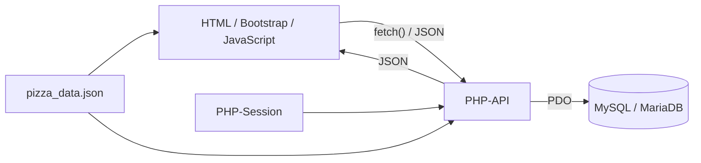

# A09 – Architekturentscheidungen

> **Standhinweis:** Dieses Kapitel beschreibt die im Projekt verwendeten Architekturentscheidungen auf Grundlage des bereitgestellten Projektstands `Pizza-Tracker--main(1).zip` und der vom Team bestätigten Entscheidungsgründe. Technische Aussagen beziehen sich auf den aktuell geprüften Stand. Änderungen von Person 1 an Rabatt-Rundung, WELCOME-Regel und Fehlerbehandlung können einzelne technische Details betreffen, ändern jedoch nicht die hier dokumentierten grundlegenden Architekturentscheidungen.

Dieses Kapitel dokumentiert zentrale technische Entscheidungen des Projekts „Pizza Tracker“. Für jede Entscheidung werden Kontext, gewählte Lösung, Begründung, betrachtete beziehungsweise nachträglich eingeordnete Alternativen sowie positive und negative Konsequenzen beschrieben.

---

## 9.1 Einsatz von PHP im Backend

### Kontext

Die Anwendung benötigt serverseitige Funktionen für:

- Registrierung,
- Login,
- Sessionverwaltung,
- Gutscheinprüfung,
- Speichern von Pizza-Konfigurationen,
- Laden eigener Konfigurationen,
- Löschen eigener Konfigurationen,
- Zugriff auf MySQL/MariaDB.

Die Benutzeroberfläche besteht aus statischen HTML-Seiten mit JavaScript. Deshalb wird ein Backend benötigt, das HTTP-Anfragen verarbeitet und JSON-Antworten zurückgibt.

### Entscheidung

Das Backend wird mit PHP umgesetzt.

Die PHP-Dateien liegen hauptsächlich unter:

- `api/`
- `config/`

Die API-Endpunkte werden von JavaScript über `fetch()` aufgerufen.

### Begründung

Das Team hat PHP gewählt, weil es gut zur vorgesehenen lokalen XAMPP-Umgebung passt und für den Umfang der Anwendung ausreichend ist.

PHP ermöglicht:

- eine direkte Verarbeitung von HTTP-Anfragen,
- einfachen Zugriff auf MySQL/MariaDB über PDO,
- serverseitige Sessions,
- Passwort-Hashing mit eingebauten PHP-Funktionen,
- die Umsetzung kleiner API-Endpunkte ohne zusätzlichen Anwendungsserver.

Für den Pizza Tracker ist kein komplexes Backend-Framework erforderlich.

### Alternativen

Als Alternativen wären beispielsweise denkbar:

- Node.js mit Express,
- Java mit Spring,
- andere serverseitige Web-Technologien.

Diese Alternativen wurden für die technische Einordnung betrachtet, aber nicht gewählt.

### Positive Konsequenzen

- Gute Integration in XAMPP.
- Wenig zusätzlicher Einrichtungsaufwand.
- Direkter Zugriff auf PDO, Sessions und Passwortfunktionen.
- Für den Projektumfang ausreichend.
- Frontend und Backend können klar getrennt bleiben.

### Negative Konsequenzen

- Frontend und Backend verwenden unterschiedliche Programmiersprachen.
- PHP-Dateien müssen über einen Webserver ausgeführt werden und können nicht einfach als lokale Dateien gestartet werden.
- Mit wachsender Projektgröße könnte ohne zusätzliche Strukturierung die Wartbarkeit schwieriger werden.
- Die vorhandene Implementierung verwendet bewusst keinen zusätzlichen Backend-Framework-Layer.

---

## 9.2 Einsatz von MySQL/MariaDB

### Kontext

Die Anwendung muss dauerhaft Daten speichern, insbesondere:

- Benutzerkonten,
- gespeicherte Pizza-Konfigurationen,
- Gutscheine.

Zwischen Benutzern und gespeicherten Konfigurationen besteht eine eindeutige Beziehung. Zusätzlich werden Eigenschaften wie eindeutige E-Mail-Adressen und Fremdschlüssel benötigt.

### Entscheidung

Für die Persistenz wird MySQL beziehungsweise MariaDB verwendet.

Das Datenbankschema befindet sich in:

`database/schema.sql`

Der Zugriff erfolgt in PHP über PDO.

### Begründung

Das Team hat MySQL/MariaDB gewählt, weil relationale Daten gut zum fachlichen Modell des Projekts passen.

Die Datenbank unterstützt:

- Primärschlüssel,
- Fremdschlüssel,
- eindeutige Constraints,
- strukturierte Benutzer- und Gutscheindaten,
- relationale Zuordnung von Konfigurationen zu Benutzern,
- JSON-Spalten für Beläge und Extras.

Außerdem lässt sich MySQL/MariaDB direkt in der vorgesehenen XAMPP-Umgebung betreiben.

### Alternativen

Als Alternativen wären beispielsweise möglich:

- SQLite,
- reine JSON-Dateien,
- andere relationale Datenbanksysteme.

SQLite wäre für ein kleines lokales Projekt technisch möglich gewesen, bietet aber eine andere Betriebsweise als die bereits vorhandene XAMPP-/MySQL-Umgebung.

Eine reine Dateiablage wäre für Beziehungen, eindeutige E-Mail-Adressen und parallele Änderungen weniger geeignet.

### Positive Konsequenzen

- Strukturierte und dauerhafte Speicherung.
- Beziehungen können über Fremdschlüssel abgebildet werden.
- Eindeutige E-Mail-Adressen können direkt durch die Datenbank abgesichert werden.
- Gute Unterstützung durch PDO.
- Passt zur lokalen XAMPP-Umgebung.
- SQL-Abfragen ermöglichen gezieltes Laden und Löschen nutzerspezifischer Daten.

### Negative Konsequenzen

- Für die lokale Ausführung muss ein Datenbankserver laufen.
- Das Schema muss vor dem ersten Start importiert werden.
- Schemaänderungen können später Migrationsschritte erforderlich machen.
- Die Datenbank erhöht die Komplexität gegenüber einer rein dateibasierten Speicherung.

---

## 9.3 Einsatz von PHP-Sessions für die Authentifizierung

### Kontext

Die Anwendung muss erkennen können, ob ein Benutzer angemeldet ist.

Geschützte Aktionen sind insbesondere:

- Pizza-Konfiguration speichern,
- eigene Pizzen laden,
- eigene Pizzen löschen.

Der angemeldete Nutzer muss über mehrere HTTP-Anfragen hinweg eindeutig identifiziert werden.

### Entscheidung

Der Pizza Tracker verwendet serverseitige PHP-Sessions.

Nach erfolgreichem Login beziehungsweise erfolgreicher Registrierung werden unter anderem folgende Werte in `$_SESSION` gespeichert:

- `user_id`,
- `vorname`,
- `email`.

Die Session-ID wird über das PHP-Session-Cookie zwischen Browser und Server übertragen.

### Begründung

Das Team hat PHP-Sessions gewählt, weil sie für die lokale Webanwendung einfacher und ausreichend sind.

Der Loginzustand bleibt serverseitig verwaltet. Der Browser muss keine Benutzer-ID als vertrauenswürdige Information selbst mitsenden.

Die Anwendung kann bei geschützten Endpunkten über die Session feststellen, welcher Benutzer angemeldet ist.

### Alternativen

Eine mögliche Alternative wäre eine tokenbasierte Authentifizierung, zum Beispiel mit JWT.

JWT wäre insbesondere bei stärker verteilten Systemen oder mehreren unabhängigen Clients interessant. Für die lokale Anwendung mit Browser und PHP-Backend wäre dies jedoch zusätzlicher Aufwand.

### Positive Konsequenzen

- Einfache Integration mit PHP.
- Benutzer-ID wird serverseitig verwaltet.
- Geschützte Endpunkte können zentral prüfen, ob eine Anmeldung besteht.
- Kein eigener Token-Lebenszyklus erforderlich.
- Logout kann durch Zerstören der Session umgesetzt werden.

### Negative Konsequenzen

- Der Server verwaltet Sessionzustand.
- Der Browser benötigt das Session-Cookie.
- Bei einer späteren stark verteilten Architektur wäre eine andere Authentifizierungsstrategie möglicherweise geeigneter.
- Session- und Cookie-Konfiguration müssen korrekt umgesetzt werden.

---

## 9.4 Kommunikation über `fetch()` und JSON-API

### Kontext

Die Benutzeroberfläche soll Aktionen ausführen können, ohne bei jedem Vorgang eine vollständig neue HTML-Seite vom Server laden zu müssen.

Dazu gehören unter anderem:

- Registrierung,
- Login,
- Sessionprüfung,
- Gutscheinprüfung,
- Speichern,
- Laden,
- Löschen.

Die vorhandenen HTML-Seiten werden statisch ausgeliefert. Dynamische Daten werden durch JavaScript verarbeitet.

### Entscheidung

Das Frontend kommuniziert über `fetch()` mit PHP-Endpunkten.

Die Daten werden überwiegend als JSON gesendet und empfangen.

Beispielhafter Ablauf:

```text
Browser
  ↓ fetch()
PHP-API
  ↓
Validierung / Datenbank
  ↓
JSON-Antwort
  ↓
JavaScript aktualisiert Benutzeroberfläche
```

### Begründung

Das Team hat `fetch()` und JSON gewählt, weil diese Kommunikation gut zur interaktiven Oberfläche des Pizza Trackers passt.

Aktionen können im Hintergrund durchgeführt werden, ohne dass die gesamte Seite neu geladen werden muss.

Dadurch lassen sich:

- Formularantworten,
- Fehlermeldungen,
- Gutscheinergebnisse,
- gespeicherte Konfigurationen

direkt mit JavaScript in der bestehenden Seite darstellen.

### Alternativen

Eine Alternative wären klassische HTML-Formulare mit vollständigem Seitenwechsel beziehungsweise Server-Rendering.

Auch andere Schnittstellenkonzepte wären grundsätzlich denkbar. Für den aktuellen Projektumfang ist eine kleine JSON-API jedoch ausreichend.

### Positive Konsequenzen

- Kein vollständiger Seitenreload für API-Aktionen erforderlich.
- Klare Trennung zwischen Benutzeroberfläche und Backend-Verarbeitung.
- JSON lässt sich in JavaScript und PHP einfach verarbeiten.
- API-Antworten können strukturierte Erfolgs- und Fehlerdaten enthalten.
- Gut geeignet für den interaktiven Konfigurator.

### Negative Konsequenzen

- JavaScript muss Netzwerk- und API-Fehler behandeln.
- Frontend und Backend müssen sich über Request- und Response-Strukturen einig sein.
- Fehlerhafte oder ungültige JSON-Antworten müssen berücksichtigt werden.
- Bei fehlgeschlagenen Netzwerkzugriffen ist zusätzliche Benutzerkommunikation notwendig.

Im aktuell geprüften Stand ist die Fehlerbehandlung für Netzwerk- und JSON-Fehler noch nicht an allen Stellen einheitlich umgesetzt.

---

## 9.5 Einsatz von `pizza_data.json` als zentrale Fachdatenquelle

### Kontext

Der Pizza-Konfigurator benötigt eine gemeinsame Menge fachlicher Daten:

- Größen,
- Teige,
- Saucen,
- Käsesorten,
- Beläge,
- Extras,
- Preise,
- kcal,
- Vorlagen.

Diese Werte werden sowohl im Browser für die Auswahl und Live-Berechnung als auch im Backend für die Validierung und serverseitige Berechnung benötigt.

### Entscheidung

Diese Fachdaten werden zentral in

`data/pizza_data.json`

gespeichert.

Sowohl JavaScript als auch PHP lesen diese Datei.

### Begründung

Das Team hat sich für `pizza_data.json` entschieden, damit die relativ statischen Produktdaten an einer zentralen Stelle gepflegt werden können.

Dadurch müssen Preise, kcal und Auswahlwerte nicht doppelt direkt in JavaScript und PHP hinterlegt werden.

Der Browser kann die Datei verwenden, um:

- Optionen anzuzeigen,
- Live-Preise und kcal zu berechnen,
- Vorlagen zu laden.

Das Backend verwendet dieselbe Datei, um:

- übermittelte Auswahlwerte zu prüfen,
- Preis und kcal beim Speichern erneut zu berechnen.

### Alternativen

Eine Alternative wäre, alle Pizza-Daten in Datenbanktabellen zu speichern.

Ebenfalls möglich wäre eine direkte Festschreibung der Daten im JavaScript- beziehungsweise PHP-Code.

### Positive Konsequenzen

- Eine gemeinsame Quelle für Preise, kcal und Auswahlwerte.
- Änderungen einfacher Fachdaten können zentral vorgenommen werden.
- Browser und Backend können dieselben fachlichen Werte verwenden.
- Kein zusätzlicher Datenbankzugriff für jede Konfiguratoroption erforderlich.
- Die Datei ist leicht lesbar und nachvollziehbar.

### Negative Konsequenzen

- Änderungen erfolgen direkt an einer Projektdatei und nicht über eine Administrationsoberfläche.
- Bei häufig veränderlichen Produktdaten wäre eine Datenbank flexibler.
- Frontend und Backend laden die Datei jeweils separat.
- Die Verwendung derselben Datenquelle garantiert nicht automatisch dieselbe Berechnungslogik. Beispielsweise kann eine unterschiedliche Rundungsregel weiterhin zu abweichenden Endpreisen führen.
- Bei Erweiterung des fachlichen Modells können neben der JSON-Datei zusätzliche Codeänderungen erforderlich werden.

---

## 9.6 Zusammenfassung der Entscheidungen

Die fünf Entscheidungen ergänzen sich zu einer einfachen lokalen Webarchitektur:



Die Architektur ist auf den überschaubaren Umfang des Hochschulprojekts ausgerichtet.

- PHP übernimmt die serverseitige Verarbeitung.
- MySQL/MariaDB übernimmt die dauerhafte Speicherung.
- PHP-Sessions verwalten den Loginzustand.
- `fetch()` und JSON verbinden JavaScript mit dem Backend.
- `pizza_data.json` stellt gemeinsame Fachdaten für Frontend und Backend bereit.

Die gewählten Lösungen halten den Technologie-Stack klein und passen zur lokalen XAMPP-Ausführung. Gleichzeitig entstehen Grenzen hinsichtlich Skalierung, zentraler Datenpflege und Fehlerbehandlung, die bei einer größeren oder produktiven Anwendung neu bewertet werden müssten.

---

## 9.7 Prüfpunkte vor der finalen Abgabe

Vor der finalen M3-Abgabe sollte dieses Kapitel noch einmal gegen den zusammengeführten `main`-Stand geprüft werden.

Dabei ist insbesondere sicherzustellen:

1. PHP bleibt die serverseitige Technologie.
2. Die Anwendung verwendet weiterhin MySQL/MariaDB über PDO.
3. Die Authentifizierung basiert weiterhin auf PHP-Sessions.
4. Die Browser-Server-Kommunikation erfolgt weiterhin über `fetch()` und JSON.
5. `pizza_data.json` bleibt die gemeinsame Fachdatenquelle für Konfiguratorwerte.
6. Änderungen von Person 1 haben keine grundlegende Architekturentscheidung verändert.
7. A06, A08 und A09 beschreiben denselben tatsächlichen Projektstand.
