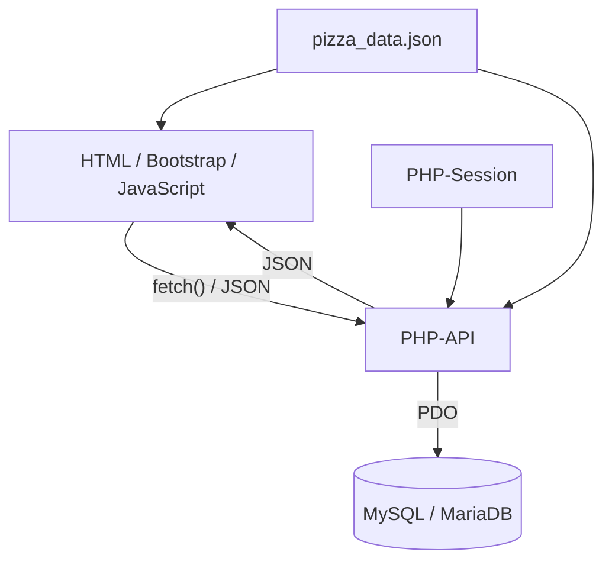

# A09 – Architekturentscheidungen

> **Einordnung:** Die folgenden Entscheidungen sind im vorliegenden Code umgesetzt. Ihre technische Begründung und die Alternativen werden hier nachvollziehbar eingeordnet. Daraus wird nicht abgeleitet, dass das Team jede Alternative vor der Implementierung praktisch erprobt oder einen formalen Entscheidungsprozess protokolliert hat.

Dieses Kapitel dokumentiert zentrale technische Entscheidungen des Projekts „Pizza Tracker“. Für jede Entscheidung werden Kontext, gewählte Lösung, Begründung, nachträglich eingeordnete Alternativen sowie positive und negative Konsequenzen beschrieben. Die Nummern 9.1 bis 9.5 dienen als stabile Entscheidungsreferenzen (ADR: Architecture Decision Record). Der Status „umgesetzt“ bezeichnet den Implementierungsstand, nicht ein bestandenes Testergebnis.

| Referenz | Entscheidung | Status | Zentrale Codebelege |
|---|---|---|---|
| ADR 9.1 | PHP für das Backend | Umgesetzt | `api/*.php`, `config/helpers.php` |
| ADR 9.2 | MySQL/MariaDB für dauerhafte Daten | Umgesetzt | `database/schema.sql`, `config/database.php` |
| ADR 9.3 | PHP-Sessions für den Loginzustand | Umgesetzt | `config/helpers.php`, `api/login.php`, `api/logout.php` |
| ADR 9.4 | `fetch()` und JSON-API | Umgesetzt | `js/*.js`, `api/*.php` |
| ADR 9.5 | JSON-Datei für Konfigurator-Fachdaten | Umgesetzt | `data/pizza_data.json`, `js/konfigurator.js`, `config/helpers.php` |

---

## 9.1 Einsatz von PHP im Backend

### Kontext

Die Anwendung benötigt serverseitige Funktionen für:

- Registrierung,
- Login,
- Sessionverwaltung,
- Gutscheinprüfung,
- Speichern von Pizza-Konfigurationen,
- Laden eigener Konfigurationen,
- Löschen eigener Konfigurationen,
- Zugriff auf MySQL/MariaDB.

Die Benutzeroberfläche besteht aus statischen HTML-Seiten mit JavaScript. Deshalb wird ein Backend benötigt, das HTTP-Anfragen verarbeitet und JSON-Antworten zurückgibt.

### Entscheidung

Das Backend wird mit PHP umgesetzt.

Die PHP-Dateien liegen hauptsächlich unter:

- `api/`
- `config/`

Die API-Endpunkte werden von JavaScript über `fetch()` aufgerufen.

### Begründung

PHP passt zur vorgesehenen lokalen XAMPP-/MAMP-Umgebung und deckt die benötigten Backend-Funktionen ab. Der Einsatz lässt sich damit durch einen überschaubaren Einrichtungsaufwand und vorhandene Standardfunktionen begründen.

PHP ermöglicht:

- eine direkte Verarbeitung von HTTP-Anfragen,
- einfachen Zugriff auf MySQL/MariaDB über PDO,
- serverseitige Sessions,
- Passwort-Hashing mit eingebauten PHP-Funktionen,
- die Umsetzung kleiner API-Endpunkte ohne zusätzlichen Anwendungsserver.

Für den Pizza Tracker ist kein komplexes Backend-Framework erforderlich.

### Alternativen

Als Alternativen wären beispielsweise denkbar:

- Node.js mit Express,
- Java mit Spring,
- andere serverseitige Web-Technologien.

Node.js mit Express würde JavaScript auch im Backend ermöglichen, aber einen Node-Prozess und zusätzliche Paketverwaltung erfordern. Java mit Spring bietet umfangreiche Strukturen und Bibliotheken, erhöht für diese kleine Anwendung jedoch den Einrichtungs- und Lernaufwand. Ein praktischer Vergleich dieser Alternativen ist nicht dokumentiert.

### Positive Konsequenzen

- Gute Integration in XAMPP.
- Wenig zusätzlicher Einrichtungsaufwand.
- Direkter Zugriff auf PDO, Sessions und Passwortfunktionen.
- Für den Projektumfang ausreichend.
- Frontend und Backend können klar getrennt bleiben.

### Negative Konsequenzen

- Frontend und Backend verwenden unterschiedliche Programmiersprachen.
- PHP-Dateien müssen über einen Webserver ausgeführt werden und können nicht einfach als lokale Dateien gestartet werden.
- Mit wachsender Projektgröße könnte ohne zusätzliche Strukturierung die Wartbarkeit schwieriger werden.
- Ohne Backend-Framework müssen übergreifende Aufgaben wie einheitliche Fehlerantworten und Validierung selbst strukturiert werden; die vorhandenen Hilfsfunktionen decken das nur teilweise ab.
- Der Rückgabetyp `never` in `jsonResponse()` setzt PHP ab Version 8.1 voraus.

---

## 9.2 Einsatz von MySQL/MariaDB

### Kontext

Die Anwendung muss dauerhaft Daten speichern, insbesondere:

- Benutzerkonten,
- gespeicherte Pizza-Konfigurationen,
- Gutscheine.

Zwischen Benutzern und gespeicherten Konfigurationen besteht eine eindeutige Beziehung. Zusätzlich werden Eigenschaften wie eindeutige E-Mail-Adressen und Fremdschlüssel benötigt.

### Entscheidung

Für die Persistenz wird MySQL beziehungsweise MariaDB verwendet.

Das Datenbankschema befindet sich in:

`database/schema.sql`

Der Zugriff erfolgt in PHP über PDO.

### Begründung

Die relationale Speicherung passt zu den Beziehungen und Integritätsanforderungen des fachlichen Modells.

Die Datenbank unterstützt:

- Primärschlüssel,
- Fremdschlüssel,
- eindeutige Constraints,
- strukturierte Benutzer- und Gutscheindaten,
- relationale Zuordnung von Konfigurationen zu Benutzern,
- JSON-Spalten für Beläge und Extras.

Außerdem lässt sich MySQL/MariaDB direkt in der vorgesehenen XAMPP-Umgebung betreiben.

### Alternativen

Als Alternativen wären beispielsweise möglich:

- SQLite,
- reine JSON-Dateien,
- andere relationale Datenbanksysteme.

SQLite wäre für ein kleines lokales Projekt technisch möglich gewesen, bietet aber eine andere Betriebsweise als die bereits vorhandene XAMPP-/MySQL-Umgebung.

SQLite würde einen separaten Datenbankserver vermeiden, erforderte aber eine Anpassung des MySQL-spezifischen Schemas und der Verbindungskonfiguration. Eine reine JSON-Dateiablage würde zusätzliche eigene Mechanismen für Eindeutigkeit, Beziehungen und konkurrierende Schreibzugriffe benötigen. Diese Alternativen sind technisch eingeordnet, nicht als durchgeführter Produktvergleich belegt.

### Positive Konsequenzen

- Strukturierte und dauerhafte Speicherung.
- Beziehungen können über Fremdschlüssel abgebildet werden.
- Eindeutige E-Mail-Adressen können direkt durch die Datenbank abgesichert werden.
- Gute Unterstützung durch PDO.
- Passt zur lokalen XAMPP-Umgebung.
- SQL-Abfragen ermöglichen gezieltes Laden und Löschen nutzerspezifischer Daten.

### Negative Konsequenzen

- Für die lokale Ausführung muss ein Datenbankserver laufen.
- Das Schema muss vor dem ersten Start importiert werden.
- Schemaänderungen können später Migrationsschritte erforderlich machen.
- Die Datenbank erhöht die Komplexität gegenüber einer rein dateibasierten Speicherung.
- Beläge und Extras sind JSON-Spalten statt eigener Zuordnungstabellen. Dadurch bleibt das Schema klein, aber einzelne Optionskennungen werden nicht durch Fremdschlüssel abgesichert; ihre Gültigkeit prüft die Anwendung.
- „MySQL/MariaDB“ bezeichnet die vorgesehene Datenbankfamilie, keine nachgewiesene Kompatibilität mit jeder Version. Die tatsächlich verwendete Umgebung muss im Testprotokoll genannt werden.

---

## 9.3 Einsatz von PHP-Sessions für die Authentifizierung

### Kontext

Die Anwendung muss erkennen können, ob ein Benutzer angemeldet ist.

Geschützte Aktionen sind insbesondere:

- Pizza-Konfiguration speichern,
- eigene Pizzen laden,
- eigene Pizzen löschen.

Der angemeldete Nutzer muss über mehrere HTTP-Anfragen hinweg eindeutig identifiziert werden.

### Entscheidung

Der Pizza Tracker verwendet serverseitige PHP-Sessions.

Nach erfolgreichem Login beziehungsweise erfolgreicher Registrierung werden unter anderem folgende Werte in `$_SESSION` gespeichert:

- `user_id`,
- `vorname`,
- `email`.

Die Session-ID wird über das PHP-Session-Cookie zwischen Browser und Server übertragen.

### Begründung

Für die Browseranwendung mit PHP-Backend auf derselben Herkunft bieten PHP-Sessions einen einfachen Loginzustand ohne selbst entwickeltes Tokenformat.

Der Loginzustand bleibt serverseitig verwaltet. Der Browser muss keine Benutzer-ID als vertrauenswürdige Information selbst mitsenden.

Die Anwendung kann bei geschützten Endpunkten über die Session feststellen, welcher Benutzer angemeldet ist.

### Alternativen

Eine mögliche Alternative wäre eine tokenbasierte Authentifizierung, zum Beispiel mit JWT.

Ein Tokenansatz wie JWT kann für unabhängige Clients oder verteilte Dienste sinnvoll sein, benötigt aber Entscheidungen zu Speicherung, Laufzeit, Erneuerung und Widerruf. Für die vorhandene Browseranwendung ist dieser zusätzliche Mechanismus nicht erforderlich. Verteilung erzwingt keinen Wechsel zu JWT: Auch Sessions lassen sich mit gemeinsamem Session-Speicher betreiben. Eine reine Login-Markierung in `localStorage` wäre dagegen keine sichere Alternative zur serverseitigen Authentifizierung.

### Positive Konsequenzen

- Einfache Integration mit PHP.
- Benutzer-ID wird serverseitig verwaltet.
- Geschützte Endpunkte können zentral prüfen, ob eine Anmeldung besteht.
- Kein eigener JWT-Ausgabe- und Erneuerungsmechanismus erforderlich; die Gültigkeit der Session muss dennoch berücksichtigt werden.
- Logout kann durch Zerstören der Session umgesetzt werden.

### Negative Konsequenzen

- Der Server verwaltet Sessionzustand.
- Der Browser benötigt das Session-Cookie.
- Mehrere Backend-Instanzen würden eine abgestimmte Sessionverwaltung benötigen, beispielsweise einen gemeinsamen Session-Speicher.
- Session- und Cookie-Konfiguration müssen korrekt umgesetzt werden. `HttpOnly`, `SameSite=Lax` und ein bei HTTPS gesetztes `Secure`-Attribut ersetzen keine vollständige Sicherheitsprüfung.

Die Zuordnung einer Session beantwortet, **wer** handelt. Ob dieser Nutzer eine konkrete Pizza laden oder löschen darf, wird zusätzlich über die Nutzer-ID in der Datenbankabfrage geprüft. Diese Autorisierung ist in [A08, Abschnitt 8.6](A08-cross-cutting-concepts.md#86-autorisierung) beschrieben.

---

## 9.4 Kommunikation über `fetch()` und JSON-API

### Kontext

Die Benutzeroberfläche soll Aktionen ausführen können, ohne bei jedem Vorgang eine vollständig neue HTML-Seite vom Server laden zu müssen.

Dazu gehören unter anderem:

- Registrierung,
- Login,
- Sessionprüfung,
- Gutscheinprüfung,
- Speichern,
- Laden,
- Löschen.

Die vorhandenen HTML-Seiten werden statisch ausgeliefert. Dynamische Daten werden durch JavaScript verarbeitet.

### Entscheidung

Das Frontend kommuniziert über `fetch()` mit PHP-Endpunkten.

Die Daten werden überwiegend als JSON gesendet und empfangen.

Ein API-Aufruf folgt dem Ablauf: JavaScript sendet eine Anfrage; PHP prüft sie und führt bei Bedarf einen Datenbankzugriff aus; JavaScript verarbeitet anschließend die JSON-Antwort. POST-Aufrufe transportieren Eingaben als JSON, GET-Aufrufe lesen Sessionstatus oder gespeicherte Konfigurationen ohne JSON-Request-Body.

### Begründung

`fetch()` und JSON passen zur interaktiven Oberfläche und sind mit den vorhandenen JavaScript- und PHP-Funktionen direkt nutzbar.

API-Anfragen können asynchron verarbeitet werden, ohne dass ihre Antwort eine vollständige HTML-Seite ersetzen muss. Das bedeutet nicht, dass die Anwendung niemals navigiert: Nach erfolgreichem Login oder Registrierung öffnet sie den Konfigurator, nach Logout die Startseite. Die normale Live-Berechnung der Pizza läuft sogar ohne API-Anfrage im Browser.

Dadurch lassen sich:

- Formularantworten,
- Fehlermeldungen,
- Gutscheinergebnisse,
- gespeicherte Konfigurationen

direkt mit JavaScript in der bestehenden Seite darstellen.

### Alternativen

Eine Alternative wären klassische HTML-Formulare mit vollständigem Seitenwechsel beziehungsweise Server-Rendering.

Server-Rendering und klassische Formulare würden weniger eigene JavaScript-Logik für Formularantworten benötigen, aber meist vollständige Seitennavigationen auslösen. Eine zusätzliche Bibliothek für HTTP-Anfragen würde den nativen `fetch()`-Aufruf kapseln, jedoch eine weitere Abhängigkeit schaffen. Für die wenigen Endpunkte ist diese Abhängigkeit nicht notwendig.

### Positive Konsequenzen

- Kein vollständiger Seitenreload für API-Aktionen erforderlich.
- Klare Trennung zwischen Benutzeroberfläche und Backend-Verarbeitung.
- JSON lässt sich in JavaScript und PHP einfach verarbeiten.
- API-Antworten können strukturierte Erfolgs- und Fehlerdaten enthalten.
- Gut geeignet für den interaktiven Konfigurator.

### Negative Konsequenzen

- JavaScript muss Netzwerk- und API-Fehler behandeln.
- Frontend und Backend müssen sich über Request- und Response-Strukturen einig sein.
- Fehlerhafte oder ungültige JSON-Antworten müssen berücksichtigt werden.
- Bei fehlgeschlagenen Netzwerkzugriffen ist zusätzliche Benutzerkommunikation notwendig.

Die Fehlerbehandlung für Netzwerk- und JSON-Fehler ist nicht überall gleich vollständig. Gutscheinprüfung und Speichern besitzen bereits `try/catch/finally`; Login, Registrierung und weitere Abläufe haben noch Lücken. Diese Einschränkung betrifft die Umsetzung der Entscheidung und wird in [A06](A06%20-%20Laufzeitsicht.md) und [A08](A08-cross-cutting-concepts.md) konkret beschrieben.

---

## 9.5 Einsatz von `pizza_data.json` als zentrale Fachdatenquelle

### Kontext

Der Pizza-Konfigurator benötigt eine gemeinsame Menge fachlicher Daten:

- Größen,
- Teige,
- Saucen,
- Käsesorten,
- Beläge,
- Extras,
- Preise,
- Kalorien und Makronährwerte,
- Allergene und Ernährungsmerkmale,
- Vorlagen.

Browser und Backend benötigen gemeinsame Optionskennungen, Preise und Kalorienwerte. Zusätzliche Nährwerte und Kennzeichnungen verwendet das Frontend; nicht jedes Datenfeld wird auch im Backend ausgewertet.

### Entscheidung

Diese Fachdaten werden zentral in

`data/pizza_data.json`

gespeichert.

Sowohl JavaScript als auch PHP lesen diese Datei.

### Begründung

Die JSON-Datei bündelt relativ statische Produktdaten an einer zentralen, zusammen mit dem Code versionierbaren Stelle. Für den vereinbarten Umfang ist keine Administrationsoberfläche zur laufenden Produktpflege vorhanden.

Dadurch müssen Preise, kcal und Auswahlwerte nicht doppelt direkt in JavaScript und PHP hinterlegt werden.

Der Browser kann die Datei verwenden, um:

- Optionen anzuzeigen,
- Live-Preise, Kalorien und Makronährwerte zu berechnen,
- Ernährungskennzeichnungen und Vorschauinformationen darzustellen,
- Vorlagen zu laden.

Das Backend verwendet dieselbe Datei, um:

- übermittelte Auswahlwerte zu prüfen,
- Preis und kcal beim Speichern erneut zu berechnen.

### Alternativen

Eine Alternative wäre, alle Pizza-Daten in Datenbanktabellen zu speichern.

Datenbanktabellen würden veränderliche Produkte und eine spätere Administrationsoberfläche besser unterstützen, benötigten aber ein zusätzliches Schema sowie einen API-Zugriff für die Browserdaten. Direkt in JavaScript und PHP festgeschriebene Werte würden Dateiabrufe sparen, aber fachliche Daten mit Programmcode vermischen und doppelte Pflege begünstigen.

### Positive Konsequenzen

- Eine gemeinsame Quelle für Preise, kcal und Auswahlwerte.
- Änderungen einfacher Fachdaten können zentral vorgenommen werden.
- Browser und Backend können dieselben fachlichen Werte verwenden.
- Kein zusätzlicher Datenbankzugriff für jede Konfiguratoroption erforderlich.
- Die Datei ist leicht lesbar und nachvollziehbar.

### Negative Konsequenzen

- Änderungen erfolgen direkt an einer Projektdatei und nicht über eine Administrationsoberfläche.
- Bei häufig veränderlichen Produktdaten wäre eine Datenbank flexibler.
- Frontend und Backend laden die Datei jeweils separat. Eine schon geöffnete Browserseite erhält spätere Dateiänderungen nicht automatisch.
- Die Datei ist für den Browser öffentlich abrufbar und darf daher keine Zugangsdaten oder andere Geheimnisse enthalten.
- PHP berechnet Preis und Kalorien, aber keine Makronährwerte. Gespeichert wird der Endpreis, nicht ein vollständiger historischer Nährwertstand.
- Die Verwendung derselben Datenquelle garantiert nicht automatisch dieselbe Berechnungslogik. Beispielsweise kann eine unterschiedliche Rundungsregel weiterhin zu abweichenden Endpreisen führen.
- Bei Erweiterung des fachlichen Modells können neben der JSON-Datei zusätzliche Codeänderungen erforderlich werden.

---

## 9.6 Zusammenfassung der Entscheidungen

Die fünf Entscheidungen ergänzen sich zu einer einfachen lokalen Webarchitektur:

Die Architektur ist auf den überschaubaren Umfang des Hochschulprojekts ausgerichtet.

- PHP übernimmt die serverseitige Verarbeitung.
- MySQL/MariaDB übernimmt die dauerhafte Speicherung.
- PHP-Sessions verwalten den Loginzustand.
- `fetch()` und JSON verbinden JavaScript mit dem Backend.
- `pizza_data.json` stellt gemeinsame Fachdaten für Frontend und Backend bereit.

Die gewählten Lösungen halten den Technologie-Stack klein und passen zur lokalen XAMPP-Ausführung. Gleichzeitig entstehen Grenzen hinsichtlich Skalierung, zentraler Datenpflege und Fehlerbehandlung, die bei einer größeren oder produktiven Anwendung neu bewertet werden müssten.

---

## 9.7 Gültigkeit und Überprüfung

Die Entscheidungen beschreiben die vorhandene Implementierung. Sie sind erneut zu bewerten, wenn sich der Einsatzbereich wesentlich ändert, beispielsweise durch produktives öffentliches Hosting, mehrere Backend-Instanzen oder häufige Produktänderungen über eine Administrationsoberfläche.

Für den finalen Projektstand gilt:

1. **Codeabgleich:** PHP, PDO, Sessionverwaltung, JSON-Kommunikation und gemeinsame Fachdaten müssen weiterhin den hier genannten Mechanismen entsprechen.
2. **Dokumentationsabgleich:** [A06](A06%20-%20Laufzeitsicht.md), [A07](A07-deployment-view.md), [A08](A08-cross-cutting-concepts.md) und dieses Kapitel müssen denselben Stand beschreiben.
3. **Qualitätsnachweis:** Die Szenarien aus [A10](A10-quality-requirements.md) prüfen ausgewählte Auswirkungen der Entscheidungen. Ein Status „umgesetzt“ ersetzt keinen bestandenen Test.
4. **Grenzen:** Rundungsabweichungen, WELCOME-Nachweis und uneinheitliche Fehlerbehandlung bleiben mit [A11](A11-risks-and-technical-debts.md) abzugleichen. Eine Architekturbegründung behebt diese Implementierungsprobleme nicht.
5. **Teamverständnis:** Die Teammitglieder müssen die gewählten Lösungen und deren Nachteile erklären können. Historische Entscheidungsgründe dürfen nur als solche ergänzt werden, wenn das Team sie tatsächlich bestätigen kann.
