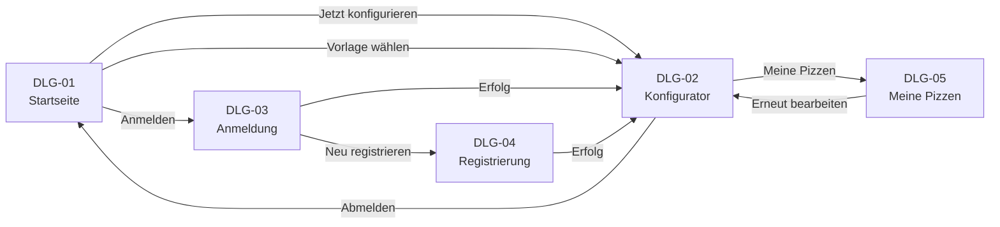

# B1 — Dialogspezifikation

Dieser Baustein beschreibt die Dialoge des Pizza Trackers aus Nutzersicht. Für jeden Dialog wird festgehalten, was der Nutzer dort tun kann und wie die Dialoge miteinander verbunden sind. Technische Umsetzungsdetails wie Frameworks oder Dateinamen sind nicht Teil dieser Beschreibung.

Jeder Dialog setzt einen oder mehrere Anwendungsfälle aus F2 um. Die Zuordnung ist in der Dialogübersicht und in der jeweiligen Dialogbeschreibung angegeben.

## Inhalt

- [B1.1 Dialogübersicht](#b11-dialogübersicht)
- [B1.2 Seitennavigation](#b12-seitennavigation)
- [B1.3 Dialogbeschreibungen](#b13-dialogbeschreibungen)
  - [DLG-01 Startseite](#dlg-01--startseite)
  - [DLG-02 Konfigurator](#dlg-02--konfigurator)
  - [DLG-03 Anmeldung](#dlg-03--anmeldung)
  - [DLG-04 Registrierung](#dlg-04--registrierung)
  - [DLG-05 Meine Pizzen](#dlg-05--meine-pizzen)
  - [DLG-06 Informationsseiten](#dlg-06--informationsseiten)
- [B1.4 Übergreifende Muster](#b14-übergreifende-muster)

---

## B1.1 Dialogübersicht

| ID | Dialog | Zugang | Setzt Use Case um |
|---|---|---|---|
| [DLG-01](#dlg-01--startseite) | Startseite | Alle | [UC11](F2-anwendungsfaelle.md#uc11--vorlage-laden) Vorlage laden |
| [DLG-02](#dlg-02--konfigurator) | Konfigurator | Alle | [UC01](F2-anwendungsfaelle.md#uc01--pizza-konfigurieren) Pizza konfigurieren · [UC02](F2-anwendungsfaelle.md#uc02--preis-berechnen) Preis berechnen · [UC03](F2-anwendungsfaelle.md#uc03--kalorien-berechnen) Kalorien berechnen · [UC04](F2-anwendungsfaelle.md#uc04--gutscheincode-einlösen) Gutschein einlösen · [UC08](F2-anwendungsfaelle.md#uc08--konfiguration-speichern) Konfiguration speichern |
| [DLG-03](#dlg-03--anmeldung) | Anmeldung | Nur Gäste | [UC06](F2-anwendungsfaelle.md#uc06--nutzer-einloggen) Einloggen |
| [DLG-04](#dlg-04--registrierung) | Registrierung | Nur Gäste | [UC05](F2-anwendungsfaelle.md#uc05--nutzer-registrieren) Registrieren |
| [DLG-05](#dlg-05--meine-pizzen) | Meine Pizzen | Nur angemeldet | [UC09](F2-anwendungsfaelle.md#uc09--gespeicherte-pizzen-anzeigen) Gespeicherte Pizzen anzeigen · [UC10](F2-anwendungsfaelle.md#uc10--konfiguration-löschen) Konfiguration löschen |
| [DLG-06](#dlg-06--informationsseiten) | Projektinformationen | Alle | Ergänzende Informationen ohne eigenen Anwendungsfall |

---

## B1.2 Seitennavigation

Die Navigation ist auf allen Seiten sichtbar. Welche Menüpunkte angezeigt werden, hängt vom Anmeldestatus ab:

| Element | Gast | Angemeldeter Nutzer |
|---|---|---|
| Startseite | ✅ | ✅ |
| Konfigurator | ✅ | ✅ |
| Meine Pizzen | ❌ | ✅ |
| Anmelden | ✅ | ❌ |
| Abmelden (Vorname) | ❌ | ✅ |

---

## B1.3 Dialogbeschreibungen

### DLG-01 — Startseite

| Abschnitt | Inhalt |
|---|---|
| **Kennung** | DLG-01 |
| **Name** | Startseite |
| **Setzt um** | [UC11](F2-anwendungsfaelle.md#uc11--vorlage-laden) Vorlage laden |
| **Zweck** | Einstieg in die Anwendung. Der Nutzer erhält einen Überblick über die Funktionen und kann direkt eine Pizza-Vorlage auswählen oder den Konfigurator öffnen. |
| **Einstiegspunkte** | Direktaufruf der Anwendung · Abmelden aus dem Konfigurator |
| **Ergebnis** | Weiterleitung zum Konfigurator — entweder leer oder mit vorausgefüllter Vorlage |

#### Felder (GUI Statik)

| Feld | Art | Beschreibung |
|---|---|---|
| Navigationsleiste | Anzeige | Logo links, Menüpunkte rechts — abhängig vom Anmeldestatus |
| Einstiegsbereich | Anzeige | Haupttitel und Schaltfläche „Jetzt konfigurieren" |
| Schritt-Erklärung | Anzeige | Drei kurze Schritte zur Bedienung |
| Pizza-Vorlagen | Auswahl | Drei vordefinierte Pizzen (Margherita, Salami, Hawaii) mit Bild und Preis |
| Funktionshinweise | Anzeige | Vier Symbole mit kurzen Beschreibungen |
| Projektinformation und FAQ | Anzeige | Erklärt Funktionsumfang und Projektgrenzen |
| Fußzeile | Navigation | Verlinkt die Allergene-Seite und kennzeichnet das Hochschulprojekt |

#### Aktionen (GUI Dynamik)

**Jetzt konfigurieren**
- **Auslöser:** Klick auf die Schaltfläche „Jetzt konfigurieren"
- **Voraussetzung:** Keine
- **Ergebnis:** Weiterleitung zu [DLG-02](#dlg-02--konfigurator) ohne vorausgefüllte Werte

**Vorlage auswählen**
- **Auslöser:** Klick auf eine der drei Pizza-Vorlagen
- **Voraussetzung:** Keine
- **Ergebnis:** Weiterleitung zu [DLG-02](#dlg-02--konfigurator) mit vorausgefüllten Werten der gewählten Vorlage ([UC11](F2-anwendungsfaelle.md#uc11--vorlage-laden))

---

### DLG-02 — Konfigurator

| Abschnitt | Inhalt |
|---|---|
| **Kennung** | DLG-02 |
| **Name** | Konfigurator |
| **Setzt um** | [UC01](F2-anwendungsfaelle.md#uc01--pizza-konfigurieren) Pizza konfigurieren · [UC02](F2-anwendungsfaelle.md#uc02--preis-berechnen) Preis berechnen · [UC03](F2-anwendungsfaelle.md#uc03--kalorien-berechnen) Kalorien berechnen · [UC04](F2-anwendungsfaelle.md#uc04--gutscheincode-einlösen) Gutschein einlösen · [UC08](F2-anwendungsfaelle.md#uc08--konfiguration-speichern) Konfiguration speichern |
| **Zweck** | Der Nutzer stellt seine Pizza zusammen. Preis und Kalorien werden nach jeder Auswahl sofort aktualisiert. Optional kann ein Gutscheincode eingegeben werden. Angemeldete Nutzer können die Konfiguration speichern. |
| **Einstiegspunkte** | Schaltfläche „Jetzt konfigurieren" auf [DLG-01](#dlg-01--startseite) · Vorlage auf [DLG-01](#dlg-01--startseite) · „Erneut bearbeiten" auf [DLG-05](#dlg-05--meine-pizzen) |
| **Ergebnis** | Konfiguration gespeichert (angemeldete Nutzer) oder nur angezeigt (Gäste) |

#### Felder (GUI Statik)

| Feld | Art | Beschreibung |
|---|---|---|
| Größenauswahl | Pflichtauswahl | S (20 cm), M (26 cm), L (30 cm), XL (34 cm) oder XXL (40 cm); jede Karte zeigt Name, Durchmesser, Aufpreis und Kalorien vollständig innerhalb der Karte |
| Teigart | Pflichtauswahl | Normal, Dünn & Knusprig, Dick & Fluffig, Vollkorn, Käserand oder Protein-Teig (Low Carb) |
| Sauce | Pflichtauswahl | Tomate, Pesto, Knoblauch-Öl, Crème fraîche oder BBQ |
| Käse | Pflichtauswahl | Mozzarella, Gouda, Gorgonzola, Ziegenkäse, Vegan, Light-Mozzarella oder Gouda light |
| Beläge | Mehrfachauswahl | Auswahl aus vordefinierten Zutaten |
| Extras | Optionale Auswahl | Zusätzliche Zutaten |
| Gutscheinfeld | Texteingabe (optional) | Eingabefeld für einen Gutscheincode mit Schaltfläche „Einlösen" |
| Preisanzeige | Anzeige | Wird nach jeder Änderung sofort aktualisiert |
| Kalorienanzeige | Anzeige | Summe der Kalorien aller gewählten Zutaten |
| Pizza-Vorschau | Anzeige | Lokales Pizzafoto als Grundbild; bei einer erkannten Vorlage das passende Vorlagenbild, sonst eine als solche gekennzeichnete Beispielabbildung |
| Zutaten-Chips | Anzeige | Alle gewählten Zutaten als Liste neben der Pizza; ersetzt die früher auf die Pizza gezeichneten Symbole |
| Separat servierte Extras | Anzeige | Knoblauch-Dip und Chili-Öl erscheinen als eigene Kennzeichnung neben der Pizza, nicht als Belag |
| Nährwertanzeige | Anzeige | Preis, Kalorien, Protein, Kohlenhydrate und Fett; Ballaststoffe, sobald vorhanden |
| Ernährungskennzeichnungen | Anzeige | High Protein, Low Carb, Vegetarisch, Vegan und Leichtere Wahl nach den Regeln aus [D2](D2-datentypen.md) |
| Richtwert-Hinweis | Anzeige | „Alle Nährwertangaben sind berechnete Richtwerte und können je nach Zutatenmenge abweichen." |
| Schaltfläche „Speichern" | Aktion | Nur für angemeldete Nutzer sichtbar |

#### Aktionen (GUI Dynamik)

**Zutat auswählen**
- **Auslöser:** Klick auf eine Auswahlkarte (Größe, Teig, Sauce, Käse, Belag, Extra)
- **Voraussetzung:** Keine
- **Ergebnis:** Preis, Kalorien und Nährwerte werden sofort neu berechnet. Ein zuvor eingelöster Gutschein wird dabei zurückgesetzt und muss erneut eingelöst werden ([UC02](F2-anwendungsfaelle.md#uc02--preis-berechnen), [UC03](F2-anwendungsfaelle.md#uc03--kalorien-berechnen))

**Gutscheincode einlösen**
- **Auslöser:** Klick auf „Einlösen" nach Eingabe eines Codes
- **Voraussetzung:** Ein Code wurde eingegeben
- **Ergebnis:** Bei gültigem Code wird der Rabatt vom Preis abgezogen und angezeigt · Bei ungültigem Code erscheint eine Fehlermeldung ([UC04](F2-anwendungsfaelle.md#uc04--gutscheincode-einlösen))

**Konfiguration speichern**
- **Auslöser:** Klick auf „Speichern"
- **Voraussetzung:** Nutzer ist angemeldet · Pflichtfelder sind ausgewählt
- **Ergebnis:** Konfiguration wird gespeichert und ist unter „Meine Pizzen" abrufbar ([UC08](F2-anwendungsfaelle.md#uc08--konfiguration-speichern))

---

### DLG-03 — Anmeldung

| Abschnitt | Inhalt |
|---|---|
| **Kennung** | DLG-03 |
| **Name** | Anmeldung |
| **Setzt um** | [UC06](F2-anwendungsfaelle.md#uc06--nutzer-einloggen) Einloggen |
| **Zweck** | Registrierte Nutzer melden sich mit E-Mail-Adresse und Passwort an. |
| **Einstiegspunkte** | Menüpunkt „Anmelden" in der Navigation |
| **Ergebnis** | Erfolg: Weiterleitung zum Konfigurator · Fehler: Fehlermeldung, Dialog bleibt offen |

#### Felder (GUI Statik)

| Feld | Art | Beschreibung |
|---|---|---|
| E-Mail-Adresse | Pflichtfeld | Login-Kennung des Nutzers |
| Passwort | Pflichtfeld | Kann ein- und ausgeblendet werden |
| Hinweisfeld | Anzeige | Zeigt Fehler- oder Erfolgsmeldungen |
| Link zur Registrierung | Navigation | Weiterleitung zu [DLG-04](#dlg-04--registrierung) |

#### Aktionen (GUI Dynamik)

**Anmelden**
- **Auslöser:** Klick auf „Anmelden"
- **Voraussetzung:** E-Mail und Passwort sind ausgefüllt
- **Ergebnis:** Bei korrekten Zugangsdaten: Anmeldung erfolgreich, Weiterleitung zu [DLG-02](#dlg-02--konfigurator) · Bei falschen Zugangsdaten: Fehlermeldung

**Zur Registrierung**
- **Auslöser:** Klick auf den Link „Neu registrieren"
- **Voraussetzung:** Keine
- **Ergebnis:** Weiterleitung zu [DLG-04](#dlg-04--registrierung)

---

### DLG-04 — Registrierung

| Abschnitt | Inhalt |
|---|---|
| **Kennung** | DLG-04 |
| **Name** | Registrierung |
| **Setzt um** | [UC05](F2-anwendungsfaelle.md#uc05--nutzer-registrieren) Nutzer registrieren |
| **Zweck** | Neue Nutzer legen ein Konto an. Nach erfolgreicher Registrierung sind sie direkt angemeldet. |
| **Einstiegspunkte** | Link „Neu registrieren" auf [DLG-03](#dlg-03--anmeldung) |
| **Ergebnis** | Erfolg: Konto angelegt, Weiterleitung zum Konfigurator · Fehler: Fehlermeldung, Dialog bleibt offen |

#### Felder (GUI Statik)

| Feld | Art | Beschreibung |
|---|---|---|
| Vorname | Pflichtfeld | — |
| Nachname | Pflichtfeld | — |
| E-Mail-Adresse | Pflichtfeld | Muss gültiges Format haben und darf noch nicht registriert sein |
| Passwort | Pflichtfeld | Mindestlänge wird geprüft |
| Passwort bestätigen | Pflichtfeld | Muss mit dem Passwort übereinstimmen |
| Straße | Pflichtfeld | — |
| Hausnummer | Pflichtfeld | — |
| Postleitzahl | Pflichtfeld | — |
| Stadt | Pflichtfeld | — |
| Telefon | Optionales Feld | — |
| Hinweisfeld | Anzeige | Zeigt Fehler- oder Erfolgsmeldungen |

#### Aktionen (GUI Dynamik)

**Konto erstellen**
- **Auslöser:** Klick auf „Registrieren"
- **Voraussetzung:** Alle Pflichtfelder sind ausgefüllt · Passwörter stimmen überein · E-Mail-Format ist gültig
- **Ergebnis:** Bei Erfolg: Konto angelegt, direkt angemeldet, Weiterleitung zu [DLG-02](#dlg-02--konfigurator) · Bei bereits vorhandener E-Mail: Fehlermeldung · Bei ungültigen Eingaben: Fehlermeldung

---

### DLG-05 — Meine Pizzen

| Abschnitt | Inhalt |
|---|---|
| **Kennung** | DLG-05 |
| **Name** | Meine Pizzen |
| **Setzt um** | [UC09](F2-anwendungsfaelle.md#uc09--gespeicherte-pizzen-anzeigen) Gespeicherte Pizzen anzeigen · [UC10](F2-anwendungsfaelle.md#uc10--konfiguration-löschen) Konfiguration löschen |
| **Zweck** | Angemeldete Nutzer sehen ihre gespeicherten Pizza-Konfigurationen und können sie erneut bearbeiten oder löschen. |
| **Einstiegspunkte** | Menüpunkt „Meine Pizzen" in der Navigation (nur für angemeldete Nutzer) |
| **Ergebnis** | Weiterleitung zum Konfigurator (erneut bearbeiten) oder Konfiguration gelöscht |

#### Felder (GUI Statik)

| Feld | Art | Beschreibung |
|---|---|---|
| Ladeanzeige | Anzeige | Wird während des Ladens der gespeicherten Pizzen angezeigt |
| Hinweis (nicht angemeldet) | Anzeige | Hinweis mit Link zur Anmeldung |
| Leere Ansicht | Anzeige | Hinweis und Link zum Konfigurator wenn noch keine Pizzen gespeichert wurden |
| Pizza-Karte | Anzeige | Zeigt Name, Datum, Größe, Teig, Sauce, Käse, Beläge, Extras, Preis und Gutschein-Badge |
| Schaltfläche „Erneut bearbeiten" | Aktion | Pro Pizza-Karte |
| Schaltfläche „Löschen" | Aktion | Pro Pizza-Karte |

#### Aktionen (GUI Dynamik)

**Erneut bearbeiten**
- **Auslöser:** Klick auf „Erneut bearbeiten" auf einer Pizza-Karte
- **Voraussetzung:** Nutzer ist angemeldet
- **Ergebnis:** Weiterleitung zu [DLG-02](#dlg-02--konfigurator) mit den gespeicherten Werten vorausgefüllt

**Pizza löschen**
- **Auslöser:** Klick auf „Löschen" auf einer Pizza-Karte
- **Voraussetzung:** Nutzer ist angemeldet · Die Pizza gehört dem angemeldeten Nutzer
- **Ergebnis:** Bestätigungsdialog erscheint · Bei Bestätigung: Konfiguration wird gelöscht, Karte verschwindet · Bei Abbruch: keine Änderung ([UC10](F2-anwendungsfaelle.md#uc10--konfiguration-löschen))

---

### DLG-06 — Informationsseiten

| Abschnitt | Inhalt |
|---|---|
| **Kennung** | DLG-06 |
| **Name** | Allergene und Inhaltsstoffe |
| **Zweck** | Transparente Hinweise zu Projektgrenzen und eindeutig ableitbaren Allergenen |
| **Zugang** | Über die gemeinsame Fußzeile auf Startseite, Konfigurator, Anmeldung und Allergenseite sowie über direkte Allergiehinweise auf Startseite und im Konfigurator |
| **Ergebnis** | Der Nutzer erhält Informationen; es werden keine Daten verändert |

Die Anmeldung (DLG-03) verwendet ein zweispaltiges Layout mit dunklem Bildbereich und hellem Formularbereich; auf schmalen Bildschirmen stapeln sich beide Bereiche untereinander. Die Registrierung (DLG-04) verwendet eine einfache Formular-Karte.

Die Informationsseite kennzeichnet Pizza Tracker ausdrücklich als Hochschulprojekt ohne echte Bestell- oder Zahlungsfunktion. Nicht belegte Produktrezepturen oder Unternehmensdaten werden nicht erfunden.

---

## B1.4 Übergreifende Muster

### Bestätigungsdialog

Unwiderrufliche Aktionen — aktuell nur das Löschen einer Konfiguration — werden durch einen Bestätigungsdialog gesichert. Verwendet wird der Bestätigungsdialog des Browsers. Er nennt den Namen der betroffenen Pizza und bietet eine Bestätigung und „Abbrechen"; die Beschriftung der Bestätigung hängt vom Browser ab. Bei „Abbrechen" bleibt alles unverändert. Bei Bestätigung wird die Konfiguration gelöscht.

### Fehlermeldungen

Fehlermeldungen erscheinen direkt im betroffenen Dialog — nicht als kurz aufblitzendes Hinweisfenster. Der Nutzer kann die Eingabe korrigieren und erneut versuchen.

Im Konfigurator erscheint eine verständliche Verbindungsmeldung, wenn die Pizzadaten, die Gutscheinprüfung oder das Speichern nicht erreichbar sind. Während Gutscheinprüfung und Speicherung wird die ausgelöste Schaltfläche vorübergehend deaktiviert, um Mehrfachanfragen zu verhindern. Im aktuellen Stand noch nicht umgesetzt (siehe [A11](../arch/A11-risks-and-technical-debts.md), R-04): Anmeldung und Registrierung zeigen fachliche Fehler der API an, besitzen aber keinen eigenen `try/catch` für Netzwerk- oder JSON-Fehler und sperren die Schaltfläche nicht. Das Laden von „Meine Pizzen" besitzt keinen allgemeinen Netzwerkfehler-Handler. Ein fehlgeschlagenes Löschen wird ohne sichtbare Fehlermeldung ignoriert.

### Nicht angemeldet

Ruft ein Nutzer „Meine Pizzen" ohne aktive Anmeldung auf, erscheint ein Hinweis mit einem Link zur Anmeldung. Der restliche Inhalt wird nicht angezeigt.

### Leere Ansicht

Wenn noch keine Konfigurationen gespeichert wurden, zeigt „Meine Pizzen" einen Hinweis und einen direkten Link zum Konfigurator — kein Fehler, nur ein Hinweis.
