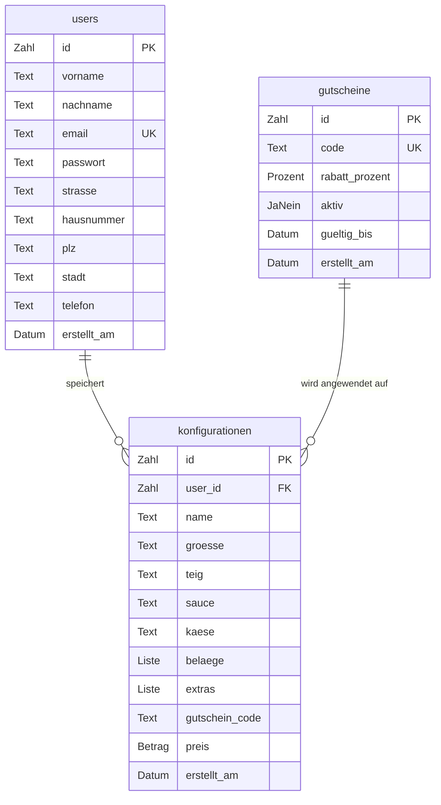

# D1 — Datenmodell

## Entity-Relationship-Diagramm

## Entitäten

### users

In dieser Tabelle werden die registrierten Nutzer gespeichert.

| Attribut | Typ | Constraints | Beschreibung |
|---|---|---|---|
| `id` | Zahl | Eindeutig, automatisch vergeben | Eindeutige Benutzer-ID |
| `vorname` | Text | Pflichtfeld | Vorname |
| `nachname` | Text | Pflichtfeld | Nachname |
| `email` | Text | Pflichtfeld, einmalig | Login-Kennung |
| `passwort` | Text | Pflichtfeld | Sicher gespeichertes Passwort |
| `strasse` | Text | Pflichtfeld | Straße |
| `hausnummer` | Text | Pflichtfeld | Hausnummer |
| `plz` | Text | Pflichtfeld | Postleitzahl |
| `stadt` | Text | Pflichtfeld | Stadt |
| `telefon` | Text | Optional | Telefonnummer |
| `erstellt_am` | Datum | Automatisch gesetzt | Registrierungszeitpunkt |

### konfigurationen

Hier werden die von Nutzern gespeicherten Pizza-Konfigurationen abgelegt.

| Attribut | Typ | Constraints | Beschreibung |
|---|---|---|---|
| `id` | Zahl | Eindeutig, automatisch vergeben | Konfigurations-ID |
| `user_id` | Zahl | Pflichtfeld, Verweis auf Nutzer | Zugehöriger Nutzer |
| `name` | Text | Optional | Benutzerdefinierter Name |
| `groesse` | Text | Pflichtfeld | S / M / L / XL / XXL |
| `teig` | Text | Pflichtfeld | Gewählte Teigart |
| `sauce` | Text | Pflichtfeld | Gewählte Sauce |
| `kaese` | Text | Pflichtfeld | Gewählter Käse |
| `belaege` | Liste | Pflichtfeld | Ausgewählte Beläge |
| `extras` | Liste | Optional | Optionale Extras |
| `gutschein_code` | Text | Optional | Eingelöster Gutscheincode |
| `preis` | Betrag | Pflichtfeld | Endpreis in Euro |
| `erstellt_am` | Datum | Automatisch gesetzt | Speicherzeitpunkt |

### gutscheine

Die Tabelle enthält die verfügbaren Rabattcodes.

| Attribut | Typ | Constraints | Beschreibung |
|---|---|---|---|
| `id` | Zahl | Eindeutig, automatisch vergeben | Gutschein-ID |
| `code` | Text | Pflichtfeld, einmalig | Gutscheincode |
| `rabatt_prozent` | Prozent | Pflichtfeld | Rabatt in Prozent |
| `aktiv` | Ja/Nein | Standard: Ja | Gibt an ob der Gutschein einlösbar ist |
| `gueltig_bis` | Datum | Optional | Ablaufdatum (leer = unbegrenzt) |
| `erstellt_am` | Datum | Automatisch gesetzt | Erstellungsdatum |

## Beziehungen

- **users → konfigurationen**: 1:N. Ein Nutzer kann mehrere Konfigurationen speichern, während jede Konfiguration genau einem Nutzer zugeordnet ist. Wird ein Nutzer gelöscht, werden auch seine Konfigurationen entfernt.
- **gutscheine → konfigurationen**: Ein Gutscheincode kann auf mehrere Konfigurationen angewendet werden. Der verwendete Code wird als Text in der Konfiguration gespeichert.

## Seed-Daten (Gutscheine)

| id | code | rabatt_prozent | aktiv | gueltig_bis | erstellt_am |
|---|---|---|---|---|---|
| 1 | PIZZA10 | 10.00 | 1 | 2027-12-31 | 2026-08-15 |
| 2 | SPARE20 | 20.00 | 1 | 2027-06-30 | 2026-08-15 |
| 3 | WELCOME | 15.00 | 1 | 2027-12-31 | 2026-08-15 |
| 4 | STUDENT5 | 5.00 | 1 | NULL | 2026-08-15 |
