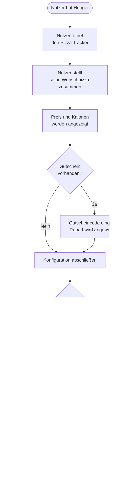
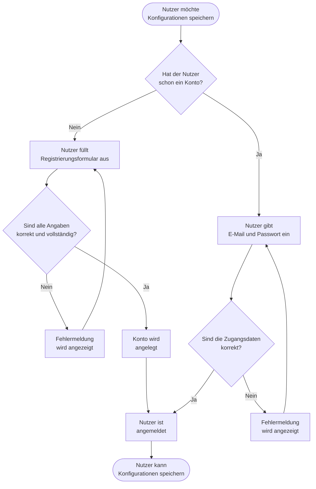
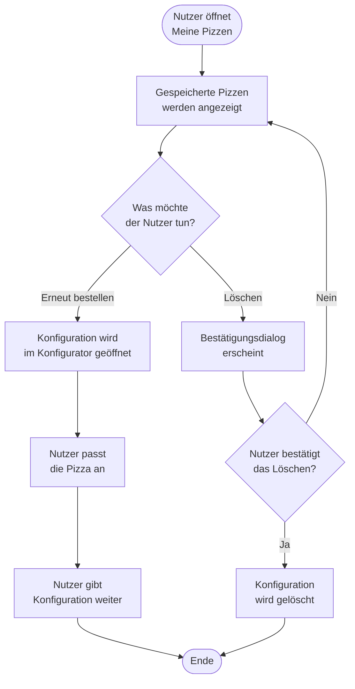

# F1 — Geschäftsprozesse

Dieser Baustein beschreibt die Geschäftsprozesse rund um den Pizza Tracker. Die Prozesse reichen über die Anwendung selbst hinaus und zeigen den größeren fachlichen Kontext also was vor, während und nach der Nutzung der App geschieht.

---

## GP1 — Pizza bestellen

Dieser Prozess beschreibt den gesamten Ablauf vom Hunger bis zur fertigen Pizza — der Pizza Tracker übernimmt dabei den Konfigurationsschritt.

### Schritte

| Schritt | Akteur | Beschreibung |
|---|---|---|
| 1 | Nutzer | Nutzer hat Hunger und möchte eine Pizza bestellen |
| 2 | Nutzer | Nutzer öffnet den Pizza Tracker |
| 3 | Nutzer | Nutzer stellt seine Wunschpizza zusammen (Größe, Teig, Sauce, Käse, Beläge) |
| 4 | System | Preis und Kalorien werden nach jeder Auswahl sofort angezeigt |
| 5 | Nutzer | Nutzer gibt optional einen Gutscheincode ein |
| 6 | System | Gutscheincode wird geprüft und Rabatt wird angewendet |
| 7 | Nutzer | Nutzer gibt die Konfiguration an eine Pizzeria weiter oder speichert sie |
| 8 | Pizzeria | Pizzeria bereitet die Pizza nach der Konfiguration zu |
| 9 | Nutzer | Nutzer bezahlt und erhält seine Pizza |

---

## GP2 — Konto erstellen und anmelden

Dieser Prozess beschreibt wie ein Nutzer ein Konto anlegt und sich anmeldet, um seine Pizzen zu speichern.

### Schritte

| Schritt | Akteur | Beschreibung |
|---|---|---|
| 1 | Nutzer | Nutzer möchte seine Pizza-Konfigurationen speichern |
| 2 | Nutzer | Nutzer registriert sich mit seinen persönlichen Daten |
| 3 | System | Angaben werden auf Vollständigkeit und Gültigkeit geprüft |
| 4 | System | Konto wird angelegt und Nutzer wird direkt angemeldet |
| 5 | Nutzer | Bei späterer Rückkehr meldet sich der Nutzer mit E-Mail und Passwort an |
| 6 | System | Zugangsdaten werden geprüft |
| 7 | Nutzer | Nutzer kann nun seine Konfigurationen speichern und verwalten |

---

## GP3 — Konfiguration verwalten

Dieser Prozess beschreibt wie ein angemeldeter Nutzer seine gespeicherten Pizza-Konfigurationen verwaltet.

### Schritte

| Schritt | Akteur | Beschreibung |
|---|---|---|
| 1 | Nutzer | Nutzer öffnet „Meine Pizzen" |
| 2 | System | Alle gespeicherten Konfigurationen des Nutzers werden angezeigt |
| 3a | Nutzer | Nutzer wählt eine Pizza zum erneuten Bestellen aus |
| 4a | System | Konfiguration wird im Konfigurator vorausgefüllt |
| 5a | Nutzer | Nutzer passt die Pizza an und gibt sie weiter |
| 3b | Nutzer | Nutzer möchte eine Pizza-Konfiguration löschen |
| 4b | System | Bestätigungsdialog erscheint |
| 5b | Nutzer | Nutzer bestätigt das Löschen |
| 6b | System | Konfiguration wird unwiderruflich gelöscht |
