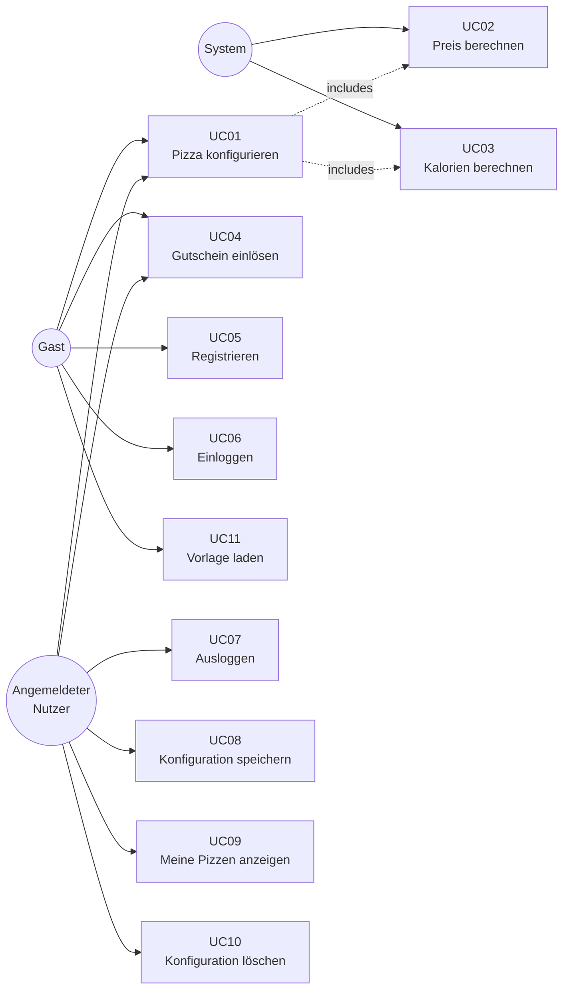
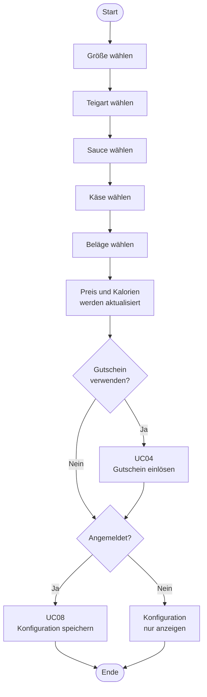

# F2 — Anwendungsfälle

## Übersicht

## Übersicht der Anwendungsfälle

| ID | Name | Akteur | Priorität |
|---|---|---|---|
| [UC01](#uc01--pizza-konfigurieren) | Pizza konfigurieren | Gast / Nutzer | Hoch |
| [UC02](#uc02--preis-berechnen) | Preis berechnen | System (automatisch) | Hoch |
| [UC03](#uc03--kalorien-berechnen) | Kalorien berechnen | System (automatisch) | Hoch |
| [UC04](#uc04--gutscheincode-einlösen) | Gutscheincode einlösen | Gast / Nutzer | Mittel |
| [UC05](#uc05--nutzer-registrieren) | Nutzer registrieren | Gast | Hoch |
| [UC06](#uc06--nutzer-einloggen) | Nutzer einloggen | Gast | Hoch |
| [UC07](#uc07--nutzer-ausloggen) | Nutzer ausloggen | Angemeldeter Nutzer | Mittel |
| [UC08](#uc08--konfiguration-speichern) | Konfiguration speichern | Angemeldeter Nutzer | Mittel |
| [UC09](#uc09--gespeicherte-pizzen-anzeigen) | Gespeicherte Pizzen anzeigen | Angemeldeter Nutzer | Mittel |
| [UC10](#uc10--konfiguration-löschen) | Konfiguration löschen | Angemeldeter Nutzer | Niedrig |
| [UC11](#uc11--vorlage-laden) | Vorlage laden | Gast / Nutzer | Niedrig |

---

## Anwendungsfälle im Detail

### UC01 — Pizza konfigurieren

| Feld | Inhalt |
|---|---|
| **Akteur** | Gast oder angemeldeter Nutzer |
| **Vorbedingung** | Der Konfigurator ist geöffnet |
| **Normaler Ablauf** | 1. Größe wählen (S, M, L, XL oder XXL)   2. Teigart wählen (Normal, Dünn & Knusprig, Dick & Fluffig, Vollkorn oder Käserand)   3. Sauce wählen (Tomate, Pesto, Knoblauch-Öl, Crème fraîche oder BBQ)   4. Käse wählen (Mozzarella, Gouda, Gorgonzola, Ziegenkäse oder Vegan)   5. Beläge auswählen (Mehrfachauswahl möglich)   6. Preis und Kalorien werden nach jeder Auswahl sofort aktualisiert |
| **Ergebnis** | Fertige Konfiguration mit angezeigtem Preis und Kalorien |
| **Alternativer Ablauf** | Nutzer wählt eine Vorlage (UC11) → Felder werden vorausgefüllt und können anschließend geändert werden |
| **Fehlerfälle** | Pflichtauswahl fehlt: Die Konfiguration kann nicht gespeichert werden |

**Akzeptanzkriterien:**
- Der Preis wird nach jeder Änderung sofort aktualisiert
- Die Kalorienanzahl summiert korrekt alle gewählten Zutaten

---

### UC02 — Preis berechnen

| Feld | Inhalt |
|---|---|
| **Akteur** | System (automatisch) |
| **Vorbedingung** | Mindestens eine Zutat wurde ausgewählt |
| **Normaler Ablauf** | Das System berechnet den Gesamtpreis auf Basis der gewählten Zutaten und zeigt ihn sofort an. Bei einem eingelösten Gutschein wird der Rabatt abgezogen. |
| **Ergebnis** | Aktueller Preis wird angezeigt |

---

### UC03 — Kalorien berechnen

| Feld | Inhalt |
|---|---|
| **Akteur** | System (automatisch) |
| **Vorbedingung** | Mindestens eine Zutat wurde ausgewählt |
| **Normaler Ablauf** | Das System summiert die Kalorienwerte aller gewählten Zutaten und zeigt das Ergebnis sofort an. |
| **Ergebnis** | Aktuelle Kalorienanzahl wird angezeigt |

---

### UC04 — Gutscheincode einlösen

| Feld | Inhalt |
|---|---|
| **Akteur** | Gast oder angemeldeter Nutzer |
| **Vorbedingung** | Eine Pizza wurde konfiguriert |
| **Normaler Ablauf** | 1. Nutzer gibt einen Gutscheincode ein   2. Das System prüft ob der Code gültig und nicht abgelaufen ist   3. Der Rabatt wird vom Preis abgezogen   4. Der neue Preis wird angezeigt |
| **Ergebnis** | Reduzierter Preis wird angezeigt |
| **Fehlerfälle** | Ungültiger Code: Fehlermeldung wird angezeigt · Abgelaufener Code: Fehlermeldung wird angezeigt |
| **Verfügbare Codes** | PIZZA10 (10 %), SPARE20 (20 %), WELCOME (15 %), STUDENT5 (5 %) |

**Akzeptanzkriterium:**
- Der Code PIZZA10 reduziert den Preis um 10 %. Bei einem ungültigen Code erscheint eine Fehlermeldung.

---

### UC05 — Nutzer registrieren

| Feld | Inhalt |
|---|---|
| **Akteur** | Gast |
| **Vorbedingung** | Nutzer ist nicht angemeldet |
| **Normaler Ablauf** | 1. Registrierungsformular ausfüllen: Vorname, Nachname, E-Mail, Passwort und Adresse   2. Eingaben werden geprüft   3. E-Mail-Adresse wird auf Gültigkeit und Verfügbarkeit geprüft   4. Passwort wird sicher gespeichert   5. Nutzer wird direkt angemeldet und zum Konfigurator weitergeleitet |
| **Ergebnis** | Konto wurde erstellt, Nutzer ist angemeldet |
| **Fehlerfälle** | E-Mail bereits vorhanden: Fehlermeldung · Pflichtfeld leer: Fehlermeldung · Passwort zu kurz: Fehlermeldung |

**Akzeptanzkriterium:**
- Ein neuer Nutzer kann sich registrieren und wird direkt angemeldet weitergeleitet.

---

### UC06 — Nutzer einloggen

| Feld | Inhalt |
|---|---|
| **Akteur** | Gast |
| **Vorbedingung** | Nutzer ist registriert und nicht angemeldet |
| **Normaler Ablauf** | 1. E-Mail-Adresse und Passwort eingeben   2. Das System prüft die Zugangsdaten   3. Bei Erfolg wird der Nutzer angemeldet und zum Konfigurator weitergeleitet |
| **Ergebnis** | Nutzer ist angemeldet |
| **Fehlerfälle** | Falsche Zugangsdaten: Fehlermeldung wird angezeigt |

**Akzeptanzkriterium:**
- Ein registrierter Nutzer kann sich einloggen. Bei falschen Zugangsdaten erscheint eine Fehlermeldung.

---

### UC07 — Nutzer ausloggen

| Feld | Inhalt |
|---|---|
| **Akteur** | Angemeldeter Nutzer |
| **Vorbedingung** | Nutzer ist angemeldet |
| **Normaler Ablauf** | 1. Nutzer klickt auf „Abmelden"   2. Die Anmeldung wird beendet   3. Nutzer wird zur Startseite weitergeleitet |
| **Ergebnis** | Nutzer ist abgemeldet · „Meine Pizzen" ist nicht mehr sichtbar |

**Akzeptanzkriterium:**
- Nach dem Abmelden ist „Meine Pizzen" nicht mehr sichtbar.

---

### UC08 — Konfiguration speichern

| Feld | Inhalt |
|---|---|
| **Akteur** | Angemeldeter Nutzer |
| **Vorbedingung** | Nutzer ist angemeldet · Pflichtfelder wurden ausgewählt |
| **Normaler Ablauf** | 1. Nutzer klickt auf „Speichern"   2. Das System prüft die Anmeldung   3. Die Konfiguration wird dem Nutzerkonto zugeordnet und gespeichert |
| **Ergebnis** | Konfiguration ist unter „Meine Pizzen" abrufbar |
| **Fehlerfälle** | Nicht angemeldet: Speichern nicht möglich · Pflichtfeld fehlt: Fehlermeldung |

**Akzeptanzkriterium:**
- Ein angemeldeter Nutzer kann eine Konfiguration speichern. Sie erscheint anschließend unter „Meine Pizzen".

---

### UC09 — Gespeicherte Pizzen anzeigen

| Feld | Inhalt |
|---|---|
| **Akteur** | Angemeldeter Nutzer |
| **Vorbedingung** | Nutzer ist angemeldet |
| **Normaler Ablauf** | 1. Nutzer öffnet „Meine Pizzen"   2. Das System lädt alle gespeicherten Konfigurationen des Nutzers   3. Konfigurationen werden als Karten angezeigt |
| **Ergebnis** | Alle gespeicherten Pizzen des Nutzers werden angezeigt |
| **Leere Ansicht** | Wenn noch keine Konfigurationen gespeichert wurden, erscheint ein Hinweis mit Link zum Konfigurator |

---

### UC10 — Konfiguration löschen

| Feld | Inhalt |
|---|---|
| **Akteur** | Angemeldeter Nutzer |
| **Vorbedingung** | Nutzer ist angemeldet · Konfiguration existiert |
| **Normaler Ablauf** | 1. Nutzer klickt auf „Löschen"   2. Bestätigungsdialog erscheint   3. Nutzer bestätigt   4. Das System prüft ob die Konfiguration dem angemeldeten Nutzer gehört   5. Konfiguration wird gelöscht |
| **Ergebnis** | Konfiguration ist nicht mehr vorhanden |
| **Fehlerfälle** | Fremde Konfiguration: Löschen nicht möglich · Nicht angemeldet: Löschen nicht möglich |

**Akzeptanzkriterium:**
- Ein Nutzer kann nur seine eigenen Konfigurationen löschen.

---

### UC11 — Vorlage laden

| Feld | Inhalt |
|---|---|
| **Akteur** | Gast oder angemeldeter Nutzer |
| **Vorbedingung** | Nutzer befindet sich auf der Startseite |
| **Normaler Ablauf** | 1. Nutzer klickt auf eine der drei Vorlagen (Margherita, Salami oder Hawaii)   2. Der Konfigurator öffnet sich mit den vorausgefüllten Werten der Vorlage   3. Nutzer kann die Vorlage nach Belieben anpassen |
| **Ergebnis** | Konfigurator ist mit Vorlage vorausgefüllt |
