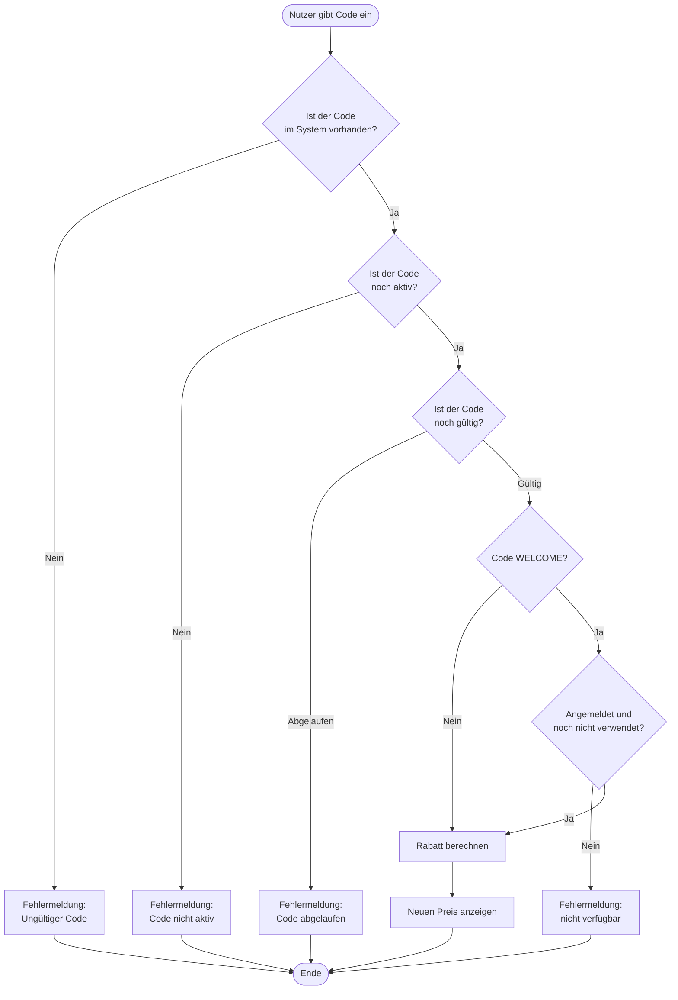

# F3 — Anwendungsfunktionen

## Gutschein-Prüfvorgang

Der Gutschein-Prüfvorgang ist die zentrale Anwendungsfunktion des Pizza Trackers, die über die reine Benutzerinteraktion hinausgeht. Sie beschreibt, wie das System einen eingegebenen Gutscheincode fachlich bewertet.

### Ablauf der Gutscheinprüfung

Wenn ein Nutzer einen Gutscheincode eingibt und auf „Einlösen" klickt, durchläuft das System folgende Prüfschritte:

### Prüfschritte im Detail

| Schritt | Beschreibung | Ergebnis bei Fehler |
|---|---|---|
| 1. Code vorhanden | Das System prüft ob der eingegebene Code überhaupt existiert | Fehlermeldung: Ungültiger Gutscheincode |
| 2. Code aktiv | Das System prüft ob der Code nicht deaktiviert wurde | Fehlermeldung: Code nicht aktiv |
| 3. Gültigkeitsdatum | Das System prüft ob der Code noch nicht abgelaufen ist | Fehlermeldung: Gutscheincode abgelaufen |
| 4. Sonderregel WELCOME | Soll: nur für angemeldete Nutzer und nur einmal pro Nutzerkonto. Umsetzung: Die API sucht eine vorhandene Konfiguration desselben Nutzers mit `gutschein_code = 'WELCOME'`. Wird dieser Datensatz gelöscht, kann die frühere Verwendung nicht mehr erkannt werden ([A11](../arch/A11-risks-and-technical-debts.md), R-03) | Fehlermeldung: nur für registrierte Nutzer bzw. bereits verwendet |
| 5. Rabatt anwenden | Der Rabatt wird in Prozent vom aktuellen Preis abgezogen | — |
| 6. Preis anzeigen | Der neue reduzierte Preis wird dem Nutzer angezeigt | — |

### Verfügbare Gutscheincodes

| Code | Rabatt | Art |
|---|---|---|
| PIZZA10 | 10 % | Zeitlich begrenzt |
| SPARE20 | 20 % | Zeitlich begrenzt |
| WELCOME | 15 % | Einmalig pro Nutzerkonto, nur angemeldet (Einschränkung siehe Schritt 4) |
| STUDENT5 | 5 % | Kein Ablaufdatum; keine technische Prüfung des Studentenstatus |

## Nährwertberechnung (seit M3)

| Punkt | Inhalt |
|---|---|
| **Auslöser** | Jede Änderung an Größe, Teig, Sauce, Käse, Belägen oder Extras |
| **Ablauf** | Der Browser summiert `protein`, `kohlenhydrate`, `fett` und `ballaststoffe` aller gewählten Einträge aus `data/pizza_data.json` — dieselbe Datei, aus der Preis und Kalorien stammen |
| **Ergebnis** | Anzeige als Kennzahlen und als Textzeile, zum Beispiel „10,90 € · 920 kcal · 54 g Protein · 88 g Kohlenhydrate · 36 g Fett · 8 g Ballaststoffe". Ballaststoffe werden ergänzt, wenn ihr berechneter Wert größer als null ist |
| **Abgrenzung** | Ein Gutschein reduziert ausschließlich den Preis. Kalorien und Nährwerte bleiben unverändert |
| **Verortung** | `calculateLocalTotals()` in `js/konfigurator.js` |

Die Nährwerte werden bewusst nur im Browser berechnet und **nicht** gespeichert: Die Tabelle
`konfigurationen` bleibt unverändert, und `api/save_config.php` berechnet Preis und Kalorien
weiterhin serverseitig neu. Damit bleibt die sicherheitsrelevante Serverlogik unangetastet.

## Ernährungskennzeichnungen (seit M3)

Die Kennzeichnungen *High Protein*, *Low Carb*, *Vegetarisch*, *Vegan* und *Leichtere Wahl* werden in
`nutritionBadges()` aus den berechneten Summen und den Zutateneigenschaften abgeleitet. Die ausführbaren
Regeln sind in dieser JavaScript-Funktion implementiert. `data/pizza_data.json` enthält unter
`kennzeichnungs_regeln` ergänzende Textbeschreibungen; [D2](D2-datentypen.md) dokumentiert dieselben Regeln.
Es wird keine Aussage über Gesundheit oder Eignung getroffen und nie vom Namen einer Pizza auf ihre
Eigenschaften geschlossen.
