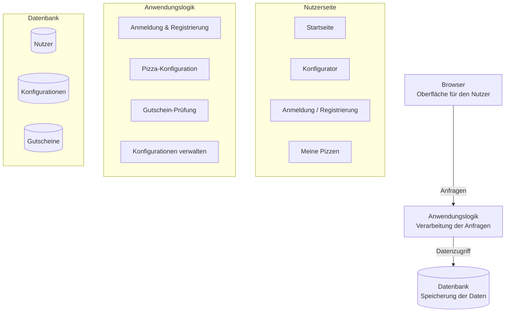

# P2 — Architekturüberblick

## Systemarchitektur

Der Pizza Tracker ist als dreischichtige Webanwendung aufgebaut. Der Nutzer interagiert über den Browser mit der Anwendung. Die Anfragen werden an das Backend weitergeleitet, das die Geschäftslogik verarbeitet und auf die Datenbank zugreift.

## Technologie-Stack

| Schicht | Technologie |
|---|---|
| Oberfläche | HTML, CSS, JavaScript |
| Gestaltung | Bootstrap |
| Anwendungslogik | PHP |
| Datenspeicherung | MySQL / MariaDB |
| Versionskontrolle | Git / GitHub |

## Wichtigste Architekturentscheidungen

| Entscheidung | Wahl | Begründung |
|---|---|---|
| Backend-Sprache | PHP | Lässt sich lokal einfach ausführen und benötigt keinen zusätzlichen Build-Schritt |
| Authentifizierung | Session-basiert | Für den Projektumfang einfacher umzusetzen als eine tokenbasierte Lösung |
| Gestaltung | Bootstrap | Vorgefertigte responsive Komponenten und einheitliches Layout |
| Aufbau | Mehrere Seiten statt einer einzigen | Überschaubare Struktur, leicht verständlich und wartbar |
